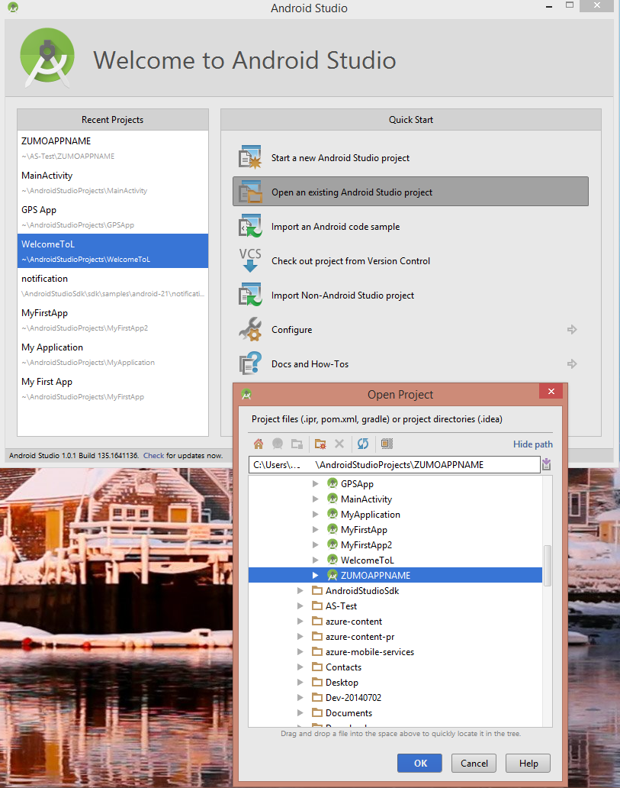
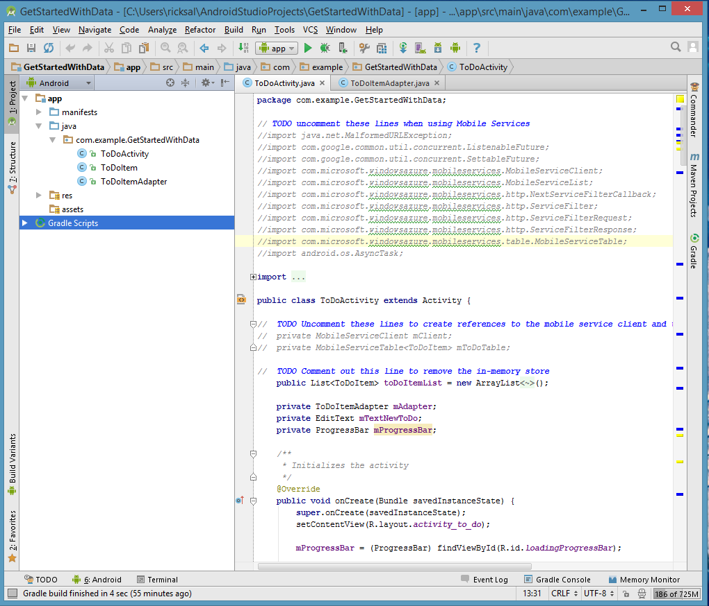
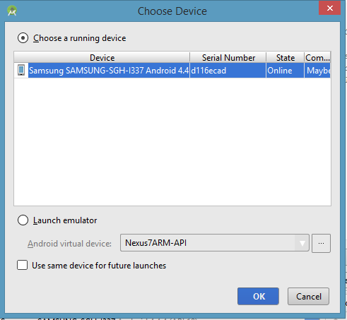
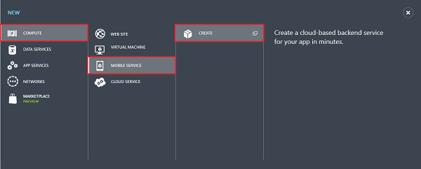
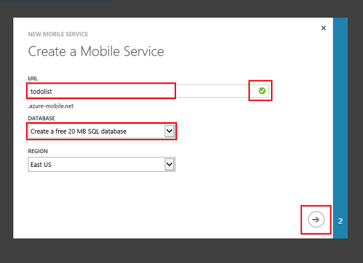
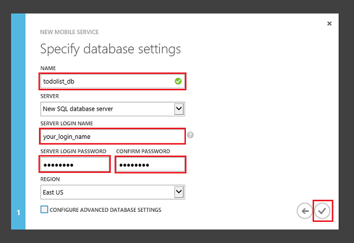
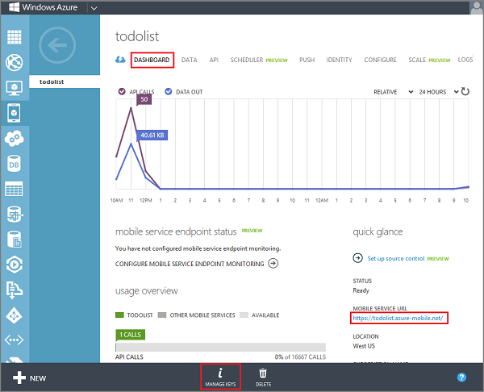

<properties
	pageTitle="Get started with data on Android  (JavaScript backend) | Microsoft Azure"
	description="Learn how to get started using Mobile Services to leverage data in your Android app  (JavaScript backend)."
	services="mobile-services"
	documentationCenter="android"
	authors="RickSaling"
	manager="erikre"
	editor=""/>

<tags
	ms.service="mobile-services"
	ms.workload="mobile"
	ms.tgt_pltfrm="mobile-android"
	ms.devlang="java"
	ms.topic="article"
	ms.date="07/21/2016"
	ms.author="ricksal"/>

# Add Mobile Services to an existing Android app (JavaScript backend)

>[AZURE.WARNING] This is an **Azure Mobile Services** topic.  This service has been superseded by Azure App Service Mobile Apps and is scheduled for removal from Azure.  We recommend using Azure Mobile Apps for all new mobile backend deployments.  Read [this announcement](https://azure.microsoft.com/blog/transition-of-azure-mobile-services/) to learn more about the pending deprecation of this service.  
>
> Learn about [migrating your site to Azure App Service](https://azure.microsoft.com/en-us/documentation/articles/app-service-mobile-migrating-from-mobile-services/).
>
> Get started with Azure Mobile Apps, see the [Azure Mobile Apps documentation center](https://azure.microsoft.com/documentation/learning-paths/appservice-mobileapps/).

## Summary

This topic shows you how to use Azure Mobile Services to add persistent data to an Android app. In this tutorial, you will download an app that stores data in memory, create a new mobile service, integrate the app with the mobile service so that it stores and updates data in Azure Mobile Services instead of locally, and then use the Azure classic portal to view changes to data that were made by running the app.

This tutorial helps you understand in more detail how Azure Mobile Services can store and retrieve data from an Android app. So it walks you through many of the steps that are already completed for you in the Mobile Services quickstart tutorial. If this is your first experience with Mobile Services, consider first completing the tutorial [Get started with Mobile Services](mobile-services-android-get-started.md).

## Prerequisites

To complete this tutorial, you need the following:

- an Azure account. If you don't have an account, you can create a free trial account in just a couple of minutes. For details, see [Azure Free Trial](http://azure.microsoft.com/pricing/free-trial/?WT.mc_id=AED8DE357).

- the [Azure Mobile Services Android SDK];
- the [Android Studio integrated development environment](https://developer.android.com/sdk/index.html), which includes the Android SDK; and Android 4.2 or a later version. The downloaded GetStartedWithData project requires Android 4.2 or a later version. However, the Mobile Services SDK requires only Android 2.2 or a later version.

## Sample Code

To see the completed source code, go [here](https://github.com/Azure/mobile-services-samples/tree/master/GettingStartedWithData/AndroidStudio).

## Download the GetStartedWithData project

### Get the sample code

This tutorial is built on **GetStartedWithData**, which is an Android app. The UI for this app is identical to the one in the Mobile Services Android quickstart, except that items that are added to the list are stored locally in memory. You will add the code needed to persist the data to storage.

1. Download the samples repository from gitHub by clicking <a href="https://github.com/Azure/mobile-services-samples" target="blank">here</a> and then Click **Download ZIP**.

2. Unzip the downloaded file and make a note of its location, or move it to your Android Studio projects directory.

3. Open Android Studio. If you are working with a different project and it appears, close the project (**File => Close Project**).

4. Select **Open an existing Android Studio project**, browse to the project location in the *AndroidStudio* folder of *GettingStartedWithData*, and then click **OK.**

 	

	The project is now ready for you to work with.

### Inspect and run the sample code

1. In Project Explorer, expand **app** => **src** => **main** => **java** => **com.example.GetStartedWithData** and then open the *ToDoActivity.java* file.

   	

   	Notice that there are `//TODO` comments that specify the steps you must take to make this app work with your mobile service.

2. From the **Run** menu, click **Run app**.

3. The **Choose Device** dialog will appear.

	

	> [AZURE.NOTE] You can run this project using an Android phone, or using the Android emulator. Running with an Android phone  requires you to download a phone-specific USB driver.
	>
	> To run the project in the Android emulator, you must define a least one Android Virtual Device (AVD). Use the AVD Manager to create and manage these devices.

4. Choose either a connected device, or *Launch Emulator*.

5. When the app appears, type meaningful text, such as _Complete the tutorial_, and then click **Add**.

   	

   	Notice that the saved text is stored in an in-memory collection and displayed in the list below.

## Create a new mobile service in the Azure classic portal

Next, you will create a new mobile service to replace the in-memory list for data storage. Follow these steps to create a new mobile service.

1. Log into the [Azure classic portal](https://manage.windowsazure.com/).
2.	At the bottom of the navigation pane, click **+NEW**.

	

3.	Expand **Compute** and **Mobile Service**, then click **Create**.

	

    This displays the **New Mobile Service** dialog.

4.	In the **Create a mobile service** page, select **Create a free 20 MB SQL Database**, then type a subdomain name for the new mobile service in the **URL** textbox and wait for name verification. Once name verification completes, click the right arrow button to go to the next page.

	

    This displays the **Specify database settings** page.

	> [AZURE.NOTE] As part of this tutorial, you create a new SQL Database instance and server. You can reuse this new database and administer it as you would any other SQL Database instance. If you already have a database in the same region as the new mobile service, you can instead choose **Use existing Database** and then select that database. The use of a database in a different region is not recommended because of additional bandwidth costs and higher latencies.

5.	In **Name**, type the name of the new database, then type **Login name**, which is the administrator login name for the new SQL Database server, type and confirm the password, and click the check button to complete the process.

	

	> [AZURE.NOTE] When the password that you supply does not meet the minimum requirements or when there is a mismatch, a warning is displayed.  
	>
	> We recommend that you make a note of the administrator login name and password that you specify; you will need this information to reuse the SQL Database instance or the server in the future.

You have now created a new mobile service that can be used by your mobile apps. Next, you will add a new table in which to store app data. This table will be used by the app in place of the in-memory collection.

## Add a new table to the mobile service

To be able to store app data in the new mobile service, you must first create a new table in the associated SQL Database instance.

1. In the [Azure classic portal](https://manage.windowsazure.com/), click **Mobile Services**, and then click the mobile service that you just created.

2. Click the **Data** tab, then click **+Create**.

   	This displays the **Create new table** dialog.

3. In **Table name** type _TodoItem_, then click the check button. This creates a new storage table **TodoItem** with the default permissions set. This means that anyone with the application key, which is distributed with your app, can access and change data in the table.

    >[AZURE.NOTE] The same table name is used in Mobile Services quickstart. However, each table is created in a schema that is specific to a given mobile service. This is to prevent data collisions when multiple mobile services use the same database.

4. Click the new **TodoItem** table and verify that there are no data rows.

5. Click the **Columns** tab. Verify that the following default columns are automatically created for you:

	<table border="1" cellpadding="10">
 	<tr>
 	<th>Column Name</th>
 	<th>Type</th>
 	<th>Index</th>
 	</tr>
 	<tr>
 	<td>id</td>
 	<td>string</td>
 	<td>Indexed</td>
 	</tr>
 	<tr>
 	<td>__createdAt</td>
 	<td>date</td>
 	<td>Indexed</td>
 	</tr>
 	<tr>
 	<td>__updatedAt</td>
 	<td>date</td>
 	<td>-</td>
 	</tr>
 	<tr>
 	<td>__version</td>
 	<td>timestamp (MSSQL)</td>
 	<td>-</td>
 	</tr> 	
 	</table> 	

  	This is the minimum requirement for a table in Mobile Services.

    > [AZURE.NOTE] When dynamic schema is enabled on your mobile service, new columns are created automatically when JSON objects are sent to the mobile service by an insert or update operation.

You are now ready to use the new mobile service as data storage for the app.

## Update the app to use the mobile service for data access

Now that your mobile service is ready, you can update the app to store items in Mobile Services instead of the local collection.

1. Verify that you have the following lines in the **dependencies** tag in the *build.gradle (Module app)* file, and if not add them. This adds references to the Mobile Services Android Client SDK.

		compile 'com.android.support:support-v4:21.0.3'
    	compile 'com.google.code.gson:gson:2.2.2'
	    compile 'com.google.guava:guava:18.0'
	    compile 'com.microsoft.azure:azure-mobile-services-android-sdk:2.0.2+'

2. Now rebuild the project by clicking on **Sync Project with Gradle Files**.

3. Open the AndroidManifest.xml file and add the following line, which enables the app to access Mobile Services in Azure.

		<uses-permission android:name="android.permission.INTERNET" />

4. In Project Explorer, open the TodoActivity.java file located in  the **GetStartedWithData => app => src => java** folder, and uncomment the following lines of code:

		import java.net.MalformedURLException;
		import android.os.AsyncTask;
		import com.google.common.util.concurrent.FutureCallback;
		import com.google.common.util.concurrent.Futures;
		import com.google.common.util.concurrent.ListenableFuture;
		import com.microsoft.windowsazure.mobileservices.MobileServiceClient;
		import com.microsoft.windowsazure.mobileservices.MobileServiceList;
		import com.microsoft.windowsazure.mobileservices.http.NextServiceFilterCallback;
		import com.microsoft.windowsazure.mobileservices.http.ServiceFilter;
		import com.microsoft.windowsazure.mobileservices.http.ServiceFilterRequest;
		import com.microsoft.windowsazure.mobileservices.http.ServiceFilterResponse;
		import com.microsoft.windowsazure.mobileservices.table.MobileServiceTable;

5. Comment out the following lines:

		import java.util.ArrayList;
		import java.util.List;

6. We will remove the in-memory list currently used by the app, so we can replace it with a mobile service. In the **ToDoActivity** class, comment out the following line of code, which defines the existing **toDoItemList** list.

		public List<ToDoItem> toDoItemList = new ArrayList<ToDoItem>();

7. Save the file, and the project will indicate build errors. Search for the three remaining locations where the `toDoItemList` variable is used and comment out the sections indicated. This fully removes the in-memory list.

8. We now add our mobile service. Uncomment the following lines of code:

		private MobileServiceClient mClient;
		private private MobileServiceTable<ToDoItem> mToDoTable;

9. Find the *ProgressFilter* class at the bottom of the file and uncomment it. This class displays a 'loading' indicator while *MobileServiceClient* is running network operations.

10. In the Azure classic portal, click **Mobile Services**, and then click the mobile service you just created.

11. Click the **Dashboard** tab and make a note of the **Site URL**, then click **Manage keys** and make a note of the **Application key**.

   	

  	You will need these values when accessing the mobile service from your app code.

12. In the **onCreate** method, uncomment the following lines of code that define the **MobileServiceClient** variable:

		try {
		// Create the Mobile Service Client instance, using the provided
		// Mobile Service URL and key
			mClient = new MobileServiceClient(
					"MobileServiceUrl",
					"AppKey",
					this).withFilter(new ProgressFilter());

			// Get the Mobile Service Table instance to use
			mToDoTable = mClient.getTable(ToDoItem.class);
		} catch (MalformedURLException e) {
			createAndShowDialog(new Exception("There was an error creating the Mobile Service. Verify the URL"), "Error");
		}

  	This creates a new instance of *MobileServiceClient* that is used to access your mobile service. It also creates the *MobileServiceTable* instance that is used to proxy data storage in the mobile service.

13. In the code above, replace `MobileServiceUrl` and `AppKey` with the URL and application key from your mobile service, in that order.

14. Uncommment these lines of the **checkItem** method:

	    new AsyncTask<Void, Void, Void>() {
	        @Override
	        protected Void doInBackground(Void... params) {
	            try {
	                mToDoTable.update(item).get();
	                runOnUiThread(new Runnable() {
	                    public void run() {
	                        if (item.isComplete()) {
	                            mAdapter.remove(item);
	                        }
	                        refreshItemsFromTable();
	                    }
	                });
	            } catch (Exception exception) {
	                createAndShowDialog(exception, "Error");
	            }
	            return null;
	        }
	    }.execute();

   	This sends an item update to the mobile service and removes checked items from the adapter.

15. Uncommment these lines of the **addItem** method:

		// Insert the new item
		new AsyncTask<Void, Void, Void>() {
	        @Override
	        protected Void doInBackground(Void... params) {
	            try {
	                mToDoTable.insert(item).get();
	                if (!item.isComplete()) {
	                    runOnUiThread(new Runnable() {
	                        public void run() {
	                            mAdapter.add(item);
	                        }
	                    });
	                }
	            } catch (Exception exception) {
	                createAndShowDialog(exception, "Error");
	            }
	            return null;
	        }
	    }.execute();

  	This code creates a new item and inserts it into the table in the remote mobile service.

16. Uncommment these lines of the **refreshItemsFromTable** method:

		// Get the items that weren't marked as completed and add them in the adapter
	    new AsyncTask<Void, Void, Void>() {
	        @Override
	        protected Void doInBackground(Void... params) {
	            try {
	                final MobileServiceList<ToDoItem> result = mToDoTable.where().field("complete").eq(false).execute().get();
	                runOnUiThread(new Runnable() {
	                    @Override
	                    public void run() {
	                        mAdapter.clear();

	                        for (ToDoItem item : result) {
	                            mAdapter.add(item);
	                        }
	                    }
	                });
	            } catch (Exception exception) {
	                createAndShowDialog(exception, "Error");
	            }
	            return null;
	        }
	    }.execute();

	This queries the mobile service and returns all items that are not marked as complete. Items are added to the adapter for binding.

## Test the app against your new mobile service

Now that the app has been updated to use Mobile Services for back end storage, you can test it against Mobile Services, using either the Android emulator or an Android phone.

1. From the **Run** menu, click **Run app** to start the project.

	This executes your app, built with the Android SDK, that uses the client library to send a query that returns items from your mobile service.

5. As before, type meaningful text, then click **Add**.

   	This sends a new item as an insert to the mobile service.

3. In the [Azure classic portal], click **Mobile Services**, and then click your mobile service.

4. Click the **Data** tab, then click **Browse**.

   	![][9]

   	Notice that the **TodoItem** table now contains data, with some values generated by Mobile Services, and that columns have been automatically added to the table to match the TodoItem class in the app.

This concludes the **Get started with data** tutorial for Android.

## Troubleshooting

### Verify Android SDK Version

Because of ongoing development, the Android SDK version installed in Android Studio might not match the version in the code. The Android SDK referenced in this tutorial is version 21, the latest at the time of writing. The version number may increase as new releases of the SDK appear, and we recomend using the latest version available.

Two symptoms of version mismatch are:

1. When you Build or Rebuild the project, you may get Gradle error messages like "**failed to find target Google Inc.:Google APIs:n**".

2. Standard Android objects in code that should resolve based on `import` statements may be generating error messages.

If either of these appear, the version of the Android SDK installed in Android Studio might not match the SDK target of the downloaded project.  To verify the version, make the following changes:

1. In Android Studio, click **Tools** => **Android** => **SDK Manager**. If you have not installed the latest version of the SDK Platform, then click to install it. Make a note of the version number.

2. In the Project Explorer tab, under **Gradle Scripts**, open the file **build.gradle (modeule: app)**. Ensure that the **compileSdkVersion** and **buildToolsVersion** are set to the latest  SDK version installed. The tags might look like this:

	 	    compileSdkVersion 'Google Inc.:Google APIs:21'
    		buildToolsVersion "21.1.2"

3. In the Android Studio Project Explorer right-click the project node, choose **Properties**, and in the left column choose **Android**. Ensure that the **Project Build Target** is set to the same SDK version as the **targetSdkVersion**.

4. In Android Studio, the manifest file is no longer used to specify the target SDK and minimum SDK version, unlike the case with Eclipse.

## Next steps

This tutorial demonstrated the basics of enabling an Android app to work with data in Mobile Services. Try these other Android tutorials:

* [Get started with authentication](mobile-services-android-get-started-users.md)
	 Learn how to authenticate users of your app.

* [Get started with push notifications](mobile-services-javascript-backend-android-get-started-push.md)
   Learn how to send a very basic push notification to your app with Mobile Services.

<!-- Anchors. -->
[Download the Android app project]: #download-app
[Create the mobile service]: #create-service
[Add a data table for storage]: #add-table
[Update the app to use Mobile Services]: #update-app
[Test the app against Mobile Services]: #test-app
[Next Steps]:#next-steps

<!-- Images. -->
[8]: ./media/mobile-services-android-get-started-data/mobile-dashboard-tab.png
[9]: ./media/mobile-services-android-get-started-data/mobile-todoitem-data-browse.png
[12]: ./media/mobile-services-android-get-started-data/mobile-eclipse-project.png
[13]: ./media/mobile-services-android-get-started-data/mobile-quickstart-startup-android.png
[14]: ./media/mobile-services-android-get-started-data/mobile-services-import-android-workspace.png
[15]: ./media/mobile-services-android-get-started-data/mobile-services-import-android-project.png

<!-- URLs. -->
[Mobile Services Android SDK]: http://aka.ms/Iajk6q
[Azure classic portal]: https://manage.windowsazure.com/
[Azure Mobile Services Android SDK]: http://aka.ms/Iajk6q
[GitHub]:  http://go.microsoft.com/fwlink/p/?LinkID=282122
[Android SDK]: https://go.microsoft.com/fwLink/p/?LinkID=280125
