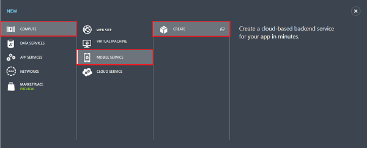

<properties
	pageTitle="Get Started with Azure Mobile Services for Android apps (JavaScript backend)"
	description="Follow this tutorial to get started using Azure Mobile Services for Android development (JavaScript backend)."
	services="mobile-services"
	documentationCenter="android"
	authors="RickSaling"
	manager="reikre"
	editor=""/>

<tags
	ms.service="mobile-services"
	ms.workload="mobile"
	ms.tgt_pltfrm="mobile-android"
	ms.devlang="java"
	ms.topic="hero-article"
	ms.date="07/21/2016"
	ms.author="ricksal"/>

# Get started with Mobile Services for Android  (JavaScript backend)

> [AZURE.SELECTOR-LIST (Platform | Backend )]
- [(iOS | .NET)](../articles/mobile-services-dotnet-backend-ios-get-started.md)
- [(iOS | JavaScript)](../articles/mobile-services-ios-get-started.md)
- [(Windows Runtime 8.1 universal C# | .NET)](../articles/mobile-services-dotnet-backend-windows-store-dotnet-get-started.md)
- [(Windows Runtime 8.1 universal C# | Javascript)](../articles/mobile-services-javascript-backend-windows-store-dotnet-get-started.md)
- [(Windows Runtime 8.1 universal JavaScript | Javascript)](../articles/mobile-services-javascript-backend-windows-store-javascript-get-started.md)
- [(Android | .NET)](../articles/mobile-services-dotnet-backend-android-get-started.md)
- [(Android | Javascript)](../articles/mobile-services-android-get-started.md)
- [(Xamarin.iOS | .NET)](../articles/mobile-services-dotnet-backend-xamarin-ios-get-started.md)
- [(Xamarin.iOS | Javascript)](../articles/partner-xamarin-mobile-services-ios-get-started.md)
- [(Xamarin.Android | .NET)](../articles/mobile-services-dotnet-backend-xamarin-android-get-started.md)
- [(Xamarin.Android | Javascript)](../articles/partner-xamarin-mobile-services-android-get-started.md)
- [(HTML | Javascript)](../articles/mobile-services-html-get-started.md)
- [(PhoneGap | Javascript)](../articles/mobile-services-javascript-backend-phonegap-get-started.md)
- [(Sencha | Javascript)](../articles/partner-sencha-mobile-services-get-started.md)

&nbsp;

>[AZURE.WARNING] This is an **Azure Mobile Services** topic.  This service has been superseded by Azure App Service Mobile Apps and is scheduled for removal from Azure.  We recommend using Azure Mobile Apps for all new mobile backend deployments.  Read [this announcement](https://azure.microsoft.com/blog/transition-of-azure-mobile-services/) to learn more about the pending deprecation of this service.  
> 
> Learn about [migrating your site to Azure App Service](../articles/app-service-mobile/app-service-mobile-migrating-from-mobile-services.md).
>
> Get started with Azure Mobile Apps, see the [Azure Mobile Apps documentation center](https://azure.microsoft.com/documentation/learning-paths/appservice-mobileapps/).
> For the equivalent Mobile Apps version of this topic, see [Create an Android app in Azure Mobile Apps](../app-service-mobile/app-service-mobile-android-get-started.md).

This tutorial shows you how to add a cloud-based backend service to an Android app using Azure Mobile Services. In this tutorial, you will create both a new mobile service and a simple **To do list** app that stores app data in the new mobile service.

> [AZURE.VIDEO mobile-get-started-android]

A screenshot from the completed app is below:

## Prerequisites

Completing this tutorial requires the [Android Developer Tools](https://developer.android.com/sdk/index.html), which includes the Android Studio integrated development environment, and the latest Android platform. Android 4.2 or a later version is required.

The downloaded quickstart project contains the Azure Mobile Services SDK for Android.

> [AZURE.IMPORTANT] To complete this tutorial, you need an Azure account. If you don't have an account, you can create a free trial account in just a couple of minutes. For details, see [Azure Free Trial](https://azure.microsoft.com/pricing/free-trial/?WT.mc_id=AE564AB28).

## Create a new mobile service

Follow these steps to create a new mobile service.

1.	Log into the [Azure classic portal](https://manage.windowsazure.com/). At the bottom of the navigation pane, click **+NEW**. Expand **Compute** and **Mobile Service**, then click **Create**.

	

	This displays the **Create a Mobile Service** dialog.

2.	In the **Create a Mobile Service** dialog, select **Create a free 20 MB SQL Database**, select **JavaScript** runtime, then type a subdomain name for the new mobile service in the **URL** textbox. Click the right arrow button to go to the next page.

	

	This displays the **Specify database settings** page.
	
	>[AZURE.NOTE]As part of this tutorial, you create a new SQL Database instance and server. You can reuse this new database and administer it as you would any other SQL Database instance. If you already have a database in the same region as the new mobile service, you can instead choose **Use existing Database** and then select that database. The use of a database in a different region is not recommended because of additional bandwidth costs and higher latencies.

3.	In **Name**, type the name of the new database, then type **Login name**, which is the administrator login name for the new SQL Database server, type and confirm the password, and click the check button to complete the process.
	

You have now created a new mobile service that can be used by your mobile apps.

## Create a new Android app

Once you have created your mobile service, you can follow an easy quickstart in the Azure classic portal to either create a new app or modify an existing app to connect to your mobile service.

In this section you will create a new Android app that is connected to your mobile service.

1.  In the Azure classic portal, click **Mobile Services**, and then click the mobile service that you just created.

2. In the quickstart tab, click **Android** under **Choose platform** and expand **Create a new Android app**.

   	

   	This displays the three easy steps to create an Android app connected to your mobile service.

  	

3. If you haven't already done so, download and install the [Android Developer Tools](https://go.microsoft.com/fwLink/p/?LinkID=280125) on your local computer or virtual machine.

4. Click **Create TodoItem table** to create a table to store app data.

5. Now download your app by pressing the **Download** button.

## Run your Android app

[AZURE.INCLUDE [mobile-services-run-your-app](../../includes/mobile-services-android-get-started.md)]

## Next Steps
Now that you have completed the quickstart, learn how to perform additional important tasks in Mobile Services:

* [Get started with data]
   Learn more about storing and querying data using Mobile Services.

* [Get started with authentication]
   Learn how to authenticate users of your app with an identity provider.

* [Get started with push notifications]
   Learn how to send a very basic push notification to your app.

[AZURE.INCLUDE [app-service-disqus-feedback-slug](../../includes/app-service-disqus-feedback-slug.md)]

<!-- URLs. -->
[Get started (Eclipse)]: mobile-services-android-get-started-ec.md
[Get started with data]: mobile-services-android-get-started-data.md
[Get started with authentication]: mobile-services-android-get-started-users.md
[Get started with push notifications]: mobile-services-javascript-backend-android-get-started-push.md
[Mobile Services Android SDK]: https://go.microsoft.com/fwLink/p/?LinkID=266533

