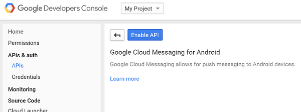
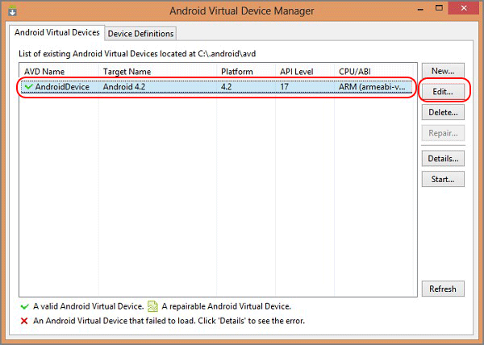

<properties
	pageTitle="Get started with push (Android) | Microsoft Azure"
	description="Learn how to use Azure Mobile Services to send push notifications to your Android .Net app."
	services="mobile-services, notification-hubs"
	documentationCenter="android"
	authors="RickSaling"
	manager="dwrede"
	editor=""/>

<tags
	ms.service="mobile-services"
	ms.workload="mobile"
	ms.tgt_pltfrm="mobile-android"
	ms.devlang="java"
	ms.topic="article"
	ms.date="07/21/2016"
	ms.author="ricksal"/>

# Add push notifications to your Mobile Services app
>[AZURE.WARNING] This is an **Azure Mobile Services** topic.  This service has been superseded by Azure App Service Mobile Apps and is scheduled for removal from Azure.  We recommend using Azure Mobile Apps for all new mobile backend deployments.  Read [this announcement](https://azure.microsoft.com/blog/transition-of-azure-mobile-services/) to learn more about the pending deprecation of this service.  
> 
> Learn about [migrating your site to Azure App Service](../articles/app-service-mobile/app-service-mobile-migrating-from-mobile-services.md).
>
> Get started with Azure Mobile Apps, see the [Azure Mobile Apps documentation center](https://azure.microsoft.com/documentation/learning-paths/appservice-mobileapps/).
> For the equivalent Mobile Apps version of this topic, see [Add push notifications to your Android app](../app-service-mobile/app-service-mobile-android-get-started-push.md).
 
&nbsp;

> [AZURE.SELECTOR-LIST (Platform | Backend )]
- [(iOS | .NET)](../articles/mobile-services-dotnet-backend-ios-get-started-push.md)
- [(iOS | JavaScript)](../articles/mobile-services-javascript-backend-ios-get-started-push.md)
- [(Windows Runtime 8.1 universal C# | .NET)](../articles/mobile-services-dotnet-backend-windows-universal-dotnet-get-started-push.md)
- [(Windows Runtime 8.1 universal C# | Javascript)](../articles/mobile-services-javascript-backend-windows-universal-dotnet-get-started-push.md)
- [(Windows Phone Silverlight 8.x | Javascript)](../articles/mobile-services-javascript-backend-windows-phone-get-started-push.md)
- [(Android | .NET)](../articles/mobile-services-dotnet-backend-android-get-started-push.md)
- [(Android | Javascript)](../articles/mobile-services-javascript-backend-android-get-started-push.md)
- [(Xamarin.iOS | Javascript)](../articles/partner-xamarin-mobile-services-ios-get-started-push.md)
- [(Xamarin.Android | Javascript)](../articles/partner-xamarin-mobile-services-android-get-started-push.md)
- [(Xamarin.Android | .NET)](../articles/mobile-services-dotnet-backend-xamarin-android-get-started-push.md)
- [(Xamarin.Forms | JavaScript)](../articles/partner-xamarin-mobile-services-xamarin-forms-get-started-push.md)

This topic shows how to use Azure Mobile Services to send push notifications to your Android app. In this tutorial you add push notifications using Google Cloud Messaging (GCM) to the quickstart project. When complete, your mobile service will send a push notification each time a record is inserted.

This tutorial is based on the Mobile Services quickstart. Before you start this tutorial, you must first complete [Get started with Mobile Services] to connect your project to the mobile service. As such, this tutorial also requires Visual Studio 2013.

## Sample code
To see the completed source code go [here](https://github.com/RickSaling/mobile-services-samples/tree/push/GettingStartedWithPush).

## Enable Google Cloud Messaging

1. Navigate to the [Google Cloud Console](https://console.developers.google.com/project), sign in with your Google account credentials. 
 
2. Click **Create Project**, type a project name, then click **Create**. If requested, carry out the SMS Verification, and click **Create** again.

   	   

	 Type in your new **Project name** and click **Create project**.

3. Click the **Utilities and More** button and then click **Project Information**. Make a note of the **Project Number**. You will need to set this value as the `SenderId` variable in the client app.

   	

4. In the project dashboard, under **Mobile APIs**, click **Google Cloud Messaging**, then on the next page click **Enable API** and accept the terms of service. 

	

	 

5. In the project dashboard, Click **Credentials** > **Create Credential** > **API Key**. 

   	

6. In **Create a new key**, click **Server key**, type a name for your key, then click **Create**.

7. Make a note of the **API KEY** value.

	You will use this API key value to enable Azure to authenticate with GCM and send push notifications on behalf of your app.

## Configure your mobile service to send push requests

1. Log on to the [Azure classic portal](https://manage.windowsazure.com/), click **Mobile Services**, and then click your app.

2. Click the **Push** tab, enter the **API Key** value obtained from GCM in the previous procedure, then click **Save**.

   	

    >[AZURE.NOTE]When you set your GCM credentials for enhanced push notifications in the Push tab in the portal, they are shared with Notification Hubs to configure the notification hub with your app.

Both your mobile service and your app are now configured to work with GCM and Notification Hubs. 

## Update the mobile service to send push notifications

[AZURE.INCLUDE [mobile-services-dotnet-backend-android-push-update-service](../../includes/mobile-services-dotnet-backend-android-push-update-service.md)]

## Add push notifications to your app

###Verify Android SDK Version

[AZURE.INCLUDE [mobile-services-verify-android-sdk-version](../../includes/mobile-services-verify-android-sdk-version.md)]

Your next step is to install Google Play services. Google Cloud Messaging has some minimum API level requirements for development and testing, which the **minSdkVersion** property in the Manifest must conform to.

If you will be testing with an older device, then consult [Set Up Google Play Services SDK] to determine how low you can set this value, and set it appropriately.

###Add Google Play Services to the project

[AZURE.INCLUDE [Add Play Services](../../includes/mobile-services-add-google-play-services.md)]

###Add code

[AZURE.INCLUDE [mobile-services-android-getting-started-with-push](../../includes/mobile-services-android-getting-started-with-push.md)]

## Test the app against the published mobile service

You can test the app by directly attaching an Android phone with a USB cable, or by using a virtual device in the emulator.

### Enable push notifications for local testing

[AZURE.INCLUDE [mobile-services-dotnet-backend-configure-local-push](../../includes/mobile-services-dotnet-backend-configure-local-push.md)]

4. Create a new class in the project called `ToDoBroadcastReceiver`.

5. Add the following using statements to **ToDoBroadcastReceiver** class:

		using Gcm.Client;
		using Microsoft.WindowsAzure.MobileServices;

6. Add the following permission requests between the **using** statements and the **namespace** declaration:

		[assembly: Permission(Name = "@PACKAGE_NAME@.permission.C2D_MESSAGE")]
		[assembly: UsesPermission(Name = "@PACKAGE_NAME@.permission.C2D_MESSAGE")]
		[assembly: UsesPermission(Name = "com.google.android.c2dm.permission.RECEIVE")]

		//GET_ACCOUNTS is only needed for android versions 4.0.3 and below
		[assembly: UsesPermission(Name = "android.permission.GET_ACCOUNTS")]
		[assembly: UsesPermission(Name = "android.permission.INTERNET")]
		[assembly: UsesPermission(Name = "android.permission.WAKE_LOCK")]

7. Replace the existing **ToDoBroadcastReceiver** class definition with the following:
 
	    [BroadcastReceiver(Permission = Gcm.Client.Constants.PERMISSION_GCM_INTENTS)]
	    [IntentFilter(new string[] { Gcm.Client.Constants.INTENT_FROM_GCM_MESSAGE }, 
	        Categories = new string[] { "@PACKAGE_NAME@" })]
	    [IntentFilter(new string[] { Gcm.Client.Constants.INTENT_FROM_GCM_REGISTRATION_CALLBACK }, 
	        Categories = new string[] { "@PACKAGE_NAME@" })]
	    [IntentFilter(new string[] { Gcm.Client.Constants.INTENT_FROM_GCM_LIBRARY_RETRY }, 
        Categories = new string[] { "@PACKAGE_NAME@" })]
        public class ToDoBroadcastReceiver : GcmBroadcastReceiverBase<PushHandlerService>
        {
	        // Set the Google app ID.
	        public static string[] senderIDs = new string[] { "<PROJECT_NUMBER>" };
        }

	In the above code, you must replace _`<PROJECT_NUMBER>`_ with the project number assigned by Google when you provisioned your app in the Google developer portal. 

8. In the ToDoBroadcastReceiver.cs project file, add the following code that defines the **PushHandlerService** class:
 
		// The ServiceAttribute must be applied to the class.
    	[Service] 
    	public class PushHandlerService : GcmServiceBase
    	{
        	public static string RegistrationID { get; private set; }

###Setting up the Android emulator for testing
When you run this app in the emulator, make sure that you use an Android Virtual Device (AVD) that supports Google APIs.

> [AZURE.IMPORTANT] In order to receive push notifications, you must set up a Google account on your Android Virtual Device (in the emulator, navigate to **Settings** and click **Add Account**). Also, make sure that the emulator is connected to the Internet.

1. From **Tools**, click **Open Android Emulator Manager**, select your device, and then click **Edit**.

   	

2. Select **Google APIs** in **Target**, then click **OK**.

   	

3. On the top toolbar, click **Run**, and then select your app. This starts the emulator and runs the app.

  The app retrieves the *registrationId* from GCM and registers with the Notification Hub.

###Inserting a new item generates a notification.

1. In the app, type meaningful text, such as _A new Mobile Services task_ and then click the **Add** button.

2. Swipe down from the top of the screen to open the device's Notification Center to see the notification.

	

You have successfully completed this tutorial.

## Next steps

This tutorial demonstrated the basics of enabling an Android app to use Mobile Services and Notification Hubs to send push notifications. Next, consider completing the next tutorial, [Send push notifications to authenticated users], which shows how to use tags to send push notifications from your mobile service to only an authenticated user.

+ [Send broadcast notifications to subscribers]
	 Learn how users can register and receive push notifications for categories they're interested in.

+ [Send template-based notifications to subscribers]
	 Learn how to use templates to send push notifications from a Mobile Service, without having to craft platform-specific payloads in your back-end.

Learn more about Mobile Services and Notification Hubs in the following topics:

* [What are Notification Hubs?]
   Learn more about how Notification Hubs works to deliver notifications to your apps across all major client platforms.

* [Debug Notification Hubs applications](http://go.microsoft.com/fwlink/p/?linkid=386630)
   Get guidance troubleshooting and debugging Notification Hubs solutions.

* [How to use the Android client library for Mobile Services]
   Learn more about how to use Mobile Services with Android.

<!-- Anchors. -->

[Create a new mobile service]: #create-service
[Download the service locally]: #download-the-service-locally
[Test the mobile service]: #test-the-service
[Download the GetStartedWithData project]: #download-app
[Update the app to use the mobile service for data access]: #update-app
[Test the Android App against the service hosted locally]: #test-locally-hosted
[Publish the mobile service to Azure]: #publish-mobile-service
[Test the Android App against the service hosted in Azure]: #test-azure-hosted
[Test the app against the published mobile service]: #test-app
[Next Steps]:#next-steps

<!-- Images. -->

<!-- URLs. -->
[Get started with push notifications (Eclipse)]: mobile-services-dotnet-backend-android-get-started-push-ec.md
[Get started with Mobile Services]: mobile-services-dotnet-backend-android-get-started.md
[Mobile Services SDK]: http://go.microsoft.com/fwlink/p/?LinkId=257545

[How to use the Android client library for Mobile Services]: mobile-services-android-how-to-use-client-library.md

[What are Notification Hubs?]: ../notification-hubs-overview.md
[Send broadcast notifications to subscribers]: ../notification-hubs-windows-store-dotnet-send-breaking-news.md
[Send template-based notifications to subscribers]: ../notification-hubs-windows-store-dotnet-send-localized-breaking-news.md
