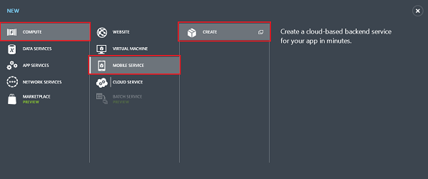
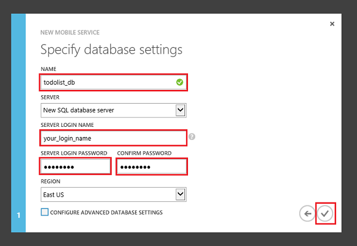
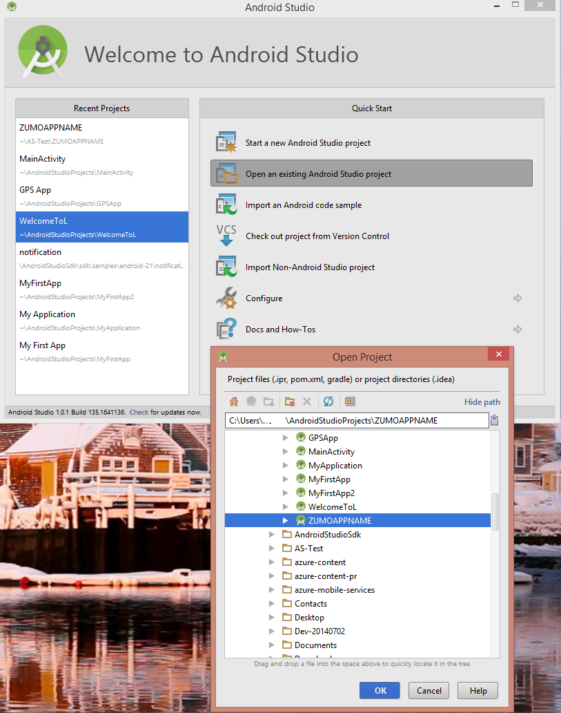

<properties
	pageTitle="Get Started with Azure Mobile Services for Android apps"
	description="Follow this tutorial to get started using Azure Mobile Services for Android development."
	services="mobile-services"
	documentationCenter="android"
	authors="RickSaling"
	manager="erikre"
	editor=""/>

<tags
	ms.service="mobile-services"
	ms.workload="mobile"
	ms.tgt_pltfrm="mobile-android"
	ms.devlang="java"
	ms.topic="get-started-article"
	ms.date="07/21/2016"
	ms.author="ricksal"/>

# Get started with Mobile Services

> [AZURE.SELECTOR-LIST (Platform | Backend )]
- [(iOS | .NET)](mobile-services-dotnet-backend-ios-get-started.md)
- [(iOS | JavaScript)](mobile-services-ios-get-started.md)
- [(Windows Runtime 8.1 universal C# | .NET)](mobile-services-dotnet-backend-windows-store-dotnet-get-started.md)
- [(Windows Runtime 8.1 universal C# | Javascript)](mobile-services-javascript-backend-windows-store-dotnet-get-started.md)
- [(Windows Runtime 8.1 universal JavaScript | Javascript)](mobile-services-javascript-backend-windows-store-javascript-get-started.md)
- [(Android | .NET)](mobile-services-dotnet-backend-android-get-started.md)
- [(Android | Javascript)](mobile-services-android-get-started.md)
- [(Xamarin.iOS | .NET)](mobile-services-dotnet-backend-xamarin-ios-get-started.md)
- [(Xamarin.iOS | Javascript)](partner-xamarin-mobile-services-ios-get-started.md)
- [(Xamarin.Android | .NET)](mobile-services-dotnet-backend-xamarin-android-get-started.md)
- [(Xamarin.Android | Javascript)](partner-xamarin-mobile-services-android-get-started.md)
- [(HTML | Javascript)](mobile-services-html-get-started.md)
- [(PhoneGap | Javascript)](mobile-services-javascript-backend-phonegap-get-started.md)
- [(Sencha | Javascript)](partner-sencha-mobile-services-get-started.md)

&nbsp;

>[AZURE.WARNING] This is an **Azure Mobile Services** topic.  This service has been superseded by Azure App Service Mobile Apps and is scheduled for removal from Azure.  We recommend using Azure Mobile Apps for all new mobile backend deployments.  Read [this announcement](https://azure.microsoft.com/blog/transition-of-azure-mobile-services/) to learn more about the pending deprecation of this service.  
>
> Learn about [migrating your site to Azure App Service](https://azure.microsoft.com/en-us/documentation/articles/app-service-mobile-migrating-from-mobile-services/).
>
> Get started with Azure Mobile Apps, see the [Azure Mobile Apps documentation center](https://azure.microsoft.com/documentation/learning-paths/appservice-mobileapps/).

This tutorial shows you how to add a cloud-based backend service to an Android app using Azure Mobile Services. In this tutorial, you will create both a new mobile service and a simple _To do list_ app that stores app data in the new mobile service. The mobile service that you will create uses the supported .NET languages using Visual Studio for server-side business logic and to manage the mobile service. To create a mobile service that lets you write your server-side business logic in JavaScript, see the [JavaScript backend version](mobile-services-android-get-started.md) of this topic.

A screenshot from the completed app is below:

Completing this tutorial requires the [Android Developer Tools][Android Studio], which includes the Android Studio integrated development environment, and the latest Android platform. Android 4.2 or a later version is required.

The downloaded quickstart project contains the Mobile Services SDK for Android.

> [AZURE.IMPORTANT] To complete this tutorial, you need an Azure account. If you don't have an account, you can sign up for an Azure trial and get up to 10 free mobile services that you can keep using even after your trial ends. For details, see [Azure Free Trial](https://azure.microsoft.com/pricing/free-trial/?WT.mc_id=AE564AB28).

## Create a new mobile service

Follow these steps to create a new mobile service.

1.	Log into the [Azure classic portal](https://manage.windowsazure.com/). At the bottom of the navigation pane, click **+NEW**. Expand **Compute** and **Mobile Service**, then click **Create**.

	

	This displays the **Create a Mobile Service** dialog.

2.	In the **Create a Mobile Service** page, select **Create a free 20 MB SQL Database**, select **.NET** runtime, then type a subdomain name for the new mobile service in the **URL** textbox. Click the right arrow button to go to the next page.

	

	This displays the **Specify database settings** page.

	> [AZURE.NOTE] As part of this tutorial, you create a new SQL Database instance and server. You can reuse this new database and administer it as you would any other SQL Database instance. If you already have a database in the same region as the new mobile service, you can instead choose **Use existing Database** and then select that database. The use of a database in a different region is not recommended because of additional bandwidth costs and higher latencies.

3.	In **Name**, type the name of the new database, then type **Login name**, which is the administrator login name for the new SQL Database server, type and confirm the password, and click the check button to complete the process.
	

You have now created a new mobile service that can be used by your mobile apps.

## Download the mobile service to your local computer

Now that you have created the mobile service, download your personalized mobile service project that you can run on your local computer or virtual machine.

1. Click the mobile service that you just created, then in the quickstart tab, click **Android** under **Choose platform** and expand **Create a new Android app**.

	![][1]

2. If you haven't already done so, download and install [Visual Studio Professional 2013](https://go.microsoft.com/fwLink/p/?LinkID=391934), or a later version.

3. In Step 2, click **Download** under **Download and publish your service to the cloud**.

	This downloads the Visual Studio project that implements your mobile service. Save the compressed project file to your local computer, and make a note of where you saved it.

## Test the mobile service

The mobile service project lets you run your new mobile service locally. This makes it easy to debug your service code before you even publish it to Azure.

1. On your Windows PC, download your personalized server project, extract it, and then open it in Visual Studio.

2. Press the **F5** key to rebuild the project and start the mobile service locally. A web page is displayed after the mobile service starts successfully.

## Publish your mobile service

1. In Visual Studio, right-click the project, click **Publish** > **Microsoft Azure Mobile Services**. Instead of using Visual Studio, [you may also use Git](./
mobile-services-dotnet-backend-store-code-source-control.md).

2. Sign in with Azure credentials and select your service from **Existing Mobile Services**. Visual Studio downloads your publish settings directly from Azure. Finally, click **Publish**.

## Create a new Android app

In this section you will create a new Android app that is connected to your mobile service.

1. In the [Azure classic portal], click **Mobile Services**, and then click the mobile service that you just created.

2. In the quickstart tab, click **Android** under **Choose platform** and expand **Create a new Android app**.

	![][2]

3. If you haven't already done so, download and install the [Android Developer Tools][Android SDK] on your local computer or virtual machine.

4. Under **Download and run your app**, click **Download**.

  	This downloads the project for the sample _To do list_ application that is connected to your mobile service. Save the compressed project file to your local computer, and make a note of where you save it.

## Run your Android app

The final stage of this tutorial is to build and run your new app.

### Load project into Android Studio and sync Gradle

1. Browse to the location where you saved the compressed project files and expand the files on your computer into your Android Studio projects directory.

2. Open Android Studio. If you are working with a project and it appears, close the project (File => Close Project).

3. Select **Open an existing Android Studio project**, browse to the project location, and then click **OK.** This will load the project and start to sync it with Gradle.

 	

4. Wait for the Gradle sync activity to complete. If you see a "failed to find target" error, this is because the version used in Android Studio doesn't match that of the sample. The easiest way to fix this is to click the **Install missing platform(s) and sync project** link in the error message. You might get additional version error messages, and you simply repeat this process until no errors appear.
    - There is another way to fix this if you want to run with the "latest and greatest" version of Android. You can update the **targetSdkVersion** in the *build.gradle* file in the *app* directory to match the version already installed on your machine, which you can discover by clicking the **SDK Manager** icon and seeing what version is listed. Next you press the **Sync Project with Gradle Files**. You may get an error message for the version of Build Tools, and you fix that the same way.

### Running the app

You can run the app using the emulator, or using an actual device.

1. To run from a device, connect it to your computer with a USB cable. You must [set up the device for development](https://developer.android.com/training/basics/firstapp/running-app.html). If you are developing on a Windows machine, you must also download and install a USB driver.

2. To run using the Android emulator, you must define at least one Android Virtual Device (AVD). Click the AVD Manager icon to create and manage these devices.

3. From the **Run** menu, click **Run** to start the project. and choose a device or emulator from the dialog box that appears.

4. When the app appears, type meaningful text, such as _Complete the tutorial_, and then click **Add**.

   	

   	This sends a POST request to the new mobile service hosted in Azure. Data from the request is inserted into the TodoItem table. Items stored in the table are returned by the mobile service, and the data is displayed in the list.

	> [AZURE.NOTE] You can review the code that accesses your mobile service to query and insert data, which is found in the ToDoActivity.java file.

8. Back in the Azure classic portal, click the **Data** tab and then click the **TodoItems** table.

   	

   	This lets you browse the data inserted by the app into the table.

   	

## Next Steps
Now that you have completed the quickstart, learn how to perform additional important tasks in Mobile Services:

* [Add push notifications to your app]
   Learn how to send a very basic push notification to your app.

* [Add authentication to your app]
   Learn how to restrict access to your backend data to specific registered users of your app.

* [Troubleshoot a Mobile Services .NET backend]
    Learn how to diagnose and fix issues that can arise with a Mobile Services .NET backend.

<!-- Anchors. -->
[Getting started with Mobile Services]:#getting-started
[Create a new mobile service]:#create-new-service
[Define the mobile service instance]:#define-mobile-service-instance
[Next Steps]:#next-steps

<!-- Images. -->
[0]: ./media/mobile-services-dotnet-backend-android-get-started/mobile-quickstart-completed-android.png
[1]: ./media/mobile-services-dotnet-backend-android-get-started/mobile-quickstart-steps-vs-AS.png
[2]: ./media/mobile-services-dotnet-backend-android-get-started/mobile-quickstart-steps-android-AS.png

[6]: ./media/mobile-services-dotnet-backend-android-get-started/mobile-portal-quickstart-android.png
[7]: ./media/mobile-services-dotnet-backend-android-get-started/mobile-quickstart-steps-android.png
[8]: ./media/mobile-services-dotnet-backend-android-get-started/mobile-eclipse-quickstart.png

[10]: ./media/mobile-services-dotnet-backend-android-get-started/mobile-quickstart-startup-android.png
[11]: ./media/mobile-services-dotnet-backend-android-get-started/mobile-data-tab.png
[12]: ./media/mobile-services-dotnet-backend-android-get-started/mobile-data-browse.png

[14]: ./media/mobile-services-dotnet-backend-android-get-started/mobile-services-import-android-workspace.png
[15]: ./media/mobile-services-dotnet-backend-android-get-started/mobile-services-import-android-project.png

<!-- URLs. -->
[Get started (Eclipse)]: mobile-services-dotnet-backend-android-get-started-ec.md
[Add push notifications to your app]: mobile-services-dotnet-backend-android-get-started-push.md
[Add authentication to your app]: mobile-services-dotnet-backend-android-get-started-auth.md
[Android SDK]: https://go.microsoft.com/fwLink/p/?LinkID=280125
[Android Studio]: https://developer.android.com/sdk/index.html
[Mobile Services Android SDK]: https://go.microsoft.com/fwLink/p/?LinkID=266533
[Troubleshoot a Mobile Services .NET backend]: mobile-services-dotnet-backend-how-to-troubleshoot.md

[Azure classic portal]: https://manage.windowsazure.com/
