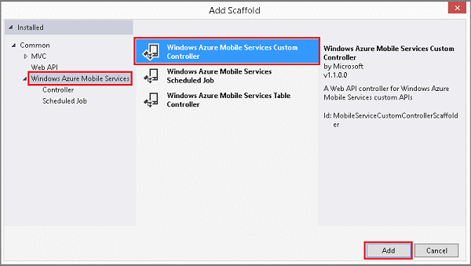

<properties
	pageTitle="How to define a custom API in a .NET backend mobile service | Azure Mobile Services"
	description="Learn how to define a custom API endpoint in a .NET backend mobile service."
	services="mobile-services"
	documentationCenter=""
	authors="ggailey777"
	manager="erikre"
	editor=""/>

<tags
	ms.service="mobile-services"
	ms.workload="mobile"
	ms.tgt_pltfrm="mobile-multiple"
	ms.devlang="dotnet"
	ms.topic="article"
	ms.date="07/21/2016"
	ms.author="glenga"/>

# How to: define a custom API endpoint in a .NET backend mobile service
> [AZURE.SELECTOR]
- [JavaScript backend](./mobile-services-javascript-backend-define-custom-api.md)
- [.NET backend](./mobile-services-dotnet-backend-define-custom-api.md)

&nbsp;

>[AZURE.WARNING] This is an **Azure Mobile Services** topic.  This service has been superseded by Azure App Service Mobile Apps and is scheduled for removal from Azure.  We recommend using Azure Mobile Apps for all new mobile backend deployments.  Read [this announcement](https://azure.microsoft.com/blog/transition-of-azure-mobile-services/) to learn more about the pending deprecation of this service.  
> 
> Learn about [migrating your site to Azure App Service](../articles/app-service-mobile/app-service-mobile-migrating-from-mobile-services.md).
>
> Get started with Azure Mobile Apps, see the [Azure Mobile Apps documentation center](https://azure.microsoft.com/documentation/learning-paths/appservice-mobileapps/).
> For the equivalent Mobile Apps version of this topic, see [How to: Define a custom API controller](../app-service-mobile/app-service-mobile-dotnet-backend-how-to-use-server-sdk.md#how-to-define-a-custom-api-controller).

This topic shows you how to define a custom API endpoint in a .NET backend mobile service. A custom API lets you define custom endpoints with server functionality, but it does not map to a database insert, update, delete, or read operation. By using a custom API, you have more control over messaging, including HTTP headers and body format.

1. In Visual Studio, right-click the Controllers folder, expand **Add**, then click **New Scaffolded Item**. This displays the Add Scaffold dialog.

2. Expand **Azure Mobile Services**, click **Azure Mobile Services Custom Controller**,  click **Add**, supply a **Controller name** of `CompleteAllController`, and click **Add** again.

	

	This creates a new empty controller class named **CompleteAllController**.

	>[AZURE.NOTE]If your dialog doesn't have Mobile Services-specific scaffolds, instead create a new **Web API Controller - Empty**. In this new controller class, add a public **Services** property, which returns the **ApiServices** type. This property is used to access server-specific settings from inside your controller.

3. In **CompleteAllController.cs**, add the following **using** statements. 	Replace `todolistService` with the namespace of your mobile service project, which should be the mobile service name appended with `Service`.

		using System.Threading.Tasks;
		using todolistService.Models;

4. In **CompleteAllController.cs**, add the following class to wrap the response sent to the client.

        // We use this class to keep parity with other Mobile Services
        // that use the JavaScript backend. This way the same client
        // code can call either type of Mobile Service backend.
        public class MarkAllResult
        {
            public int count;
        }

5. Add the following code to the new controller. Replace `todolistContext` with the name of the DbContext for your data model, which should be the mobile service name appended with `Context`. Similarly, replace the schema name in the UPDATE statement with the name of your mobile service. This code uses the [Database Class](http://msdn.microsoft.com/library/system.data.entity.database.aspx) to access the **TodoItems** table directly to set the completed flag on all items. This method supports a POST request, and the number of changed rows is returned to the client as an integer value.

	    // POST api/completeall
        public async Task<MarkAllResult> Post()
        {
            using (todolistContext context = new todolistContext())
            {
                // Get the database from the context.
                var database = context.Database;

                // Create a SQL statement that sets all uncompleted items
                // to complete and execute the statement asynchronously.
                var sql = @"UPDATE todolist.TodoItems SET Complete = 1 " +
                            @"WHERE Complete = 0; SELECT @@ROWCOUNT as count";

                var result = new MarkAllResult();
                result.count = await database.ExecuteSqlCommandAsync(sql);

                // Log the result.
                Services.Log.Info(string.Format("{0} items set to 'complete'.",
                    result.count.ToString()));

                return result;
            }
        }

	> [AZURE.TIP] With default permissions, anyone with the app key may call the custom API. However, the application key is not considered a secure credential because it may not be distributed or stored securely. Consider restricting access to only authenticated users for additional security.

For information on how to invoke a custom API in your app using a Mobile Services client library, see [Call a custom API](mobile-services-windows-dotnet-how-to-use-client-library.md#custom-api) in the client SDK reference.

<!-- Anchors. -->

<!-- Images. -->

<!-- URLs. -->

