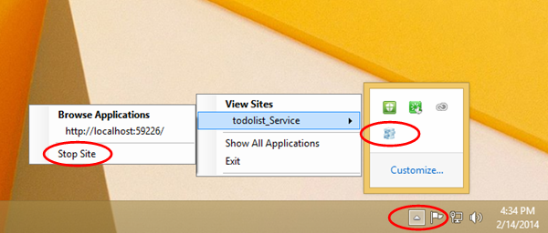
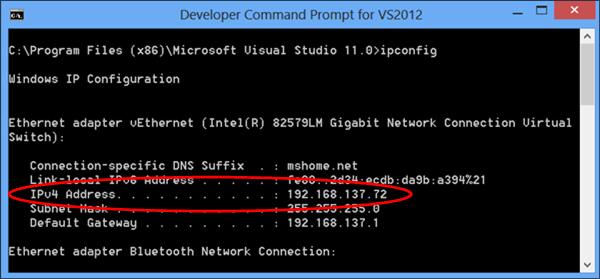

<properties
	pageTitle="Configure IIS Express for local mobile service testing | Azure Mobile Services"
	description="Learn how to configure IIS Express to allow connections to a local mobile service project for testing."
	authors="ggailey777"
	manager="dwrede"
	services="mobile-services"
	documentationCenter=""
	editor=""/>

<tags
	ms.service="mobile-services"
	ms.workload="mobile"
	ms.tgt_pltfrm="na"
	ms.devlang="multiple"
	ms.topic="article"
	ms.date="07/21/2016"
	ms.author="glenga"/>

# Configure the local web server to allow connections to a local mobile service

>[AZURE.WARNING] This is an **Azure Mobile Services** topic.  This service has been superseded by Azure App Service Mobile Apps and is scheduled for removal from Azure.  We recommend using Azure Mobile Apps for all new mobile backend deployments.  Read [this announcement](https://azure.microsoft.com/blog/transition-of-azure-mobile-services/) to learn more about the pending deprecation of this service.  
> 
> Learn about [migrating your site to Azure App Service](https://azure.microsoft.com/en-us/documentation/articles/app-service-mobile-migrating-from-mobile-services/).
>
> Get started with Azure Mobile Apps, see the [Azure Mobile Apps documentation center](https://azure.microsoft.com/documentation/learning-paths/appservice-mobileapps/).

&nbsp;

Azure Mobile Services enables you create your mobile service in Visual Studio using one of the supported .NET languages and then publish it to Azure. One of the major benefits of using a .NET backend for your mobile service is the ability to run, test, and debug the mobile service on your local computer or virtual machine before publishing it to Azure.

To be able to test a mobile service locally with clients running on an emulator, virtual machine or on a separate workstation, you have to configure the local Web server and host computer to allow connections to the workstation's IP address and port. This topic shows you how to configure IIS Express to enable connections to your locally hosted mobile service.

1. Make sure to stop the mobile service if it is currently running in IIS Express. Right click the IIS Express tray icon and click **stop** for the mobile service.

    

2. In a command prompt window, run the **ipconfig** command to look up a valid local IP address for your workstation.

    

3. In Visual Studio, open the applicationhost.config file for IIS Express. This file is located in the following subdirectory of your user profile directory.

        C:\Users\<your profile name>\Documents\IISExpress\config\applicationhost.config

4. Configure IIS Express to allow remote connection requests to the service. To do this, in the applicationhost.config file, find the site element for your mobile service and add a new `binding` element for the port using the IP address you noted above. Then save the applicationhost.config file. 

    Your updated site element should look similar to the following:

        <site name="todolist_Service(1)" id="2">
            <application path="/" applicationPool="Clr4IntegratedAppPool">
                <virtualDirectory path="/" physicalPath="C:\Archive\GetStartedDataWP8\C#\todolist_Service" />
            </application>
            <bindings>
                <binding protocol="http" bindingInformation="*:58203:localhost" />
                <binding protocol="http" bindingInformation="*:58203:192.168.137.72" />
            </bindings>
        </site>

5. Open the Windows Firewall console and create a new port rule to allow connections to the port. For more information on creating a new Windows Firewall port rule, see [How to add a new Windows Firewall port rule].

    >[AZURE.NOTE] If your test machine is joined to a domain, firewall exceptions may be controlled by a domain policy. In this case, you would need to contact your domain adminstrator to get an exemption for the port on your machine.

    You should now be configured to test with IIS Express hosting your mobile service. 

    >[AZURE.NOTE] Once you finish your testing of the service locally, you should delete the Windows Firewall rule you created. 

<!-- URLs. -->
[How to add a new Windows Firewall port rule]:  http://go.microsoft.com/fwlink/?LinkId=392240
