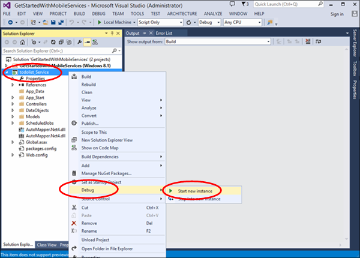
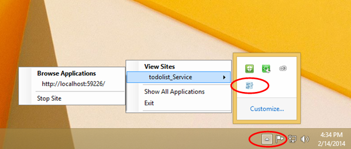
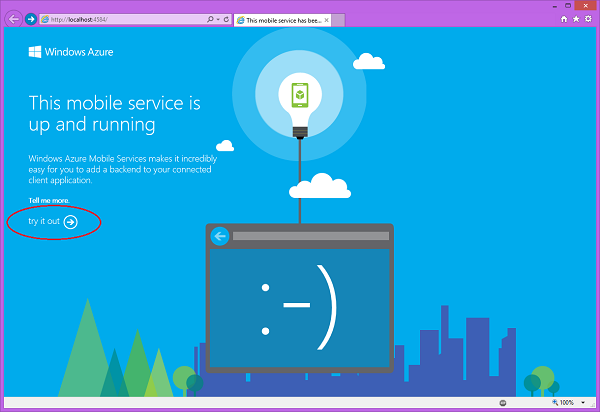
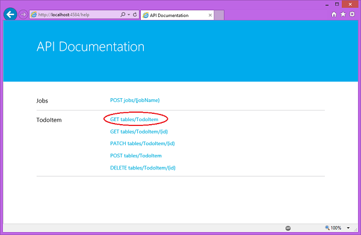
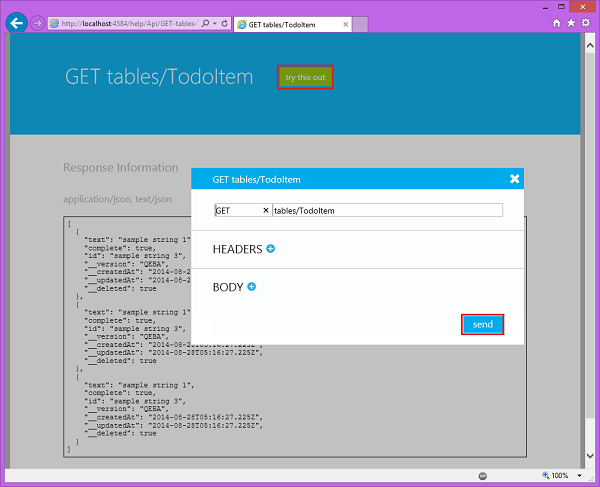
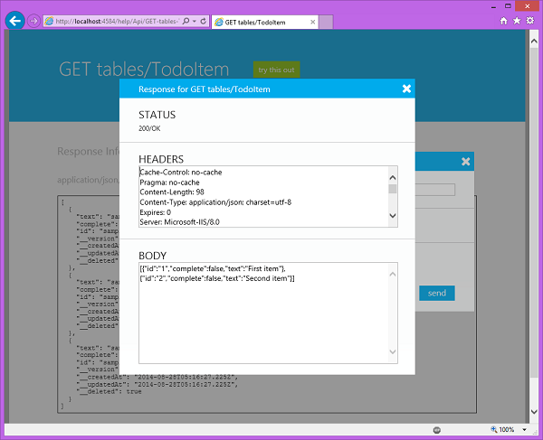
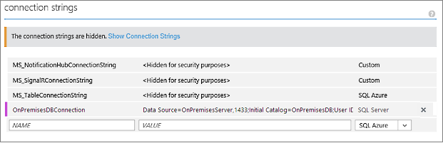

<properties
	pageTitle="Connect to an on-premises SQL Server from a .NET backend mobile service using Hybrid Connections |  Azure Mobile Services"
	description="Learn how to connect to an on-premises SQL Server from a .NET backend mobile service using Azure Hybrid Connections"
	services="mobile-services"
	documentationCenter=""
	authors="ggailey777"
	manager="dwrede"
	editor=""/>

<tags
	ms.service="mobile-services"
	ms.workload="mobile"
	ms.tgt_pltfrm="na"
	ms.devlang="multiple"
	ms.topic="article"
	ms.date="07/21/2016"
	ms.author="glenga"/>

# Connect to an on-premises SQL Server from Azure Mobile Services using Hybrid Connections

>[AZURE.WARNING] This is an **Azure Mobile Services** topic.  This service has been superseded by Azure App Service Mobile Apps and is scheduled for removal from Azure.  We recommend using Azure Mobile Apps for all new mobile backend deployments.  Read [this announcement](https://azure.microsoft.com/blog/transition-of-azure-mobile-services/) to learn more about the pending deprecation of this service.  
> 
> Learn about [migrating your site to Azure App Service](https://azure.microsoft.com/en-us/documentation/articles/app-service-mobile-migrating-from-mobile-services/).
>
> Get started with Azure Mobile Apps, see the [Azure Mobile Apps documentation center](https://azure.microsoft.com/documentation/learning-paths/appservice-mobileapps/).
> For the equivalent Mobile Apps version of this topic, see [Access on-premises resources using hybrid connections in Azure App Service](../app-service-web/web-sites-hybrid-connection-get-started.md).

When your enterprise transitions to the cloud, you might not be able to migrate all of your assets to Azure right away. Hybrid Connections lets Azure Mobile Services securely connect to your on-premises assets. In this way, you can make your on-premises data accessible to your mobile clients by using Azure. Supported assets include any resource that runs on a static TCP port, including Microsoft SQL Server, MySQL, HTTP Web APIs, and most custom web services. Hybrid Connections use Shared Access Signature (SAS) authorization to secure the connections from your mobile service and the on-premises Hybrid Connection Manager to the hybrid connection. For more information, see [Hybrid Connections Overview](../biztalk-services/integration-hybrid-connection-overview.md).

In this tutorial, you will learn how to modify a .NET backend mobile service to use a local on-premises SQL Server database instead of the default Azure SQL Database provisioned with your service. Hybrid Connections are also supported for a JavaScript backend mobile service, as described in [this article](http://blogs.msdn.com/b/azuremobile/archive/2014/05/12/connecting-to-an-external-database-with-node-js-backend-in-azure-mobile-services.aspx).

##Prerequisites##

This tutorial requires you to have the following:

- **An existing .NET backend mobile service**  Follow the tutorial [Get started with Mobile Services] to create and download a new .NET backend mobile service from the [Azure classic portal].

- **Visual Studio 2013**  This a requirement for using To download a free trial version of Visual Studio 2013, see [Visual Studio Downloads](http://www.visualstudio.com/downloads/download-visual-studio-vs). 

- **SQL Server 2014 Express with Tools**  Download Microsoft SQL Server Express for free at the [Microsoft SQL Server Express Edition page](http://www.microsoft.com/en-us/server-cloud/Products/sql-server-editions/sql-server-express.aspx). Choose the **Download SQL Server Express** and fill out your profile, choosing **SQL Server 2014 Express with Tools**, then click continue. This starts the download of the installer for both SQL Server Express and the SQL Server Express Management Tools. Save the installer package to your on-premises computer.

- **An on-premises computer**  You can run the Hybrid Connections Manger on the same on-premises computer as your SQL Server instance, or you can run each on a separate computer. The computer on which the Hybrid Connection Manager runs must meet the following criteria:

	- Be able to connect to Azure over port 5671.
	- Be able to access the *hostname*:*portnumber* of the computer running your SQL Server instance.  

	For more information see [Hybrid Connections Overview](../articles/integration-hybrid-connection-overview.md).

## Install SQL Server Express, enable TCP/IP, and create a SQL Server database on-premises

This section shows you how to install a SQL Server Express, enable TCP/IP, set a static port, and create a database that can be used with Hybrid Connections.  

###Install SQL Server Express

To use an on-premises SQL Server or SQL Server Express database with a hybrid connection, TCP/IP needs to be enabled on a static port. Default instances on SQL Server use static port 1433, whereas named instances do not. Because of this, we will install the default instance. If you already have the default instance of SQL Server Express installed, you can skip this section.

1. To install SQL Server Express, run the **SQLEXPRWT_x64_ENU.exe** or **SQLEXPR_x86_ENU.exe** file that you downloaded. The SQL Server Installation Center wizard appears.
	
2. Choose **New SQL Server stand-alone installation or add features to an existing installation**, follow the instructions, accepting the default choices and settings, until you get to the **Instance Configuration** page.
	
3. On the **Instance Configuration** page, choose **Default instance**, then accept the default settings on the **Server Configuration** page.

	>[AZURE.NOTE]If you already have a default instance of SQL Server installed, you can skip to the next section and use this instance with Hybrid Connections. 
	
5. On the **Database Engine Configuration** page, under **Authentication Mode**, choose **Mixed Mode (SQL Server authentication and Windows authentication)**, and provide a secure password for the built-in **sa** administrator account.
	
	In this tutorial, you will be using SQL Server authentication. Be sure to remember the password that you provide, because you will need it later.
	
6. Finish the wizard to complete the installation.

###Enable TCP/IP and setting a static port

This section uses SQL Server Configuration Manager, which was installed when you installed SQL Server Express, to enable TCP/IP and set a static IP address. 

1. Follow the steps in [Enable TCP/IP Network Protocol for SQL Server](http://technet.microsoft.com/library/hh231672%28v=sql.110%29.aspx) to enable TCP/IP access to the instance.

2. (Optional) If you are not able to use the default instance, you must follow the steps in [Configure a Server to Listen on a Specific TCP Port ](https://msdn.microsoft.com/library/ms177440.aspx) to set a static port for the instance. If you complete this step, you will connect using the new port that you define, instead of port 1433.

3. (Optional) If needed, add exceptions in the firewall to allow remote access to the SQL Server process (sqlservr.exe).

###Create a new database in the on-premises SQL Server instance

1. In SQL Server Management Studio, connect to the SQL Server you just installed. (If the **Connect to Server** dialog does not appear automatically, navigate to **Object Explorer** in the left pane, click **Connect**, and then click **Database Engine**.) 	

	
	
	For **Server type**, choose **Database Engine**. For **Server name**, you can use **localhost** or the name of the computer where you installed SQL Server. Choose **SQL Server authentication**, and supply the password for the sa login that you created earlier. 
	
2. To create a new database by using SQL Server Management Studio, right-click **Databases** in Object Explorer, and then click **New Database**.
	
3. In the **New Database** dialog, type `OnPremisesDB`, and then click **OK**. 
	
4. In Object Explorer, if you expand **Databases**, you will see that the new database is created.

###Create a new SQL Server login and set permissions

Finally, you will create a new SQL Server login with restricted permissions. Your Azure service will connect to the on-premise SQL Server using this login instead of the built-in sa login, which has full permissions on the server.

1. In SQL Server Management Studio Object Explorer, right-click the **OnPremisesDB** database and click **New Query**.

2.  Paste the following TSQL query into the query window.

		USE [master]
		GO
		
		/* Replace the PASSWORD in the following statement with a secure password. 
		   If you save this script, make sure that you secure the file to 
		   securely maintain the password. */ 
		CREATE LOGIN [HybridConnectionLogin] WITH PASSWORD=N'<**secure_password**>', 
			DEFAULT_DATABASE=[OnPremisesDB], DEFAULT_LANGUAGE=[us_english], 
			CHECK_EXPIRATION=OFF, CHECK_POLICY=ON
		GO
	
		USE [OnPremisesDB]
		GO
	
		CREATE USER [HybridConnectionLogin] FOR LOGIN [HybridConnectionLogin] 
		WITH DEFAULT_SCHEMA=[dbo]
		GO

		GRANT CONNECT TO [HybridConnectionLogin]
		GRANT CREATE TABLE TO [HybridConnectionLogin]
		GRANT CREATE SCHEMA TO [HybridConnectionLogin]
		GO  
   
3. In the above script, replace the string `<**secure_password**>` with a secure password for the new *HybridConnectionsLogin*.

4. **Execute** the query to create the new login and grant the required permissions in the on-premises database.

## Create a Hybrid Connection

1. On the on-premises machine, log on to the [Azure Management Portal](http://manager.windowsazure.com) (this is the old portal).

2. At the bottom of the navigation pane, select **+NEW** > **App Services** > **BizTalk Service** > **Custom Create**.

3. Provide a **BizTalk Service Name** and select an **Edition**. 

	This tutorial uses **mobile1**. You will need to supply a unique name for your new BizTalk Service.

4. Once the BizTalk Service has been created, select the **Hybrid Connections** tab, then click **Add**.

	

	This creates a new hybrid connection.

5. Provide a **Name** and **Host Name** for your hybrid connection and set **Port** to `1433`. 
  
	

	The host name is the name of the on-premises server. This configures the hybrid connection to access SQL Server running on port 1433. If you are using a named SQL Server instance, instead use the static port you defined earlier.

6. After the new connection is created, the status of the of the new connection shows **On-premises setup incomplete**.

7. Navigate back to your mobile service, click **Configure**, scroll down to **Hybrid connections** and click **Add hybrid connection**, then select the hybrid connection that you just created and click **OK**.

    This enables your mobile service to use your new hybrid connection.

Next, you'll need to install the Hybrid Connection Manager on the on-premises computer.

## Install the on-premises Hybrid Connection Manager to complete the connection

The Hybrid Connection Manager enables your on-premises machine to connect to Azure and relay TCP traffic. You must  install the manager to an on-premises computer that can connect to the your SQL Server instance.

1. The connection you just created should have a **Status** of **On-premesis setup incomplete**. Click this connection and click **On-premises Setup**.

	

2. Click **Install and Configure**.

	This installs a customized instance of the Connection Manager, which is already pre-configured to work with the hybrid connection you just created.

3. Complete the rest of the setup steps for the Connection Manager.

	After the installation is complete, the hybrid connection status will change to **1 Instance Connected**. You may need to refresh the browser and wait a few minutes. 

The hybrid connection setup is now complete.

## Configure the mobile service project to connect to the SQL Server database

In this step, you define a connection string for the on-premises database and modify the mobile service to use this connection.

1. In Visual Studio 2013, open the project that defines your .NET backend mobile service.

	To learn how to download your .NET backend project, see [Get started with Mobile Services](mobile-services-dotnet-backend-windows-store-dotnet-get-started.md) .

2. In Solution Explorer, open the Web.config file, locate the **connectionStrings** section, add a new SqlClient entry like the following, which points to the on-premises SQL Server database:

	    <add name="OnPremisesDBConnection"
         connectionString="Data Source=OnPremisesServer,1433;
         Initial Catalog=OnPremisesDB;
         User ID=HybridConnectionLogin;
         Password=<**secure_password**>;
         MultipleActiveResultSets=True"
         providerName="System.Data.SqlClient" />

	Remember to replace `<**secure_password**>` in this string with the password you created for the *HbyridConnectionLogin*.

3. Click **Save** in Visual Studio to save the Web.config file.

	> [AZURE.NOTE]This connection setting is used when running on the local computer. When running in Azure, this setting is overriden by the connection setting defined in the portal.

4. Expand the **Models** folder and open the data model file, which ends in *Context.cs*.

6. Modify the **DbContext** instance constructor to pass the value `OnPremisesDBConnection` to the base **DbContext** constructor, similar to the following snippet:

        public class hybridService1Context : DbContext
        {
            public hybridService1Context()
                : base("OnPremisesDBConnection")
            {
            }
        }

	The service will now use the new connection to the SQL Server database.

##Test the database connection locally

Before publishing to Azure and using the hybrid connection, it's a good idea to make sure that the database connection works when running locally. That way you can more easily diagnose and correct any connection issues before you republish and start using the hybrid connection.

1. In Visual Studio in Solution Explorer, right click the service project and click **Start new instance** under the **Debug** context menu.

    

    Visual Studio opens the default web page for your service. By default, Visual Studio hosts your mobile service locally in IIS Express.

2. Right-click the tray icon for IIS Express on the Windows taskbar and verify that your mobile service has started.

	 

3. On the start page of your .NET backend, click **try it out**.

    

    This displays the API documentation page, which you can use to test the mobile service.

	>[AZURE.NOTE]Authentication is not required to access this page when running locally. When running in Azure, you must supply the application key as the password (with no username) to access this page.

4. Click the **GET tables/TodoItem** link.

	
   	
	This displays the GET response page for the API.

5. Click **try this out** and then click **send**.
 
	

	This sends a GET request to the local mobile service to return all rows in the TodoItem table. Because the table is seeded by the initializer, two TodoItem objects are returned in the body of the response message. For more information about initializers, see [How to make data model changes to a .NET backend mobile service](mobile-services-dotnet-backend-how-to-use-code-first-migrations.md).

	

## Update Azure to use the on-premises connection string

Now that you have verified the database connection, you need to add an app setting for this new connection string so that it can be used from Azure and publish the mobile service to Azure.

1. In the [Azure classic portal], browse to your mobile service.

1. Click the **Configure** tab, and locate **Connection Strings** section.

	

2. Add an new connection **SQL Server** string named `OnPremisesDBConnection` with a value like the following:

		Server=OnPremisesServer,1433;Database=OnPremisesDB;User ID=HybridConnectionsLogin;Password=<**secure_password**>

	Replace `<**secure_password**>` with the secure password for *HybridConnectionLogin*.

2. Press **Save** to save the hybrid connection and connection string you just created.

3. Using Visual Studio, publish your updated mobile service project to Azure.

	The service start page is displayed.

4. Using either the **Try it now** button on the start page as before or using a client app connected to your mobile service, invoke some operations that generate database changes.

	>[AZURE.NOTE]When you use the **Try it now** button to launch the Help API pages, remember to supply your application key as the password (with a blank username).

4. In SQL Server Management Studio, connect to your SQL Server instance, open the Object Explorer, expand the **OnPremisesDB** database and expand **Tables**.

5. Right-click the **hybridService1.TodoItems** table and choose **Select Top 1000 Rows** to view the results.

	Note that changes generated in your app have been saved by your mobile service to your on-premises database using the hybrid connection.

##See Also##

+ [Hybrid Connections web site](https://azure.microsoft.com/services/biztalk-services/)
+ [Hybrid Connections overview](../biztalk-services/integration-hybrid-connection-overview.md)
+ [BizTalk Services: Dashboard, Monitor, Scale, Configure, and Hybrid Connection tabs](../biztalk-services/biztalk-dashboard-monitor-scale-tabs.md)
+ [How to make data model changes to a .NET backend mobile service](mobile-services-dotnet-backend-how-to-use-code-first-migrations.md)

<!-- IMAGES -->

<!-- Links -->
[Azure classic portal]: http://manage.windowsazure.com
[Get started with Mobile Services]: mobile-services-dotnet-backend-windows-store-dotnet-get-started.md
