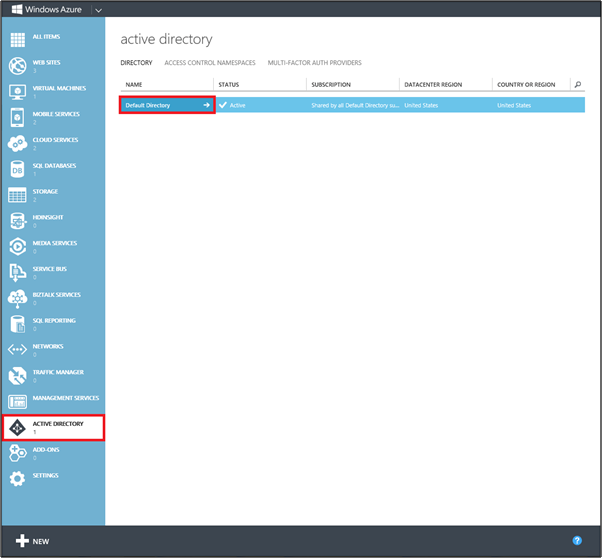
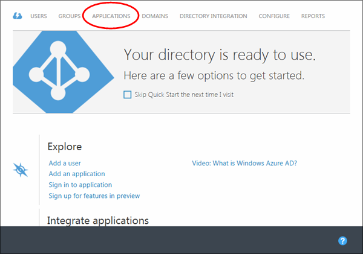
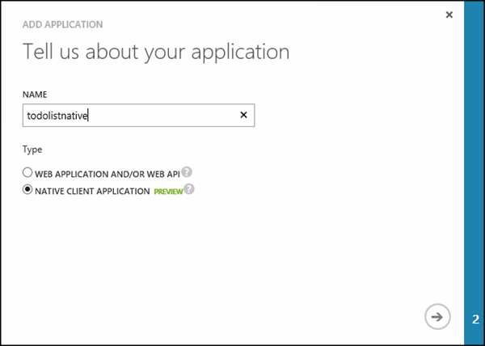
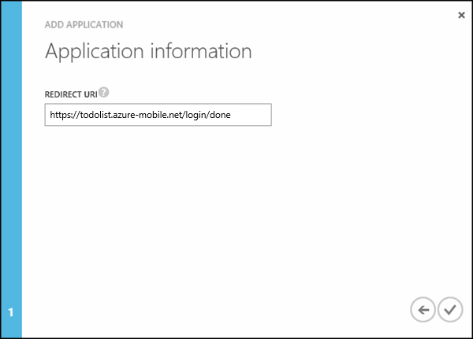
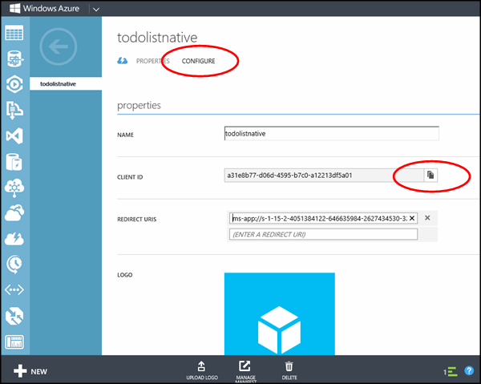
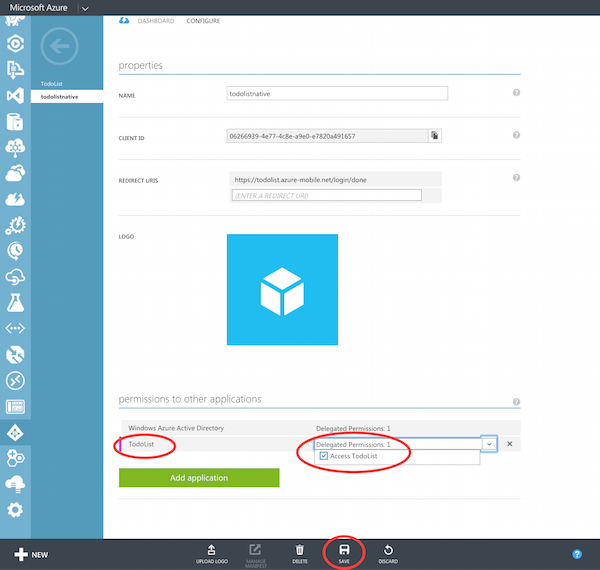
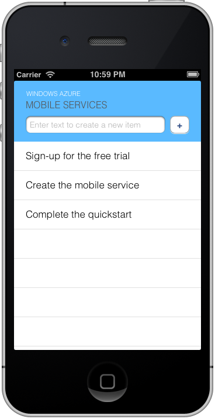

<properties
	pageTitle="Authenticate your app with Active Directory Authentication Library Single Sign-On (iOS) | Microsoft Azure"
	description="Learn how to authentication users for single sign-on with ADAL in your iOS application."
	documentationCenter="ios"
	authors="mattchenderson"
	manager="dwrede"
	editor=""
	services="mobile-services"/>

<tags
	ms.service="mobile-services"
	ms.workload="mobile"
	ms.tgt_pltfrm="mobile-ios"
	ms.devlang="objective-c"
	ms.topic="article"
	ms.date="07/21/2016"
	ms.author="mahender"/>

# Authenticate your app with Active Directory Authentication Library Single Sign-On

>[AZURE.WARNING] This is an **Azure Mobile Services** topic.  This service has been superseded by Azure App Service Mobile Apps and is scheduled for removal from Azure.  We recommend using Azure Mobile Apps for all new mobile backend deployments.  Read [this announcement](https://azure.microsoft.com/blog/transition-of-azure-mobile-services/) to learn more about the pending deprecation of this service.  
> 
> Learn about [migrating your site to Azure App Service](https://azure.microsoft.com/en-us/documentation/articles/app-service-mobile-migrating-from-mobile-services/).
>
> Get started with Azure Mobile Apps, see the [Azure Mobile Apps documentation center](https://azure.microsoft.com/documentation/learning-paths/appservice-mobileapps/).

&nbsp;

> [AZURE.SELECTOR-LIST (Platform | Backend)]
- [(iOS | .NET)](../articles/mobile-services-dotnet-backend-ios-adal-sso-authentication.md)
- [(Windows 8.x Store C# | .NET)](../articles/mobile-services-windows-store-dotnet-adal-sso-authentication.md)

##Overview

In this tutorial, you add authentication to the quickstart project using the Active Directory Authentication Library.

To be able to authenticate users, you must register your application with the Azure Active Directory (AAD). This is done in two steps. First, you must register your mobile service and expose permissions on it. Second, you must register your iOS app and grant it access to those permissions

>[AZURE.NOTE] This tutorial is intended to help you better understand how Mobile Services enables you to do single sign-on Azure Active Directory authentication for iOS apps. If this is your first experience with Mobile Services, complete the tutorial [Get started with Mobile Services].

##Prerequisites

This tutorial requires the following:

* XCode 4.5 and iOS 6.0 (or later versions)
* Completion of the [Get started with Mobile Services] tutorial.
* Completion of the [Register your apps to use an Azure Active Directory Account login]
* Microsoft Azure Mobile Services SDK
* The [Active Directory Authentication Library for iOS]

## Register your client app with the Azure Active Directory

1. Navigate to **Active Directory** in the [Azure classic portal](https://manage.windowsazure.com/), then click your directory.

   

2. Click the **Applications** tab at the top, then click to **ADD** an app. 

   

3. Click **Add an application my organization is developing**.

4. In the Add Application Wizard, enter a **Name** for your application and click the  **Native Client Application** type. Then click to continue.

   

5. In the **Redirect URI** box, enter the /login/done endpoint for your mobile service. This value should be similar to https://todolist.azure-mobile.net/login/done.

   

6. Click the **Configure** tab for the native application and copy the **Client ID**. You will need this later.

   

7. Scroll the page down to the **permissions to other applications** section and click the **Add application** button. Choose **Other** from the Show menu and search for todo. Click **TodoList** to add it the mobile service you registered earlier and click the checkmark for done. Grant access to the mobile service application. Then click **Save**

   

Your mobile service is now configured in AAD to receive single sign-on logins from your app.

##Configure the mobile service to require authentication

By default, all requests to mobile service resources are restricted to clients that present the application key, which does not strictly secure access to resources. To secure your resources, you must restrict access to only authenticated clients.

1. In Visual Studio, open your mobile service project, expand the Controllers folder, and open **TodoItemController.cs**. The **TodoItemController** class implements data access for the TodoItem table. Add the following `using` statement:

		using Microsoft.WindowsAzure.Mobile.Service.Security;

2. Apply the following _AuthorizeLevel_ attribute to the **TodoItemController** class. 

		[AuthorizeLevel(AuthorizationLevel.User)]

	This makes sure that all operations against the _TodoItem_ table require an authenticated user. You can also apply the *AuthorizeLevel* attribute at the method level.

3. (Optional) If you wish to debug authentication locally, expand the `App_Start` folder, open **WebApiConfig.cs**, and add the following code to the **Register** method.  

		config.SetIsHosted(true);

	This tells the local mobile service project to run as if it is being hosted in Azure, including honoring the *AuthorizeLevel* settings. Without this setting, all HTTP requests to localhost are permitted without authentication despite the *AuthorizeLevel* setting. When you enable self-hosted mode, you also need to set a value for the local application key.

4. (Optional) In the web.config project file, set a string value for the `MS_ApplicationKey` app setting. 

	This is the password that you use (with no username) to test the API help pages when you run the service locally.  This string value is not used by the live site in Azure, and you do not need to use the actual application key; any valid string value will work.
 
4. Republish your project.

##Add authentication code to the client app

1. Download the [Active Directory Authentication Library for iOS] and include it in your project. Be sure to also add the storyboards from the ADAL source.

2. In the QSTodoListViewController, include ADAL with the following:

        #import "ADALiOS/ADAuthenticationContext.h"

2. Then add the following method:

        - (void) loginAndGetData
        {
            MSClient *client = self.todoService.client;
            if (client.currentUser != nil) {
                return;
            }

            NSString *authority = @"<INSERT-AUTHORITY-HERE>";
            NSString *resourceURI = @"<INSERT-RESOURCE-URI-HERE>";
            NSString *clientID = @"<INSERT-CLIENT-ID-HERE>";
            NSString *redirectURI = @"<INSERT-REDIRECT-URI-HERE>";

            ADAuthenticationError *error;
            ADAuthenticationContext *authContext = [ADAuthenticationContext authenticationContextWithAuthority:authority error:&error];
            NSURL *redirectUri = [[NSURL alloc]initWithString:redirectURI];

            [authContext acquireTokenWithResource:resourceURI clientId:clientID redirectUri:redirectUri completionBlock:^(ADAuthenticationResult *result) {
                if (result.tokenCacheStoreItem == nil)
                {
                    return;
                }
                else
                {
                    NSDictionary *payload = @{
                        @"access_token" : result.tokenCacheStoreItem.accessToken
                    };
                    [client loginWithProvider:@"windowsazureactivedirectory" token:payload completion:^(MSUser *user, NSError *error) {
                        [self refresh];
                    }];
                }
            }];
        }

6. In the code for the `loginAndGetData` method above, replace **INSERT-AUTHORITY-HERE** with the name of the tenant in which you provisioned your application, the format should be https://login.windows.net/tenant-name.onmicrosoft.com. This value can be copied out of the Domain tab in your Azure Active Directory in the [Azure classic portal].

7. In the code for the `loginAndGetData` method above, replace **INSERT-RESOURCE-URI-HERE** with the **App ID URI** for your mobile service. If you followed the [How to Register with the Azure Active Directory] topic your App ID URI should be similar to https://todolist.azure-mobile.net/login/aad.

8. In the code for the `loginAndGetData` method above, replace **INSERT-CLIENT-ID-HERE** with the client ID you copied from the native client application.

9. In the code for the `loginAndGetData` method above, replace **INSERT-REDIRECT-URI-HERE** with the /login/done endpoint for your mobile service. This should be similar to https://todolist.azure-mobile.net/login/done.

3. In the QSTodoListViewController, modify `ViewDidLoad` by replacing `[self refresh]` with the following:

        [self loginAndGetData];

##Test the client using authentication

1. From the Product menu, click Run to start the app
2. You will receive a prompt to login against your Azure Active Directory.
3. The app authenticates and returns the todo items.

   

<!-- URLs. -->
[Get started with Mobile Services]: mobile-services-dotnet-backend-ios-get-started.md
[Register your apps to use an Azure Active Directory Account login]:mobile-services-how-to-register-active-directory-authentication.md
[How to Register with the Azure Active Directory]: mobile-services-how-to-register-active-directory-authentication.md
[Azure classic portal]: https://manage.windowsazure.com/
[Active Directory Authentication Library for iOS]: https://github.com/MSOpenTech/azure-activedirectory-library-for-ios
