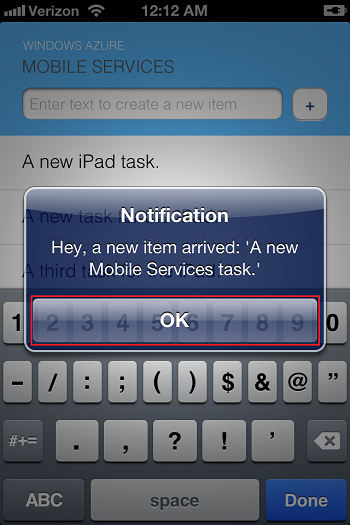

<properties
	pageTitle="Add Push Notifications to App (iOS) | .NET Backend"
	description="Learn how to use Azure Mobile Services to send push notifications to your iOS app."
	services="mobile-services,notification-hubs"
	documentationCenter="ios"
	manager="dwrede"
	editor=""
	authors="krisragh"/>

<tags
	ms.service="mobile-services"
	ms.workload="mobile"
	ms.tgt_pltfrm="ios"
	ms.devlang="objective-c"
	ms.topic="article"
	ms.date="07/21/2016"
	ms.author="krisragh"/>


# Add Push Notifications to iOS App and .NET Backend

> [AZURE.SELECTOR-LIST (Platform | Backend )]
- [(iOS | .NET)](mobile-services-dotnet-backend-ios-get-started-push.md)
- [(iOS | JavaScript)](mobile-services-javascript-backend-ios-get-started-push.md)
- [(Windows Runtime 8.1 universal C# | .NET)](mobile-services-dotnet-backend-windows-universal-dotnet-get-started-push.md)
- [(Windows Runtime 8.1 universal C# | Javascript)](mobile-services-javascript-backend-windows-universal-dotnet-get-started-push.md)
- [(Windows Phone Silverlight 8.x | Javascript)](mobile-services-javascript-backend-windows-phone-get-started-push.md)
- [(Android | .NET)](mobile-services-dotnet-backend-android-get-started-push.md)
- [(Android | Javascript)](mobile-services-javascript-backend-android-get-started-push.md)
- [(Xamarin.iOS | Javascript)](partner-xamarin-mobile-services-ios-get-started-push.md)
- [(Xamarin.Android | Javascript)](partner-xamarin-mobile-services-android-get-started-push.md)
- [(Xamarin.Android | .NET)](mobile-services-dotnet-backend-xamarin-android-get-started-push.md)
- [(Xamarin.Forms | JavaScript)](partner-xamarin-mobile-services-xamarin-forms-get-started-push.md)

&nbsp;

>[AZURE.WARNING] This is an **Azure Mobile Services** topic.  This service has been superseded by Azure App Service Mobile Apps and is scheduled for removal from Azure.  We recommend using Azure Mobile Apps for all new mobile backend deployments.  Read [this announcement](https://azure.microsoft.com/blog/transition-of-azure-mobile-services/) to learn more about the pending deprecation of this service.  
>
> Learn about [migrating your site to Azure App Service](https://azure.microsoft.com/en-us/documentation/articles/app-service-mobile-migrating-from-mobile-services/).
>
> Get started with Azure Mobile Apps, see the [Azure Mobile Apps documentation center](https://azure.microsoft.com/documentation/learning-paths/appservice-mobileapps/).

This topic shows you how to add push notifications to the [quickstart project](mobile-services-dotnet-backend-ios-get-started.md), so that your mobile service sends a push notification each time a record is inserted. You must complete [Get Started with Mobile Services] first.


* [Register an App ID for your app](https://developer.apple.com/library/ios/documentation/IDEs/Conceptual/AppDistributionGuide/MaintainingProfiles/MaintainingProfiles.html#//apple_ref/doc/uid/TP40012582-CH30-SW991). Create an explicit App ID (not a wildcard App ID) and for **Bundle ID**, use the exact **Bundle ID** that is in your Xcode quickstart project. It is also crucial that you check the **Push Notifications** option.

* Next, [configuring push notifications](https://developer.apple.com/library/ios/documentation/IDEs/Conceptual/AppDistributionGuide/AddingCapabilities/AddingCapabilities.html#//apple_ref/doc/uid/TP40012582-CH26-SW6). You may create either a "Development" or "Distribution" SSL certificate (remember to select the corresponding option in the Azure portal later.)

## <a id="configure"></a>Configure Azure to Send Push Notifications


* Follow the steps at [Installing a Client SSL Signing Identity on the Server](https://developer.apple.com/library/prerelease/ios/documentation/IDEs/Conceptual/AppDistributionGuide/AddingCapabilities/AddingCapabilities.html#//apple_ref/doc/uid/TP40012582-CH26-SW16) to export the certificate you downloaded in the previous step to a .p12 file.

* In the Azure classic portal, click **Mobile Services** > your app > the **Push** tab > **apple push notification settings** > "**Upload**. Upload the .p12 file, making sure that the correct **Mode** is selected (either Sandbox or Production, corresponding to whether the client SSL certificate you generated was Development or Distribution.) Your mobile service is now configured to work with push notifications on iOS!

## <a id="update-server"></a>Update Backend Code to Send Push Notifications

* Open Visual Studio project > **Controllers** folder > **TodoItemController.cs** > method `PostTodoItem`. Replace the method with the following. When a todo item is inserted, this code sends out a push notification with the item text. If there's an error, the code adds an error log entry that is viewable via the logs section of the portal.


```
        public async Task<IHttpActionResult> PostTodoItem(TodoItem item)
        {
            TodoItem current = await InsertAsync(item);

            ApplePushMessage message = new ApplePushMessage(item.Text, System.TimeSpan.FromHours(1));

            try
            {
                var result = await Services.Push.SendAsync(message);
                Services.Log.Info(result.State.ToString());
            }
            catch (System.Exception ex)
            {
                Services.Log.Error(ex.Message, null, "Push.SendAsync Error");
            }
            return CreatedAtRoute("Tables", new { id = current.Id }, current);
        }
```

## <a name="publish-the-service"></a>Publish Mobile Service to Azure


1. In Visual Studio, right-click the project, click **Publish** > **Microsoft Azure Mobile Services**. Instead of using Visual Studio, [you may also use Git](./
mobile-services-dotnet-backend-store-code-source-control.md).

2. Sign in with Azure credentials and select your service from **Existing Mobile Services**. Visual Studio downloads your publish settings directly from Azure. Finally, click **Publish**.


## <a id="add-push"></a>Add Push Notifications to App

* In QSAppDelegate.m, import the iOS SDK and QSTodoService.h:

```
        #import <WindowsAzureMobileServices/WindowsAzureMobileServices.h>
        #import "QSTodoService.h"
```

* In `didFinishLaunchingWithOptions` in QSAppDelegate.m, insert the following lines right before `return YES;`:

```
        UIUserNotificationSettings* notificationSettings = [UIUserNotificationSettings settingsForTypes:UIUserNotificationTypeAlert | UIUserNotificationTypeBadge | UIUserNotificationTypeSound categories:nil];
        [[UIApplication sharedApplication] registerUserNotificationSettings:notificationSettings];
        [[UIApplication sharedApplication] registerForRemoteNotifications];
```

* In QSAppDelegate.m, add the following handler methods. Your app is now updated to support push notifications.

```
        // Registration with APNs is successful
        - (void)application:(UIApplication *)application
        didRegisterForRemoteNotificationsWithDeviceToken:(NSData *)deviceToken {

            QSTodoService *todoService = [QSTodoService defaultService];
            MSClient *client = todoService.client;

            [client.push registerNativeWithDeviceToken:deviceToken tags:nil completion:^(NSError *error) {
                if (error != nil) {
                    NSLog(@"Error registering for notifications: %@", error);
                }
            }];
        }

        // Handle any failure to register
        - (void)application:(UIApplication *)application didFailToRegisterForRemoteNotificationsWithError:
        (NSError *)error {
            NSLog(@"Failed to register for remote notifications: %@", error);
        }

        // Use userInfo in the payload to display a UIAlertView.
        - (void)application:(UIApplication *)application
              didReceiveRemoteNotification:(NSDictionary *)userInfo {
            NSLog(@"%@", userInfo);

            NSDictionary *apsPayload = userInfo[@"aps"];
            NSString *alertString = apsPayload[@"alert"];

            UIAlertView *alert = [[UIAlertView alloc]
              initWithTitle:@"Notification"
              message:alertString
              delegate:nil
              cancelButtonTitle:@"OK"
              otherButtonTitles:nil];
            [alert show];
        }
```


* In Xcode, press **Run** and start the app on an iOS device (not the simulator.) Click **OK** to accept push notifications; this request occurs the first time the app runs.

* In the app, add a new item and click **+**.

* Verify that a notification is received, then click **OK** to dismiss the notification. You have now successfully completed this tutorial.

  	

<!-- Anchors.  -->
[Generate the certificate signing request]: #certificates
[Register your app and enable push notifications]: #register
[Create a provisioning profile for the app]: #profile
[Configure Mobile Services]: #configure
[Update scripts to send push notifications]: #update-scripts
[Add push notifications to the app]: #add-push
[Insert data to receive notifications]: #test
[Test the app against the published mobile service]: #test-app
[Next Steps]:#next-steps
[Download the service locally]: #download-the-service-locally
[Test the mobile service]: #test-the-service
[Publish the mobile service to Azure]: #publish-mobile-service

<!-- Images. -->
[5]: ./media/mobile-services-ios-get-started-push/mobile-services-ios-push-step5.png
[6]: ./media/mobile-services-ios-get-started-push/mobile-services-ios-push-step6.png
[7]: ./media/mobile-services-ios-get-started-push/mobile-services-ios-push-step7.png

[9]: ./media/mobile-services-ios-get-started-push/mobile-services-ios-push-step9.png
[10]: ./media/mobile-services-ios-get-started-push/mobile-services-ios-push-step10.png
[17]: ./media/mobile-services-ios-get-started-push/mobile-services-ios-push-step17.png
[18]: ./media/mobile-services-ios-get-started-push/mobile-services-selection.png
[19]: ./media/mobile-services-ios-get-started-push/mobile-push-tab-ios.png
[20]: ./media/mobile-services-ios-get-started-push/mobile-push-tab-ios-upload.png
[21]: ./media/mobile-services-ios-get-started-push/mobile-portal-data-tables.png
[22]: ./media/mobile-services-ios-get-started-push/mobile-insert-script-push2.png
[23]: ./media/mobile-services-ios-get-started-push/mobile-quickstart-push1-ios.png
[24]: ./media/mobile-services-ios-get-started-push/mobile-quickstart-push2-ios.png
[25]: ./media/mobile-services-ios-get-started-push/mobile-quickstart-push3-ios.png
[26]: ./media/mobile-services-ios-get-started-push/mobile-quickstart-push4-ios.png
[28]: ./media/mobile-services-ios-get-started-push/mobile-services-ios-push-step18.png

[101]: ./media/mobile-services-ios-get-started-push/mobile-services-ios-push-01.png
[102]: ./media/mobile-services-ios-get-started-push/mobile-services-ios-push-02.png
[103]: ./media/mobile-services-ios-get-started-push/mobile-services-ios-push-03.png
[104]: ./media/mobile-services-ios-get-started-push/mobile-services-ios-push-04.png
[105]: ./media/mobile-services-ios-get-started-push/mobile-services-ios-push-05.png
[106]: ./media/mobile-services-ios-get-started-push/mobile-services-ios-push-06.png
[107]: ./media/mobile-services-ios-get-started-push/mobile-services-ios-push-07.png
[108]: ./media/mobile-services-ios-get-started-push/mobile-services-ios-push-08.png

[110]: ./media/mobile-services-ios-get-started-push/mobile-services-ios-push-10.png
[111]: ./media/mobile-services-ios-get-started-push/mobile-services-ios-push-11.png
[112]: ./media/mobile-services-ios-get-started-push/mobile-services-ios-push-12.png
[113]: ./media/mobile-services-ios-get-started-push/mobile-services-ios-push-13.png
[114]: ./media/mobile-services-ios-get-started-push/mobile-services-ios-push-14.png
[115]: ./media/mobile-services-ios-get-started-push/mobile-services-ios-push-15.png
[116]: ./media/mobile-services-ios-get-started-push/mobile-services-ios-push-16.png
[117]: ./media/mobile-services-ios-get-started-push/mobile-services-ios-push-17.png

<!-- URLs. -->
[Install Xcode]: https://go.microsoft.com/fwLink/p/?LinkID=266532
[iOS Provisioning Portal]: http://go.microsoft.com/fwlink/p/?LinkId=272456
[Mobile Services iOS SDK]: https://go.microsoft.com/fwLink/p/?LinkID=266533
[Apple Push Notification Service]: http://go.microsoft.com/fwlink/p/?LinkId=272584
[Get started with Mobile Services]: mobile-services-dotnet-backend-ios-get-started.md
[apns object]: http://go.microsoft.com/fwlink/p/?LinkId=272333

[Get started with authentication]: mobile-services-dotnet-backend-ios-get-started-users.md
[Mobile Services Objective-C how-to conceptual reference]: mobile-services-windows-dotnet-how-to-use-client-library.md
[What are Notification Hubs?]: https://azure.microsoft.com/en-us/documentation/articles/notification-hubs-push-notification-overview/
[Send broadcast notifications to subscribers]: https://azure.microsoft.com/en-us/documentation/articles/notification-hubs-ios-xplat-segmented-apns-push-notification/
[Send template-based notifications to subscribers]: https://azure.microsoft.com/en-us/documentation/articles/notification-hubs-ios-xplat-localized-apns-push-notification/
