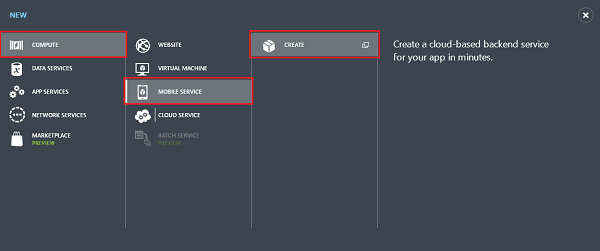
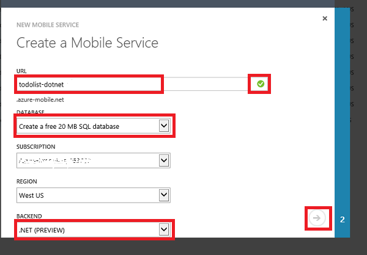

<properties
	pageTitle="Get Started with Azure Mobile Services for iOS apps"
	description="Follow this tutorial to get started using Azure Mobile Services for iOS development."
	services="mobile-services"
	documentationCenter="ios"
	authors="krisragh"
	manager="dwrede"
	editor=""/>

<tags
	ms.service="mobile-services"
	ms.workload="mobile"
	ms.tgt_pltfrm="mobile-ios"
	ms.devlang="objective-c"
	ms.topic="article"
	ms.date="07/21/2016"
	ms.author="krisragh"/>

# Get started with Mobile Services

> [AZURE.SELECTOR-LIST (Platform | Backend )]
- [(iOS | .NET)](../articles/mobile-services-dotnet-backend-ios-get-started.md)
- [(iOS | JavaScript)](../articles/mobile-services-ios-get-started.md)
- [(Windows Runtime 8.1 universal C# | .NET)](../articles/mobile-services-dotnet-backend-windows-store-dotnet-get-started.md)
- [(Windows Runtime 8.1 universal C# | Javascript)](../articles/mobile-services-javascript-backend-windows-store-dotnet-get-started.md)
- [(Windows Runtime 8.1 universal JavaScript | Javascript)](../articles/mobile-services-javascript-backend-windows-store-javascript-get-started.md)
- [(Android | .NET)](../articles/mobile-services-dotnet-backend-android-get-started.md)
- [(Android | Javascript)](../articles/mobile-services-android-get-started.md)
- [(Xamarin.iOS | .NET)](../articles/mobile-services-dotnet-backend-xamarin-ios-get-started.md)
- [(Xamarin.iOS | Javascript)](../articles/partner-xamarin-mobile-services-ios-get-started.md)
- [(Xamarin.Android | .NET)](../articles/mobile-services-dotnet-backend-xamarin-android-get-started.md)
- [(Xamarin.Android | Javascript)](../articles/partner-xamarin-mobile-services-android-get-started.md)
- [(HTML | Javascript)](../articles/mobile-services-html-get-started.md)
- [(PhoneGap | Javascript)](../articles/mobile-services-javascript-backend-phonegap-get-started.md)
- [(Sencha | Javascript)](../articles/partner-sencha-mobile-services-get-started.md)

&nbsp;

>[AZURE.WARNING] This is an **Azure Mobile Services** topic.  This service has been superseded by Azure App Service Mobile Apps and is scheduled for removal from Azure.  We recommend using Azure Mobile Apps for all new mobile backend deployments.  Read [this announcement](https://azure.microsoft.com/blog/transition-of-azure-mobile-services/) to learn more about the pending deprecation of this service.  
> 
> Learn about [migrating your site to Azure App Service](../articles/app-service-mobile/app-service-mobile-migrating-from-mobile-services.md).
>
> Get started with Azure Mobile Apps, see the [Azure Mobile Apps documentation center](https://azure.microsoft.com/documentation/learning-paths/appservice-mobileapps/).
> For the equivalent Mobile Apps version of this topic, see [Create an iOS app in Azure Mobile Apps](../app-service-mobile/app-service-mobile-ios-get-started.md).

This tutorial shows you how to add a cloud-based backend service to an iOS app using Azure Mobile Services. In this tutorial, you will create both a new mobile service and a simple _To do list_ app that stores app data in the new mobile service. The mobile service uses .NET and Visual Studio for server-side business logic. To create a mobile service with server-side business logic in JavaScript, see the [JavaScript backend version] of this topic.

> [AZURE.NOTE] To complete this tutorial, you need an Azure account. If you don't have an account, you can sign up for an Azure trial and get [free mobile services that you can keep using even after your trial ends](https://azure.microsoft.com/pricing/details/mobile-services/).  For details, see [Azure Free Trial](https://azure.microsoft.com/pricing/free-trial/?WT.mc_id=AE564AB28&amp;returnurl=http%3A%2F%2Fazure.microsoft.com%2Fdocumentation%2Farticles%2Fmobile-services-dotnet-backend-ios-get-started%2F).

## Create a new mobile service

Follow these steps to create a new mobile service.

1.	Log into the [Azure classic portal](https://manage.windowsazure.com/). At the bottom of the navigation pane, click **+NEW**. Expand **Compute** and **Mobile Service**, then click **Create**.
	
	

	This displays the **Create a Mobile Service** dialog.

2.	In the **Create a Mobile Service** page, select **Create a free 20 MB SQL Database**, select **.NET** runtime, then type a subdomain name for the new mobile service in the **URL** textbox. Click the right arrow button to go to the next page.
	
	

	This displays the **Specify database settings** page.

	> [AZURE.NOTE] As part of this tutorial, you create a new SQL Database instance and server. You can reuse this new database and administer it as you would any other SQL Database instance. If you already have a database in the same region as the new mobile service, you can instead choose **Use existing Database** and then select that database. The use of a database in a different region is not recommended because of additional bandwidth costs and higher latencies.

3.	In **Name**, type the name of the new database, then type **Login name**, which is the administrator login name for the new SQL Database server, type and confirm the password, and click the check button to complete the process.
	

You have now created a new mobile service that can be used by your mobile apps.

## Download the mobile service and app to your local computer

Now that you have created the mobile service, download projects that you can run locally.

1. Click the mobile service that you just created, then in the Quick Start tab, click **iOS** under **Choose a platform** and expand **Create a new iOS app**.

2. On your Windows PC, click **Download** under **Download and publish your service to the cloud**. This downloads the Visual Studio project that implements your mobile service. Save the compressed project file to your local computer, and make a note of where you saved it.

3. On your Mac, click **Download** under **Download and run your app**. This downloads the project for the sample _To do list_ application that is connected to your mobile service, along with the Mobile Services iOS SDK. Save the compressed project file to your local computer, and make a note of where you saved it.

## Test the mobile service

The mobile service project lets you run your new mobile service locally. This makes it easy to debug your service code before you even publish it to Azure.

1. On your Windows PC, download your personalized server project, extract it, and then open it in Visual Studio.

2. Press the **F5** key to rebuild the project and start the mobile service locally. A web page is displayed after the mobile service starts successfully.

## Publish your mobile service

1. In Visual Studio, right-click the project, click **Publish** > **Microsoft Azure Mobile Services**. Instead of using Visual Studio, [you may also use Git](../articles/mobile-services/mobile-services-dotnet-backend-store-code-source-control.md).

2. Sign in with Azure credentials and select your service from **Existing Mobile Services**. Visual Studio downloads your publish settings directly from Azure. Finally, click **Publish**.

## Run your new iOS app

The final stage of this tutorial is to build and run your new app.

1. Browse to the location where you saved the compressed project files, expand the files on your computer, and open the project file using Xcode.

2. Press the **Run** button to build the project and start the app in the iPhone emulator.

3. In the app, type meaningful text, such as _Complete the tutorial_ and then click the plus (**+**) icon.

   	

   	This sends a POST request to the new mobile service hosted in Azure. Data from the request is inserted into the TodoItem table. Items stored in the table are returned by the mobile service, and the data is displayed in the list.

 	

## Next Steps

This shows how to run your new client app against the mobile service running in Azure. Before you can test the iOS app with the mobile service running on a local computer, you must configure the Web server and firewall to allow access from your iOS development computer. For more information, see [Configure the local web server to allow connections to a local mobile service](mobile-services-dotnet-backend-how-to-configure-iis-express.md).

Learn how to perform additional important tasks in Mobile Services:

* [Get started with offline data sync]
   Learn how to use offline data sync to make your app responsive and robust.

* [Add authentication to an existing app]
   Learn how to authenticate users of your app with an identity provider.

* [Add push notifications to an existing app]
   Learn how to send a very basic push notification to your app.

* [Troubleshoot Mobile Services .NET backend]
    Learn how to diagnose and fix issues that can arise with a Mobile Services .NET backend.

 

<!-- Anchors. -->
[Getting started with Mobile Services]:#getting-started
[Create a new mobile service]:#create-new-service
[Define the mobile service instance]:#define-mobile-service-instance
[Next Steps]:#next-steps

<!-- Images. -->
[0]: ./media/mobile-services-dotnet-backend-ios-get-started/mobile-quickstart-completed-ios.png
[1]: ./media/mobile-services-dotnet-backend-ios-get-started/mobile-quickstart-steps-vs.png

[6]: ./media/mobile-services-dotnet-backend-ios-get-started/mobile-portal-quickstart-ios.png
[7]: ./media/mobile-services-dotnet-backend-ios-get-started/mobile-quickstart-steps-ios.png
[8]: ./media/mobile-services-dotnet-backend-ios-get-started/mobile-xcode-project.png

[10]: ./media/mobile-services-dotnet-backend-ios-get-started/mobile-quickstart-startup-ios.png
[11]: ./media/mobile-services-dotnet-backend-ios-get-started/mobile-data-tab.png
[12]: ./media/mobile-services-dotnet-backend-ios-get-started/mobile-data-browse.png

<!-- URLs. -->
[Get started with offline data sync]: mobile-services-ios-get-started-offline-data.md
[Add authentication to an existing app]: mobile-services-dotnet-backend-ios-get-started-users.md
[Add push notifications to an existing app]: mobile-services-dotnet-backend-ios-get-started-push.md
[Troubleshoot Mobile Services .NET backend]: mobile-services-dotnet-backend-how-to-troubleshoot.md
[Mobile Services iOS SDK]: https://go.microsoft.com/fwLink/p/?LinkID=266533
[XCode]: https://go.microsoft.com/fwLink/p/?LinkID=266532
[JavaScript backend version]: mobile-services-ios-get-started.md
