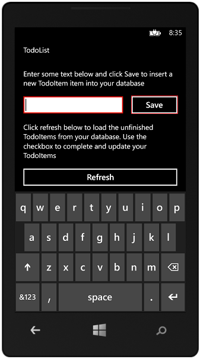
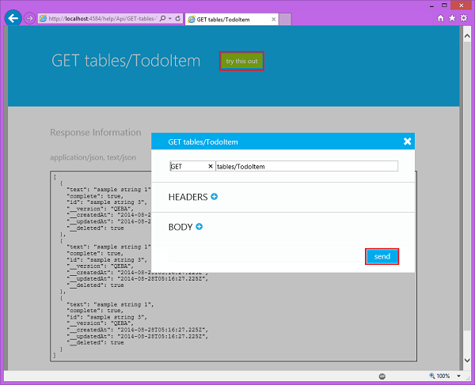
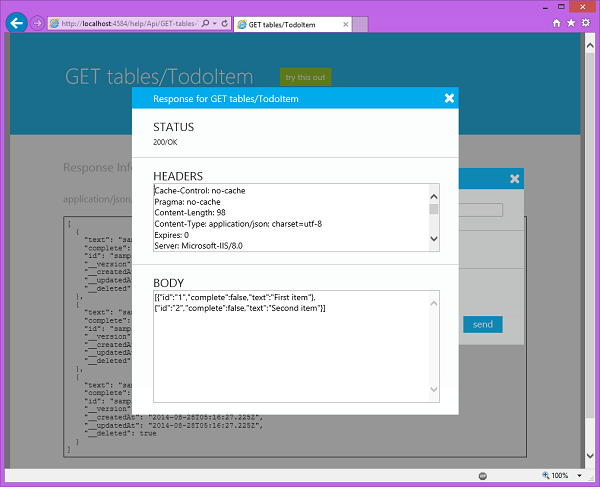
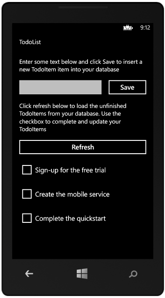

<properties
	pageTitle="Add Mobile Services to an existing universal Windows Store app | Microsoft Azure"
	description="Learn how to get started using Mobile Services to leverage data in your Windows Store app."
	services="mobile-services"
	documentationCenter="windows"
	authors="ggailey777"
	manager="dwrede"
	editor=""/>

<tags
	ms.service="mobile-services"
	ms.workload="mobile"
	ms.tgt_pltfrm="mobile-windows"
	ms.devlang="dotnet"
	ms.topic="article"
	ms.date="07/21/2016"
	ms.author="glenga"/>

# Add Mobile Services to an existing app

> [AZURE.SELECTOR-LIST (Platform | Backend )]
- [(Windows Runtime 8.1 universal C# | .NET)](../articles/mobile-services-dotnet-backend-windows-universal-dotnet-get-started-data.md)
- [(Windows Phone Silverlight 8.x | Javascript)](../articles/mobile-services-windows-phone-get-started-data.md)
- [(Android | Javascript)](../articles/mobile-services-android-get-started-data.md)
 
&nbsp;

>[AZURE.WARNING] This is an **Azure Mobile Services** topic.  This service has been superseded by Azure App Service Mobile Apps and is scheduled for removal from Azure.  We recommend using Azure Mobile Apps for all new mobile backend deployments.  Read [this announcement](https://azure.microsoft.com/blog/transition-of-azure-mobile-services/) to learn more about the pending deprecation of this service.  
> 
> Learn about [migrating your site to Azure App Service](https://azure.microsoft.com/en-us/documentation/articles/app-service-mobile-migrating-from-mobile-services/).
>
> Get started with Azure Mobile Apps, see the [Azure Mobile Apps documentation center](https://azure.microsoft.com/documentation/learning-paths/appservice-mobileapps/).
> For the equivalent Mobile Apps version of this topic, see [How to use the managed client for Azure Mobile Apps](../app-service-mobile/app-service-mobile-dotnet-how-to-use-client-library.md).

##Overview

This topic shows you how to use Azure Mobile Services as a backend data source for a Windows Store app. In this tutorial, you will download a Visual Studio 2013 project for an app that stores data in memory, create a new mobile service, integrate the mobile service with the app, and view the changes to data made when running the app.

The mobile service that you will create in this tutorial is a .NET backend mobile service. .NET backend enables you to use .NET languages and Visual Studio for server-side business logic in the mobile service, and you can run and debug your mobile service on your local computer. To create a mobile service that lets you write your server-side business logic in JavaScript, see the JavaScript backend version of this topic.

>[AZURE.NOTE]This topic shows you how to use the tooling in Visual Studio Professional 2013 with Update 3 to connect a new mobile service to a universal Windows app. The same steps can be used to connect a mobile service to a Windows Store or Windows Phone Store 8.1 app. To connect a mobile service to a Windows Phone 8.0 or Windows Phone Silverlight 8.1 app, see [Get started with data for Windows Phone](mobile-services-windows-phone-get-started-data.md).

##Prerequisites

To complete this tutorial, you need the following:

* An active Azure account. If you don't have an account, you can create a free trial account in just a couple of minutes. For details, see [Azure Free Trial](https://azure.microsoft.com/pricing/free-trial/?WT.mc_id=A0E0E5C02&amp;returnurl=http%3A%2F%2Fazure.microsoft.com%2Fdocumentation%2Farticles%2Fmobile-services-dotnet-backend-windows-universal-dotnet-get-started-data%2F).
* <a href="https://go.microsoft.com/fwLink/p/?LinkID=391934" target="_blank">Visual Studio 2013</a> (Update 3 or a later version).

##Download the GetStartedWithData project

This tutorial is built on the [GetStartedWithMobileServices app](http://go.microsoft.com/fwlink/p/?LinkID=510826), which is a universal Windows app project in Visual Studio 2013. The UI for this app is identical to the app generated by the Mobile Services quickstart, except that added items are stored locally in memory. 

1. Download the C# version of the GetStartedWithMobileServices sample app from the [Developer Code Samples site]. 

2. In Visual Studio 2013, open the downloaded project and examine the MainPage.xaml.cs file found in the GetStartedWithData.Shared project folder.

   	Notice that added **TodoItem** objects are stored in an in-memory **ObservableCollection&lt;TodoItem&gt;**.

3. Press the **F5** key to rebuild the project and start the app.

4. In the app, type some text in **Insert a TodoItem**, then click **Save**.

   	 

   	Notice that the saved text is displayed.

5. Right-click the Windows Phone 8.1 project, click **Set as Start-up Project**, then press **F5** to start the Windows Phone Store app.  

	

6. Repeat steps 3 and 4 to verify that the sample behaves the same way.

##Create a new mobile service from Visual Studio

The following steps create a new mobile service in Azure and add code to your project that connects your app to this new service. Visual Studio 2013 connects to Azure on your behalf to create the new mobile service by using the credentials that you provide. When you create a new mobile service, you must specify an Azure SQL Database that is used by the mobile service to store app data. 

1. In Visual Studio 2013, open Solution Explorer, right-click the Windows Store app project, click **Add**, and then click **Connected Service...**. 

2. In the Services Manager dialog, click **Create service...**, then select **&lt;Manage...&gt;** from  **Subscription** in the Create Mobile Service dialog.  

	

3. In Manage Microsoft Azure Subscriptions, click **Sign In...** to sign in to your Azure account (if required), select an available subscription, then click **Close**.

	When your subscription already has one or more existing mobile services, the service names are displayed. 

5. Back in the **Create Mobile Service** dialog, select your **Subscription**, the **.NET Framework** backend  in **Runtime** and a **Region** for your mobile service, then type a **Name** for your mobile service.

	>[AZURE.NOTE]Mobile service names must be unique. A red X is displayed next to **Name** when the name you supplied is not available. 

6. In **Database**, select **&lt;Create a free SQL Database&gt;**, supply the **Server user name**, **Server password**, and **Server password confirmation** then click **Create**.

  	

	> [AZURE.NOTE]
	> As part of this tutorial, you create a new free SQL Database instance and server. You can reuse this new database and administer it as you would any other SQL Database instance. You can only have one free database instance. If you already have a database in the same region as the new mobile service, you can instead choose the existing database. When you choose an existing database, make sure that you supply correct login credentials. If you supply incorrect login credentials, the mobile service is created in an unhealthy state.

7. After the mobile service is created, select the newly created mobile service from the list in Service Manager and click **OK**.
 
   	After the wizard completes, the mobile service project is added to your solution, the required NuGet packages are installed, a reference to the Mobile Services client library is added to the project, and your project source code is updated.

&nbsp;&nbsp;7. In Solution Explorer, open the App.xaml.cs code file in the GetStartedWithData.Shared project folder, and notice the new static field that was added to the **App** class inside a Windows Store app conditional compilation block, which looks like the following example:

	public static Microsoft.WindowsAzure.MobileServices.MobileServiceClient
	    todolistClient = new Microsoft.WindowsAzure.MobileServices.MobileServiceClient(
	        "https://todolist.azure-mobile.net/",
	        "XXXXXXXXXXXXXXXXXXXXXXXXXXXXXXXXX");

&nbsp;&nbsp;This code provides access to your new mobile service in your app by using an instance of the [MobileServiceClient](http://go.microsoft.com/fwlink/p/?LinkId=302030) class. The client is created by supplying the URI and the application key of the new mobile service. This static field is available to all pages in your app.

&nbsp;&nbsp;8. Right-click the Windows Phone app project, click **Add**, click **Connected Service...**, select the mobile service that you just created, and then click **OK**. The same code is added to the shared App.xaml.cs file, but this time within a Windows Phone app conditional compilation block.

At this point, both the Windows Store and Windows Phone Store apps are connected to the new mobile service. The next step is to test the new mobile service project.

##Test the mobile service project locally

1. In Visual Studio in Solution Explorer, right click the service project and click **Start new instance** under the **Debug** context menu.

    

    Visual Studio opens the default web page for your service. By default, Visual Studio hosts your mobile service locally in IIS Express.

2. Right-click the tray icon for IIS Express on the Windows taskbar and verify that your mobile service has started.

	 

3. On the start page of your .NET backend, click **try it out**.

    

    This displays the API documentation page, which you can use to test the mobile service.

	>[AZURE.NOTE]Authentication is not required to access this page when running locally. When running in Azure, you must supply the application key as the password (with no username) to access this page.

4. Click the **GET tables/TodoItem** link.

	
   	
	This displays the GET response page for the API.

5. Click **try this out** and then click **send**.
 
	

	This sends a GET request to the local mobile service to return all rows in the TodoItem table. Because the table is seeded by the initializer, two TodoItem objects are returned in the body of the response message. For more information about initializers, see [How to make data model changes to a .NET backend mobile service](../articles/mobile-services-dotnet-backend-how-to-use-code-first-migrations.md).

	

##Update the app to use the mobile service

In this section you will update the universal Windows app to use the mobile service as a backend service for the application. You only need to make changes to the MainPage.cs project file in the GetStartedWithData.Shared project folder.

2. Replace the TodoItem class definition with the following code: 

	    public class TodoItem
	    {
	        public string Id { get; set; }
	
	        [Newtonsoft.Json.JsonProperty(PropertyName = "text")]  
	        public string Text { get; set; }
	
	        [Newtonsoft.Json.JsonProperty(PropertyName = "complete")]  
	        public bool Complete { get; set; }
	    }
	
	The **JsonPropertyAttribute** is used to define the mapping between property names in the client type to column names in the underlying data table.

	>[AZURE.NOTE] In a universal Windows app project, the TodoItem class is defined in the seperate code file in the shared DataModel folder.

1. In the file MainPage.cs, add or uncomment the following using statements: 

		using Microsoft.WindowsAzure.MobileServices;

4. Comment-out or delete the line that defines the existing items collection, then uncomment or add the following lines, replacing _&lt;yourClient&gt;_ with the `MobileServiceClient` field added to the App.xaml.cs file when you connected your project to the mobile service: 

		private MobileServiceCollection<TodoItem, TodoItem> items;
		private IMobileServiceTable<TodoItem> todoTable = 
		    App.<yourClient>.GetTable<TodoItem>();
		  
	This code creates a mobile services-aware binding collection (items) and a proxy class for the database table (todoTable). 

4. In the **InsertTodoItem** method, remove the line of code that sets the **TodoItem.Id** property, add the **async** modifier to the method, and uncomment the following line of code: 

		await todoTable.InsertAsync(todoItem);

	This code inserts a new item into the table. 

5. Replace the **RefreshTodoItems** method with the following code: 

		private async void RefreshTodoItems()
        {
            MobileServiceInvalidOperationException exception = null;
            try
            {
                // Query that returns all items.   
                items = await todoTable.ToCollectionAsync();             
            }
            catch (MobileServiceInvalidOperationException e)
            {
                exception = e;
            }
            if (exception != null)
            {
                await new MessageDialog(exception.Message, "Error loading items").ShowAsync();
            }
            else
            {
                ListItems.ItemsSource = items;
                this.ButtonSave.IsEnabled = true;
            }    
        }

	This sets the binding to the collection of items in `todoTable`, which contains all of the **TodoItem** objects returned from the mobile service. If there is a problem executing the query, a message box is raised to display the errors. 

6. In the **UpdateCheckedTodoItem** method, add the **async** modifier to the method, and uncomment the following line of code: 

		await todoTable.UpdateAsync(item);

	This sends an item update to the mobile service. 

Now that the app has been updated to use Mobile Services for backend storage, it's time to test the app against Mobile Services.

##Publish the mobile service to Azure

1. In Visual Studio, right-click the project, click **Publish** > **Microsoft Azure Mobile Services**. Instead of using Visual Studio, [you may also use Git](./
mobile-services-dotnet-backend-store-code-source-control.md).

2. Sign in with Azure credentials and select your service from **Existing Mobile Services**. Visual Studio downloads your publish settings directly from Azure. Finally, click **Publish**.

##Test the mobile service hosted in Azure

Now we can test both versions of the universal Windows app against the mobile service hosted in Azure.

1. Press the F5 key to rebuild the project and start the Windows Store app.

2. In the app, type meaningful text, such as *Complete the tutorial*, in **Insert a TodoItem**, and then click **Save**.

	

	This sends a POST request to the new mobile service hosted in Azure.

3. Stop debugging and change the default start up project in the universal Windows solution to the Windows Phone Store app and press F5 again.

	
	
	Notice that data saved from the previous step is loaded from the mobile service after the app starts.

##View the data stored in the SQL Database

The final optional step of this tutorial is to check in the SQL Database associated with the mobile service an review the stored data. 

1. In the [Azure classic portal](https://manage.windowsazure.com/), click manage for the database associated with your mobile service.
 
	

2. In the portal execute a query to view the changes made by the Windows Store app. Your query will be similar to the following query but use your database name instead of <code>todolist</code>.

        SELECT * FROM [todolist].[todoitems]

    

	Note that the table includes Id, __createdAt, __updatedAt, and __version columns. These columns support offline data sync and are implemented in the [EntityData](http://msdn.microsoft.com/library/microsoft.windowsazure.mobile.service.entitydata.aspx) base class. For more information, see [Get started with offline data sync].

This concludes the tutorial.

##Next steps

This tutorial demonstrated the basics of enabling a universal Windows app project to work with data in Mobile Services. Next, consider reading up on one of these other topics:

* [Get started with authentication]
   Learn how to authenticate users of your app.

* [Get started with push notifications]
   Learn how to send a very basic push notification to your app.

* [Mobile Services C# How-to Conceptual Reference](mobile-services-dotnet-how-to-use-client-library.md)
   Learn more about how to use Mobile Services with .NET.

<!-- Images. -->

<!-- URLs. -->
[Validate and modify data with scripts]: /develop/mobile/tutorials/validate-modify-and-augment-data-dotnet
[Refine queries with paging]: /develop/mobile/tutorials/add-paging-to-data-dotnet
[Get started with Mobile Services]: mobile-services-dotnet-backend-windows-store-dotnet-get-started.md
[Get started with authentication]: ../mobile-services-dotnet-backend-windows-store-dotnet-get-started-users.md
[Get started with push notifications]: ../mobile-services-dotnet-backend-windows-store-dotnet-get-started-push.md

[Get started with offline data sync]: mobile-services-windows-store-dotnet-get-started-offline-data.md

[Mobile Services SDK]: http://go.microsoft.com/fwlink/p/?LinkId=257545
[Developer Code Samples site]:  http://go.microsoft.com/fwlink/p/?LinkID=510826
[Mobile Services .NET How-to Conceptual Reference]: mobile-services-windows-dotnet-how-to-use-client-library.md
[MobileServiceClient class]: http://go.microsoft.com/fwlink/p/?LinkId=302030
