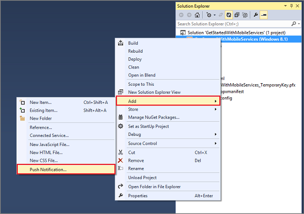
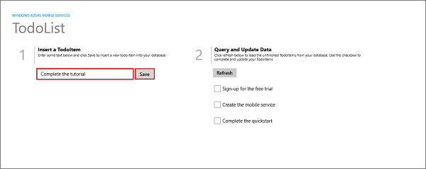
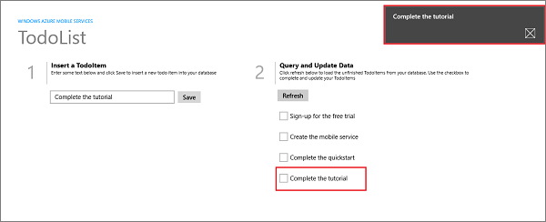

<properties
	pageTitle="Add push notifications to your universal Windows 8.1 app | Microsoft Azure"
	description="Learn how to send push notifications to your universal Windows 8.1 app from your .NET backend mobile service using Azure Notification Hubs."
	services="mobile-services,notification-hubs"
	documentationCenter="windows"
	authors="ggailey777"
	manager="erikre"
	editor=""/>

<tags
	ms.service="mobile-services"
	ms.workload="mobile"
	ms.tgt_pltfrm="mobile-windows-store"
	ms.devlang="dotnet"
	ms.topic="article"
	ms.date="07/21/2016"
	ms.author="glenga"/>

# Add push notifications to your Mobile Services app

> [AZURE.SELECTOR-LIST (Platform | Backend )]
- [(iOS | .NET)](mobile-services-dotnet-backend-ios-get-started-push.md)
- [(iOS | JavaScript)](mobile-services-javascript-backend-ios-get-started-push.md)
- [(Windows Runtime 8.1 universal C# | .NET)](mobile-services-dotnet-backend-windows-universal-dotnet-get-started-push.md)
- [(Windows Runtime 8.1 universal C# | Javascript)](mobile-services-javascript-backend-windows-universal-dotnet-get-started-push.md)
- [(Windows Phone Silverlight 8.x | Javascript)](mobile-services-javascript-backend-windows-phone-get-started-push.md)
- [(Android | .NET)](mobile-services-dotnet-backend-android-get-started-push.md)
- [(Android | Javascript)](mobile-services-javascript-backend-android-get-started-push.md)
- [(Xamarin.iOS | Javascript)](partner-xamarin-mobile-services-ios-get-started-push.md)
- [(Xamarin.Android | Javascript)](partner-xamarin-mobile-services-android-get-started-push.md)
- [(Xamarin.Android | .NET)](mobile-services-dotnet-backend-xamarin-android-get-started-push.md)
- [(Xamarin.Forms | JavaScript)](partner-xamarin-mobile-services-xamarin-forms-get-started-push.md)

&nbsp;

>[AZURE.WARNING] This is an **Azure Mobile Services** topic.  This service has been superseded by Azure App Service Mobile Apps and is scheduled for removal from Azure.  We recommend using Azure Mobile Apps for all new mobile backend deployments.  Read [this announcement](https://azure.microsoft.com/blog/transition-of-azure-mobile-services/) to learn more about the pending deprecation of this service.  
>
> Learn about [migrating your site to Azure App Service](https://azure.microsoft.com/en-us/documentation/articles/app-service-mobile-migrating-from-mobile-services/).
>
> Get started with Azure Mobile Apps, see the [Azure Mobile Apps documentation center](https://azure.microsoft.com/documentation/learning-paths/appservice-mobileapps/).

## Overview
This topic shows you how to use Azure Mobile Services with a .NET backend to send push notifications to a universal Windows app. In this tutorial you enable push notifications using Azure Notification Hubs in a universal Windows app project. When complete, your mobile service will send a push notification from the .NET backend to all registered Windows Store and Windows Phone Store apps each time a record is inserted in the TodoList table. The notification hub that you create is free with your mobile service, can be managed independent of the mobile service, and can be used by other applications and services.

To complete this tutorial, you need the following:

* An active [Microsoft Store account](http://go.microsoft.com/fwlink/p/?LinkId=280045).
* [Visual Studio Community 2013](https://go.microsoft.com/fwLink/p/?LinkID=391934).

## Register your app for push notifications

The following steps registers your app with the Windows Store, configure your mobile service to enable push notifications, and add code to your app to register a device channel with your notification hub. Visual Studio 2013 connects to Azure and to the Windows Store by using the credentials that you provide.

1. In Visual Studio 2013, open Solution Explorer, right-click the Windows Store app project, click **Add** then **Push Notification...**. 

	

	This starts the Add Push Notification Wizard.

2. Click **Next**, sign in to your Windows Store account, then supply a name in **Reserve a new name** and click **Reserve**.

	This creates a new app registration.

3. Click the new registration in the **App Name** list, then click **Next**.

4. In the **Select a service** page, click the name of your mobile service, then click **Next** and **Finish**.

	The notification hub used by your mobile service is updated with the Windows Notification Services (WNS) registration. You can now use Azure Notification Hubs to send notifications from Mobile Services to your app by using WNS.

	>[AZURE.NOTE]This tutorial demonstrates sending notifications from a mobile service backend. You can use the same notification hub registration to send notifications from any backend service. For more information, see [Notification Hubs Overview](http://msdn.microsoft.com/library/azure/jj927170.aspx).

5. When you complete the wizard, a new **Push setup is almost complete** page is opened in Visual Studio. This page details an alternate method to configure your mobile service project to send notifications that is different from this tutorial.

	The code that is added to your universal Windows app solution by the Add Push Notification wizard is platform-specific. Later in this section, you will remove this redundancy by sharing the Mobile Services client code, which makes the universal app easier to maintain.  

<!-- URLs. -->
[Get started with Mobile Services]: https://azure.microsoft.com/develop/mobile/tutorials/get-started/
[Get started with data]: https://azure.microsoft.com/develop/mobile/tutorials/get-started-with-data-dotnet/

&nbsp;&nbsp;6. Browse to the `\Services\MobileServices\your_service_name` project folder, open the generated push.register.cs code file, and inspect the **UploadChannel** method that registers the device's channel URL with the notification hub.

&nbsp;&nbsp;7. Open the shared App.xaml.cs code file and notice that a call to the new **UploadChannel** method was added in the **OnLaunched** event handler. This makes sure that registration of the device is attempted whenever the app is launched.

&nbsp;&nbsp;8. Repeat the previous steps to add push notifications to the Windows Phone Store app project, then in the shared App.xaml.cs file, remove the extra call to **UploadChannel** and the remaining `#if...#endif` conditional wrapper. Both projects can now share a single call to **UploadChannel**.

> [AZURE.NOTE] You can also simplify the generated code by unifying the `#if...#endif` wrapped [MobileServiceClient](http://msdn.microsoft.com/library/azure/microsoft.windowsazure.mobileservices.mobileserviceclient.aspx) definitions into a single unwrapped definition used by both versions of the app.

Now that push notifications are enabled in the app, you must update the mobile service to send push notifications.

## Update the service to send push notifications

The following steps update the existing TodoItemController class to send a push notification to all registered devices when a new item is inserted. You can implement similar code in any custom [ApiController](https://msdn.microsoft.com/library/system.web.http.apicontroller.aspx), [TableController](https://msdn.microsoft.com/library/azure/microsoft.windowsazure.mobile.service.tables.tablecontroller.aspx), or anywhere else in your backend services.

1. In Visual Studio Solution Explorer, expand the **Controllers** folder in the mobile service project. Open TodoItemController.cs and update the `PostTodoItem` method definition with the following code:  

        public async Task<IHttpActionResult> PostTodoItem(TodoItem item)
        {
            TodoItem current = await InsertAsync(item);

            // Create a WNS native toast.
            WindowsPushMessage message = new WindowsPushMessage();

            // Define the XML paylod for a WNS native toast notification
			// that contains the text of the inserted item.
            message.XmlPayload = @"<?xml version=""1.0"" encoding=""utf-8""?>" +
                                 @"<toast><visual><binding template=""ToastText01"">" +
                                 @"<text id=""1"">" + item.Text + @"</text>" +
                                 @"</binding></visual></toast>";
            try
            {
                var result = await Services.Push.SendAsync(message);
                Services.Log.Info(result.State.ToString());
            }
            catch (System.Exception ex)
            {
                Services.Log.Error(ex.Message, null, "Push.SendAsync Error");
            }
            return CreatedAtRoute("Tables", new { id = current.Id }, current);
        }

    This code sends a push notification (with the text of the inserted item) after inserting a todo item. In the event of an error, the code will add an error log entry which is viewable on the **Logs** tab of the mobile service in the [Azure classic portal](https://manage.windowsazure.com/).

	>[AZURE.NOTE] You can use template notifications to send a single push notification to clients on multiple platforms. For more information, see [Supporting multiple device platforms from a single mobile service](mobile-services-how-to-use-multiple-clients-single-service.md#push).

2. Republish the mobile service project to Azure.

##  Enable push notifications for local testing

You can optionally test push notifications with your mobile service running on the local computer or VM before you publish to Azure. To do this, you must set information about the notification hub used by your app in the web.config file. This information is only used when running locally to connect to the notification hub; it is ignored when published to Azure.

1. Open the readme.html file in the mobile service project folder.

	This displays the **Push setup is almost complete** page, if you don't still have it open. The section **Step 3: Modify Web Config** contains the notification hub connection information.

2. In your mobile service project in Visual Studio, open the Web.config file for the service, then in **connectionStrings**, add the **MS_NotificationHubConnectionString** connection string from the **Push setup is almost complete** page.

3. In **appSettings**, replace the value of the **MS_NotificationHubName** app setting with the name of the notification hub found in the **Push setup is almost complete** page.

4. Right-click the mobile service project and click **Debug** then **Start new instance** and make a note of the service root URL of the start up page displayed in the browser.

	This is the URL of the local host for the .NET backend project. You will use this URL to test the app against the mobile service running on the local computer.

Now, the mobile service project is configured to connect to the notification hub in Azure when running locally. Note that it is important to use the same notification hub name and connection string as the portal because these project settings in the Web.config file are overridden by the portal settings when running in Azure.

The remaining steps in this section are optional. They allow you to test your app against your mobile service running on a local computer. If you plan to test push notifications using the mobile service running in Azure, you can just skip to the last section. This is because the Add Push Notification wizard already configured your app to connect to your service running in Azure.

>[AZURE.NOTE]Never use a production mobile service for testing and development work. Always publish your mobile service project to a separate staging service for testing.

&nbsp;&nbsp;5. Open the shared App.xaml.cs project file and locate any the lines of code that create a new instance of the [MobileServiceClient] class to access the mobile service running in Azure.

&nbsp;&nbsp;6. Comment-out this code and add code that creates a new [MobileServiceClient] of the same name but using the URL of the local host in the constructor, similar to the following:

	// This MobileServiceClient has been configured to communicate with your local
	// test project for debugging purposes.
	public static MobileServiceClient todolistClient = new MobileServiceClient(
		"http://localhost:4584"
	);

&nbsp;&nbsp;Using this [MobileServiceClient], the app will connect to the local service instead of the version hosted in Azure. When you want to switch back and run app against the mobile service hosted in Azure, change back to the original [MobileServiceClient] definitions.

##  Test push notifications in your app

1. Right-click the Windows Store project, click **Set as StartUp Project**, then press the F5 key to run the Windows Store app.

	After the app starts, the device is registered for push notifications.

2. Stop the Windows Store app and repeat the previous step to run the Windows Phone Store app.

	At this point, both devices are registered to receive push notifications.

3. Run the Windows Store app again, and type text in **Insert a TodoItem**, and then click **Save**.

   	

   	Note that after the insert completes, both the Windows Store and the Windows Phone apps receive a push notification from WNS.

   	

	The notification is displayed on Windows Phone even when the app isn't running.

   	

## Next steps

This tutorial demonstrated the basics of enabling a Windows Store app to use Mobile Services and Notification Hubs to send push notifications. Next, consider completing the next tutorial, [Send push notifications to authenticated users], which shows how to use tags to send push notifications from a Mobile Service to only an authenticated user.

Learn more about Mobile Services and Notification Hubs in the following topics:

* [Add Mobile Services to an existing app][Get started with data]
   Learn more about storing and querying data using mobile services.

* [Add authentication to your app][Get started with authentication]
   Learn how to authenticate users of your app with different account types using mobile services.

* [What are Notification Hubs?]
   Learn more about how Notification Hubs works to deliver notifications to your apps across all major client platforms.

* [Debug Notification Hubs applications](http://go.microsoft.com/fwlink/p/?linkid=386630)
   Get guidance troubleshooting and debugging Notification Hubs solutions.

* [How to use a .NET client for Azure Mobile Services]
   Learn more about how to use Mobile Services from C# Windows apps.

<!-- Anchors. -->

<!-- Images. -->

<!-- URLs. -->
[Submit an app page]: http://go.microsoft.com/fwlink/p/?LinkID=266582
[My Applications]: http://go.microsoft.com/fwlink/p/?LinkId=262039
[Live SDK for Windows]: http://go.microsoft.com/fwlink/p/?LinkId=262253
[Get started with Mobile Services]: mobile-services-dotnet-backend-windows-store-dotnet-get-started.md
[Get started with data]: mobile-services-dotnet-backend-windows-universal-dotnet-get-started-data.md
[Get started with authentication]: mobile-services-dotnet-backend-windows-universal-dotnet-get-started-users.md

[Send push notifications to authenticated users]: mobile-services-dotnet-backend-windows-store-dotnet-push-notifications-app-users.md

[What are Notification Hubs?]: https://azure.microsoft.com/en-us/documentation/articles/notification-hubs-push-notification-overview/

[How to use a .NET client for Azure Mobile Services]: mobile-services-windows-dotnet-how-to-use-client-library.md
[MobileServiceClient]: http://msdn.microsoft.com/library/azure/microsoft.windowsazure.mobileservices.mobileserviceclient.aspx
