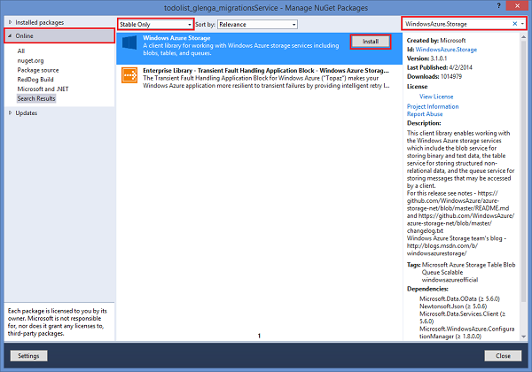
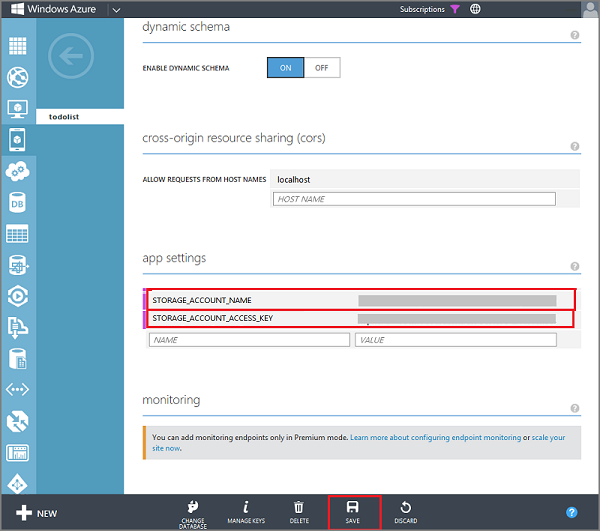
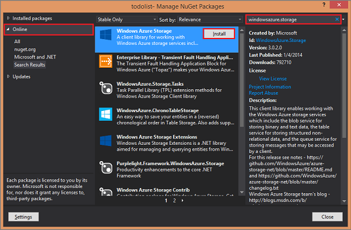
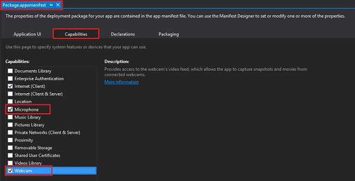
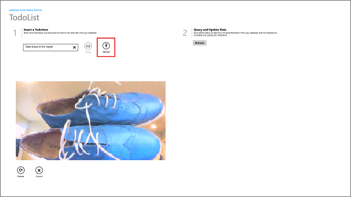
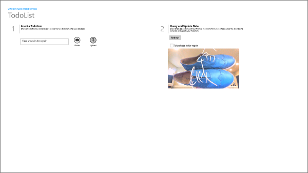
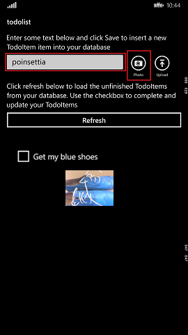
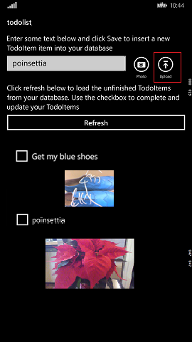

<properties
	pageTitle="Upload images to Azure Blob storage from a universal Windows app | Microsoft Azure"
	description="Learn how to use a .NET backend mobile service to upload images to Azure Blob Storage and access the images from your universal Windows app."
	documentationCenter="windows"
	authors="ggailey777"
	services="mobile-services,storage"
	manager="dwrede"
	editor=""/>

<tags
	ms.service="mobile-services"
	ms.workload="mobile"
	ms.tgt_pltfrm="mobile-windows-store"
	ms.devlang="dotnet"
	ms.topic="article"
	ms.date="07/21/2016"
	ms.author="glenga"/>

# Upload images to Azure Storage by using Mobile Services

>[AZURE.WARNING] This is an **Azure Mobile Services** topic.  This service has been superseded by Azure App Service Mobile Apps and is scheduled for removal from Azure.  We recommend using Azure Mobile Apps for all new mobile backend deployments.  Read [this announcement](https://azure.microsoft.com/blog/transition-of-azure-mobile-services/) to learn more about the pending deprecation of this service.  
>
> Learn about [migrating your site to Azure App Service](https://azure.microsoft.com/en-us/documentation/articles/app-service-mobile-migrating-from-mobile-services/).
>
> Get started with Azure Mobile Apps, see the [Azure Mobile Apps documentation center](https://azure.microsoft.com/documentation/learning-paths/appservice-mobileapps/).

&nbsp;

> [AZURE.SELECTOR-LIST (Platform | Backend)]
- [(Windows Runtime 8.1 universal C# | .NET)](mobile-services-dotnet-backend-windows-universal-dotnet-upload-data-blob-storage.md)
- [(Windows Runtime 8.1 universal C# | Javascript)](mobile-services-javascript-backend-windows-universal-dotnet-upload-data-blob-storage.md)
- [(Android | Javascript)](mobile-services-android-upload-data-blob-storage.md)

## Overview
This topic shows you how to use Azure Mobile Services to enable your app to upload and store user-generated images in Azure Storage. Mobile Services uses a SQL Database to store data. However, binary large object (BLOB) data is more efficiently stored in Azure Blob storage service.

You cannot securely distribute with the client app the credentials required to securely upload data to the Blob Storage service. Instead, you must store these credentials in your mobile service and use them to generate a Shared Access Signature (SAS) that is used to upload a new image. The SAS, a credential with a short expiration&mdash;in this case 5 minutes, is returned securely by Mobile Services to the client app. The app then uses this temporary credential to upload the image. In this example, downloads from the Blob service are public.

In this tutorial you add functionality to the Mobile Services quickstart app to take pictures and upload the images to Azure by using an SAS generated by Mobile Services.

## Prerequisites

This tutorial requires the following:

+ Microsoft Visual Studio 2013 Update 3, or a later version.
+ [Azure Storage account](https://azure.microsoft.com/en-us/documentation/articles/storage-create-storage-account/)
+ A camera or other image capture device attached to your computer.

This tutorial is based on the Mobile Services quickstart. Before you start this tutorial, you must first complete [Get started with Mobile Services].

## Install the storage client in the mobile service project

To be able to generate an SAS to upload images to Blob storage, you must first add the NuGet package that installs Storage client library in the mobile service project.

1. In **Solution Explorer** in Visual Studio, right-click the mobile service project, and then select **Manage NuGet Packages**.

2. In the left pane, select the **Online** category, select **Stabile Only**, search for **WindowsAzure.Storage**, click **Install** on the **Azure Storage** package, then accept the license agreements.

  	

  	This adds the client library for Azure storage services to the mobile service project.

## Update the TodoItem definition in the data model

The TodoItem class defines the data object, and you need to add the same properties to this class as you did on the client.

1. In Visual Studio 2013, open your mobile service project, expand the DataObjects folder, then open the TodoItem.cs project file.

2. Add the following new properties to the **TodoItem** class:

        public string containerName { get; set; }
		public string resourceName { get; set; }
		public string sasQueryString { get; set; }
		public string imageUri { get; set; }

	These properties are used to generate the SAS and to store image information. Note that the casing on these properties matches the JavaScript backend version.

	>[AZURE.NOTE] When using the default database initializer, Entity Framework will drop and recreate the database when it detects a data model change in the Code First definition. To make this data model change and maintain existing data in the database, you must use Code First Migrations. The default initializer cannot be used against a SQL Database in Azure. For more information, see [How to Use Code First Migrations to Update the Data Model](mobile-services-dotnet-backend-how-to-use-code-first-migrations.md).

## Update the TodoItem controller to generate a shared access signature

The existing **TodoItemController** is updated so that the **PostTodoItem** method generates an SAS when a new TodoItem is inserted. You also

0. If you haven't yet created your storage account, see [How To Create a Storage Account].

1. In the [Azure classic portal](https://manage.windowsazure.com/), click **Storage**, click the storage account, then click **Manage Keys**.

2. Make a note of the **Storage Account Name** and **Access Key**.

3. In your mobile service, click the **Configure** tab, scroll down to **App settings** and enter a **Name** and **Value** pair for each of the following that you obtained from the storage account, then click **Save**.

	+ `STORAGE_ACCOUNT_NAME`
	+ `STORAGE_ACCOUNT_ACCESS_KEY`

	

	The storage account access key is stored encrypted in app settings. You can access this key from any server script at runtime. For more information, see [App settings].

4. In Solution Explorer in Visual Studio, open the Web.config file for the mobile service project and add the following new app settings, replacing the placeholders with the storage account name and access key that you just set in the portal:

		<add key="STORAGE_ACCOUNT_NAME" value="**your_account_name**" />
		<add key="STORAGE_ACCOUNT_ACCESS_KEY" value="**your_access_token_secret**" />

	The mobile service uses these stored settings when it runs on the local computer, which lets you test the code before you publish it. When running in Azure, the mobile service instead uses app settings values set in the portal and ignores these project settings.

7.  In the Controllers folder, open the TodoItemController.cs file and add the following **using** directives:

		using System;
		using Microsoft.WindowsAzure.Storage.Auth;
		using Microsoft.WindowsAzure.Storage.Blob;

8.  Replace the existing **PostTodoItem** method with the following code:

        public async Task<IHttpActionResult> PostTodoItem(TodoItem item)
        {
            string storageAccountName;
            string storageAccountKey;

            // Try to get the Azure storage account token from app settings.  
            if (!(Services.Settings.TryGetValue("STORAGE_ACCOUNT_NAME", out storageAccountName) |
            Services.Settings.TryGetValue("STORAGE_ACCOUNT_ACCESS_KEY", out storageAccountKey)))
            {
                Services.Log.Error("Could not retrieve storage account settings.");
            }

            // Set the URI for the Blob Storage service.
            Uri blobEndpoint = new Uri(string.Format("https://{0}.blob.core.windows.net", storageAccountName));

            // Create the BLOB service client.
            CloudBlobClient blobClient = new CloudBlobClient(blobEndpoint,
                new StorageCredentials(storageAccountName, storageAccountKey));

            if (item.containerName != null)
            {
                // Set the BLOB store container name on the item, which must be lowercase.
                item.containerName = item.containerName.ToLower();

                // Create a container, if it doesn't already exist.
                CloudBlobContainer container = blobClient.GetContainerReference(item.containerName);
                await container.CreateIfNotExistsAsync();

                // Create a shared access permission policy.
                BlobContainerPermissions containerPermissions = new BlobContainerPermissions();

                // Enable anonymous read access to BLOBs.
                containerPermissions.PublicAccess = BlobContainerPublicAccessType.Blob;
                container.SetPermissions(containerPermissions);

                // Define a policy that gives write access to the container for 5 minutes.                                   
                SharedAccessBlobPolicy sasPolicy = new SharedAccessBlobPolicy()
                {
                    SharedAccessStartTime = DateTime.UtcNow,
                    SharedAccessExpiryTime = DateTime.UtcNow.AddMinutes(5),
                    Permissions = SharedAccessBlobPermissions.Write
                };

                // Get the SAS as a string.
                item.sasQueryString = container.GetSharedAccessSignature(sasPolicy);

                // Set the URL used to store the image.
                item.imageUri = string.Format("{0}{1}/{2}", blobEndpoint.ToString(),
                    item.containerName, item.resourceName);
            }

            // Complete the insert operation.
            TodoItem current = await InsertAsync(item);
            return CreatedAtRoute("Tables", new { id = current.Id }, current);
        }

   	This POST method now generates a new SAS for the inserted item, which is valid for 5 minutes, and assigns the value of the generated SAS to the `sasQueryString` property of the returned item. The `imageUri` property is also set to the resource path of the new BLOB to enable image display during binding in the client UI.

	>[AZURE.NOTE] This code creates an SAS for an individual BLOB. If you need to upload multiple blobs to a container using the same SAS, you can instead call the <a href="http://go.microsoft.com/fwlink/?LinkId=390455" target="_blank">generateSharedAccessSignature method</a> with an empty blob resource name, like this:
	<pre><code>blobService.generateSharedAccessSignature(containerName, '', sharedAccessPolicy);</code></pre>

Next, you will update the quickstart app to add image upload functionality by using the SAS generated on insert.

<!-- Anchors. -->

<!-- Images. -->

<!-- URLs. -->
[How To Create a Storage Account]: https://azure.microsoft.com/en-us/documentation/articles/storage-create-storage-account/
[App settings]: http://msdn.microsoft.com/library/windowsazure/b6bb7d2d-35ae-47eb-a03f-6ee393e170f7

## Install the Storage client for Windows Store apps

To be able to use an SAS to upload images to Blob storage, you must first add the NuGet package that installs Storage client library for Windows Store apps.

1. In **Solution Explorer** in Visual Studio, right-click the project name, and then select **Manage NuGet Packages**.

2. In the left pane, select the **Online** category, search for `WindowsAzure.Storage`, click **Install** on the **Azure Storage** package, then accept the license agreements.

  	

  	This adds the client library for Azure storage services to the project.

Next, you will update the quickstart app to capture and upload images.

## Update the quickstart client app to capture and upload images

1. In Visual Studio, open the Package.appxmanifest file for the Windows app project and in the **Capabilities** tab enable the **Webcam** and **Microphone** capabilities.

   	

   	This makes sure that your app can use a camera attached to the computer. Users will be requested to allow camera access the first time that the app is run.

2. Repeat the step above for the Windows Phone app project.

3. In the Windows app project, open the MainPage.xaml file and replace the **StackPanel** element directly after the first **QuickStartTask** element with the following code:

		<StackPanel Orientation="Horizontal" Margin="72,0,0,0">
            <TextBox Name="TextInput" Margin="5" MaxHeight="40" MinWidth="300"></TextBox>
            <AppBarButton Label="Photo" Icon="Camera" Name="ButtonCapture" Click="ButtonCapture_Click" />
            <AppBarButton Label="Upload" Icon="Upload" Name="ButtonSave" Click="ButtonSave_Click"/>
        </StackPanel>
        <Grid Name="captureGrid" Margin="62,0,0,0" Visibility="Collapsed" >
            <Grid.RowDefinitions>
                <RowDefinition Height="*" />
                <RowDefinition Height="Auto" />
            </Grid.RowDefinitions>
            <CaptureElement x:Name="previewElement" Grid.Row="0" Tapped="previewElement_Tapped" />
            <Image Name="imagePreview" Grid.Row="0"  />
            <StackPanel Name="captureButtons" Orientation="Horizontal" Grid.Row="1">
                <TextBlock Name="TextCapture" />
                <AppBarButton Label="Retake" Icon="Redo" Name="ButtonRetake" Click="ButtonCapture_Click" />
                <AppBarButton Label="Cancel" Icon="Cancel" Name="ButtonCancel" Click="ButtonCancel_Click" />
            </StackPanel>
        </Grid>

2. Replace the **StackPanel** element in the **DataTemplate** with the following code:

        <StackPanel Orientation="Vertical">
            <CheckBox Name="CheckBoxComplete" IsChecked="{Binding Complete, Mode=TwoWay}"
                        Checked="CheckBoxComplete_Checked" Content="{Binding Text}"
                        Margin="10,5" VerticalAlignment="Center"/>
            <Image Name="ImageUpload" Source="{Binding ImageUri, Mode=OneWay}"
                    MaxHeight="250"/>
        </StackPanel>

   	This adds an image to the **ItemTemplate** and sets its binding source as the URI of the uploaded image in the Blob Storage service.

3. In the Windows Phone app project, open the MainPage.xaml file and replace the **ButtonSave** element with the following code:

        <StackPanel Grid.Row ="1" Grid.Column="1"  Orientation="Horizontal">
            <AppBarButton Label="Photo" Icon="Camera" Name="ButtonCapture"
                          Click="ButtonCapture_Click" Height="78" Width="62" />
            <AppBarButton Label="Upload" Icon="Upload" Name="ButtonSave"
                          Click="ButtonSave_Click"/>
        </StackPanel>
        <Grid Grid.Row="2" Name="captureGrid" Grid.RowSpan="3" Grid.ColumnSpan="2"
              Canvas.ZIndex="99" Background="{ThemeResource ApplicationPageBackgroundThemeBrush}"
              Visibility="Collapsed">
            <Grid.RowDefinitions>
                <RowDefinition Height="*" />
                <RowDefinition Height="Auto" />
            </Grid.RowDefinitions>
            <CaptureElement Grid.Row="0" x:Name="previewElement" Tapped="previewElement_Tapped" />                    
            <Image Grid.Row="0" Name="imagePreview" Visibility="Collapsed" />
            <StackPanel Grid.Row="1" Name="captureButtons"
                        Orientation="Horizontal" Visibility="Collapsed">
                <TextBlock Name="TextCapture" VerticalAlignment="Bottom" />
                <AppBarButton Label="Retake" Icon="Redo" Name="ButtonRetake"
                              Click="ButtonRetake_Click" />
                <AppBarButton Label="Cancel" Icon="Cancel" Name="ButtonCancel"
                              Click="ButtonCancel_Click" />
            </StackPanel>
        </Grid>

2. Replace the **StackPanel** element in the **DataTemplate** with the following code:

        <StackPanel Orientation="Vertical">
            <CheckBox Name="CheckBoxComplete" IsChecked="{Binding Complete, Mode=TwoWay}"
                      Checked="CheckBoxComplete_Checked" Content="{Binding Text}"
                      Margin="10,5" VerticalAlignment="Center"/>
            <Image Name="ImageUpload" Source="{Binding ImageUri, Mode=OneWay}"
                   MaxHeight="150"/>
        </StackPanel>

4. In the shared DataModel folder, open the TodoItem.cs project file and add add the following properties to the TodoItem class:

        [JsonProperty(PropertyName = "containerName")]
        public string ContainerName { get; set; }

        [JsonProperty(PropertyName = "resourceName")]
        public string ResourceName { get; set; }

        [JsonProperty(PropertyName = "sasQueryString")]
        public string SasQueryString { get; set; }

        [JsonProperty(PropertyName = "imageUri")]
        public string ImageUri { get; set; }

3. Open the shared MainPage.cs project file and add the following **using** statements:

		using Windows.Media.Capture;
		using Windows.Media.MediaProperties;
		using Windows.Storage;
		using Windows.UI.Xaml.Input;
		using Microsoft.WindowsAzure.Storage.Auth;
		using Microsoft.WindowsAzure.Storage.Blob;
		using Windows.UI.Xaml.Media.Imaging;

5. Add the following code to the MainPage class:

        // Use a StorageFile to hold the captured image for upload.
        StorageFile media = null;
        MediaCapture cameraCapture;
        bool IsCaptureInProgress;

        private async Task CaptureImage()
        {
            // Capture a new photo or video from the device.
            cameraCapture = new MediaCapture();
            cameraCapture.Failed += cameraCapture_Failed;

            // Initialize the camera for capture.
            await cameraCapture.InitializeAsync();

            #if WINDOWS_PHONE_APP
            cameraCapture.SetPreviewRotation(VideoRotation.Clockwise90Degrees);
            cameraCapture.SetRecordRotation(VideoRotation.Clockwise90Degrees);
            #endif

            captureGrid.Visibility = Windows.UI.Xaml.Visibility.Visible;
            previewElement.Visibility = Windows.UI.Xaml.Visibility.Visible;
            previewElement.Source = cameraCapture;
            await cameraCapture.StartPreviewAsync();
        }

        private async void previewElement_Tapped(object sender, TappedRoutedEventArgs e)
        {
            // Block multiple taps.
            if (!IsCaptureInProgress)
            {                
                IsCaptureInProgress = true;

                // Create the temporary storage file.
                media = await ApplicationData.Current.LocalFolder
                    .CreateFileAsync("capture_file.jpg", CreationCollisionOption.ReplaceExisting);

                // Take the picture and store it locally as a JPEG.
                await cameraCapture.CapturePhotoToStorageFileAsync(
                    ImageEncodingProperties.CreateJpeg(), media);

                captureButtons.Visibility = Visibility.Visible;

				// Use the stored image as the preview source.
                BitmapImage tempBitmap = new BitmapImage(new Uri(media.Path));
                imagePreview.Source = tempBitmap;
                imagePreview.Visibility = Visibility.Visible;
                previewElement.Visibility = Visibility.Collapsed;
                IsCaptureInProgress = false;
            }
        }

        private async void cameraCapture_Failed(MediaCapture sender, MediaCaptureFailedEventArgs errorEventArgs)
        {
            // It's safest to return this back onto the UI thread to show the message dialog.
            MessageDialog dialog = new MessageDialog(errorEventArgs.Message);
            await this.Dispatcher.RunAsync(Windows.UI.Core.CoreDispatcherPriority.Normal,
                async () => { await dialog.ShowAsync(); });            
        }

        private async void ButtonCapture_Click(object sender, RoutedEventArgs e)
        {
            // Prevent multiple initializations.
            ButtonCapture.IsEnabled = false;

            await CaptureImage();
        }

        private async void ButtonRetake_Click(object sender, Windows.UI.Xaml.RoutedEventArgs e)
        {
            // Reset the capture and then start again.
            await ResetCaptureAsync();
            await CaptureImage();
        }

        private async void ButtonCancel_Click(object sender, Windows.UI.Xaml.RoutedEventArgs e)
        {
            await ResetCaptureAsync();
        }

        private async Task ResetCaptureAsync()
        {
            captureGrid.Visibility = Windows.UI.Xaml.Visibility.Collapsed;
            imagePreview.Visibility = Visibility.Collapsed;
            captureButtons.Visibility = Visibility.Collapsed;
            previewElement.Source = null;
            ButtonCapture.IsEnabled = true;

            // Make sure we stop the preview and release resources.
            await cameraCapture.StopPreviewAsync();
            cameraCapture.Dispose();
            media = null;
        }

  	This code displays the UI used to capture an image, and saves the image to a storage file.

6. Replace the existing `InsertTodoItem` method with the following code:

        private async Task InsertTodoItem(TodoItem todoItem)
        {
            string errorString = string.Empty;

            if (media != null)
            {
                // Set blob properties of TodoItem.
                todoItem.ContainerName = "todoitemimages";

                // Use a unigue GUID to avoid collisions.
                todoItem.ResourceName = Guid.NewGuid().ToString();
            }

            // Send the item to be inserted. When blob properties are set this
            // generates an SAS in the response.
            await todoTable.InsertAsync(todoItem);

            // If we have a returned SAS, then upload the blob.
            if (!string.IsNullOrEmpty(todoItem.SasQueryString))
            {
                // Get the URI generated that contains the SAS
                // and extract the storage credentials.
                StorageCredentials cred = new StorageCredentials(todoItem.SasQueryString);
                var imageUri = new Uri(todoItem.ImageUri);

                // Instantiate a Blob store container based on the info in the returned item.
                CloudBlobContainer container = new CloudBlobContainer(
                    new Uri(string.Format("https://{0}/{1}",
                        imageUri.Host, todoItem.ContainerName)), cred);

                // Get the new image as a stream.
                using (var inputStream = await media.OpenReadAsync())
                {
                    // Upload the new image as a BLOB from the stream.
                    CloudBlockBlob blobFromSASCredential =
                        container.GetBlockBlobReference(todoItem.ResourceName);
                    await blobFromSASCredential.UploadFromStreamAsync(inputStream);
                }

                // When you request an SAS at the container-level instead of the blob-level,
                // you are able to upload multiple streams using the same container credentials.

                await ResetCaptureAsync();
            }

            // Add the new item to the collection.
            items.Add(todoItem);
        }

	This code sends a request to the mobile service to insert a new TodoItem. The response contains the SAS, which is then used to upload the image from local storage to Azure Blob storage. The URL of the uploaded image is used in data binding.

The final step is to test both versions of the app and validate that uploads succeed from both devices.

## Test uploading the images in your app

1. In Visual Studio, make sure that the Windows project is set as the default project, then press the F5 key to run the app.

2. Enter text in the textbox under **Insert a TodoItem**, then click **Photo**.

3. Click or tap the preview to take a picture, then click **Upload** to insert the new item and upload the image.

	

4. The new item, along with the uploaded image, is displayed in the list view.

	

   	>[AZURE.NOTE]The image is downloaded automatically from Blob storage when the *imageUri* property of the new item is bound to the **Image** control.

5. Stop the app and restart the Windows Phone project version of the app.

	The previously uploaded image is displayed.

6. As before, enter some text in the textbox, then click **Photo**.

   	

3. Tap the preview to take a picture, then click **Upload** to insert the new item and upload the image.

	

You have completed the upload images tutorial.

## Next steps

Now that you have been able to securely upload images by integrating your mobile service with the Blob service, check out some of the other backend service and integration topics:

+ [Schedule backend jobs in Mobile Services](mobile-services-dotnet-backend-schedule-recurring-tasks.md)

     Learn how to use the Mobile Services job scheduler functionality to define server script code that is executed on a schedule that you define.

+ [Mobile Services .NET How-to Conceptual Reference](mobile-services-dotnet-how-to-use-client-library.md)

     Learn more about how to use Mobile Services with .NET

<!-- Anchors. -->
[Install the Storage Client library]: #install-storage-client
[Update the client app to capture images]: #add-select-images
[Install the storage client in the mobile service project]: #storage-client-server
[Update the TodoItem definition in the data model]: #update-data-model
[Update the table controller to generate an SAS]: #update-scripts
[Upload images to test the app]: #test
[Next Steps]:#next-steps

<!-- Images. -->

<!-- URLs. -->
[Get started with Mobile Services]: mobile-services-windows-store-dotnet-get-started.md
[How To Create a Storage Account]: https://azure.microsoft.com/en-us/documentation/articles/storage-create-storage-account/
[Azure Storage Client library for Store apps]: http://go.microsoft.com/fwlink/p/?LinkId=276866
