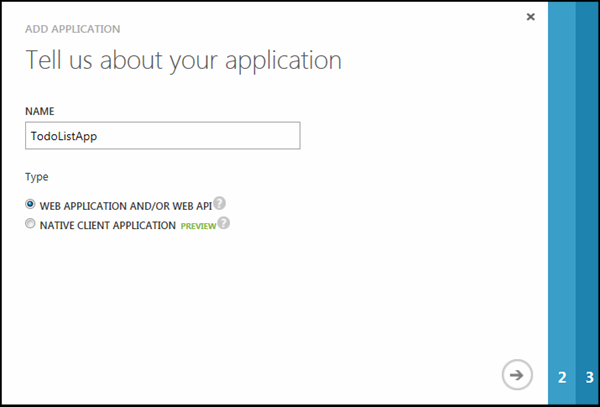
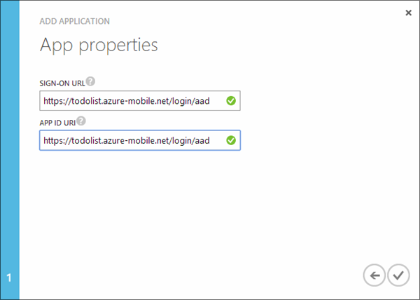
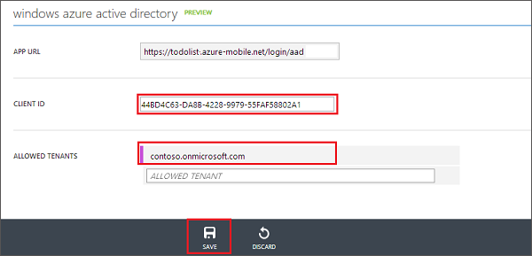

<properties
	pageTitle="Register for Azure Active Directory authentication | Microsoft Azure"
	description="Learn how to register for Azure Active Directory authentication in your Mobile Services application."
	authors="wesmc7777"
	services="mobile-services"
	documentationCenter=""
	manager="dwrede"
	editor=""/>

<tags
	ms.service="mobile-services"
	ms.workload="mobile"
	ms.tgt_pltfrm="multiple"
	ms.devlang="multiple"
	ms.topic="article"
	ms.date="07/21/2016"
	ms.author="ricksal"/>

# Register your apps to use an Azure Active Directory Account login

>[AZURE.WARNING] This is an **Azure Mobile Services** topic.  This service has been superseded by Azure App Service Mobile Apps and is scheduled for removal from Azure.  We recommend using Azure Mobile Apps for all new mobile backend deployments.  Read [this announcement](https://azure.microsoft.com/blog/transition-of-azure-mobile-services/) to learn more about the pending deprecation of this service.  
> 
> Learn about [migrating your site to Azure App Service](../articles/app-service-mobile/app-service-mobile-migrating-from-mobile-services.md).
>
> Get started with Azure Mobile Apps, see the [Azure Mobile Apps documentation center](https://azure.microsoft.com/documentation/learning-paths/appservice-mobileapps/).

&nbsp;

> [AZURE.SELECTOR]
- [Azure Active Directory](../articles/mobile-services/mobile-services-how-to-register-active-directory-authentication.md)
- [Facebook](../articles/mobile-services/mobile-services-how-to-register-facebook-authentication.md)
- [Google](../articles/mobile-services/mobile-services-how-to-register-google-authentication.md)
- [Microsoft account](../articles/mobile-services/mobile-services-how-to-register-microsoft-authentication.md)
- [Twitter](../articles/mobile-services/mobile-services-how-to-register-twitter-authentication.md)

##Overview

This topic shows you how to register your apps to be able to use Azure Active Directory as an authentication provider for your mobile service.

##Registering your app

>[AZURE.NOTE] The steps outlined in this topic are intended to be used with [Add Authentication to your Mobile Services app](mobile-services-dotnet-backend-windows-universal-dotnet-get-started-users.md) tutorial when you want to use [Service-directed login operations](http://msdn.microsoft.com/library/azure/dn283952.aspx) with your app. Alternatively, if your app has a requirement for [client-directed login operations](http://msdn.microsoft.com/library/azure/jj710106.aspx) for Azure Active Directory and a .NET backend mobile service you should start with the [Authenticate your app with Active Directory Authentication Library Single Sign-On](mobile-services-windows-store-dotnet-adal-sso-authentication.md) tutorial.

1. Log on to the [Azure classic portal], navigate to your mobile service, click the **Identity** tab, then scroll down to the **Azure active directory** identity provider section and copy the **App URL** shown there.

    

2. Navigate to **Active Directory** in the [classic portal], click your directory then **Domains** and make a note of your directory's default domain.

3. Click **Applications** > **Add** > **Add an application my organization is developing**.

4. In the Add Application Wizard, enter a **Name** for your application and click the  **Web application and/or Web API** type.

    

5. In the **Sign-on URL** box, paste the app URL value you copied from your mobile service. Enter the same unique value in the **App ID URI** box, then click to continue.

    

6. After the application has been added, click the **Configure** tab and copy the **Client ID** for the app.

    >[AZURE.NOTE]For a .NET backend mobile service, you must also edit the **Reply URL** value under **Single Sign-on** to be the URL of your mobile service appended with the path, _signin-aad_. For example,  `https://todolist.azure-mobile.net/signin-aad`

7. Return to your mobile service's **Identity** tab and paste the copied **Client ID** value for the azure active directory identity provider.

    

8.  In the **Allowed Tenants** list, type the domain of the directory in which you registered the application (such as `contoso.onmicrosoft.com`), then click **Save**.

You are now ready to use an Azure Active Directory for authentication in your app.

<!-- Anchors. -->

<!-- Images. -->

<!-- URLs. -->
[Azure classic portal]: https://manage.windowsazure.com/
[classic portal]: https://manage.windowsazure.com/

