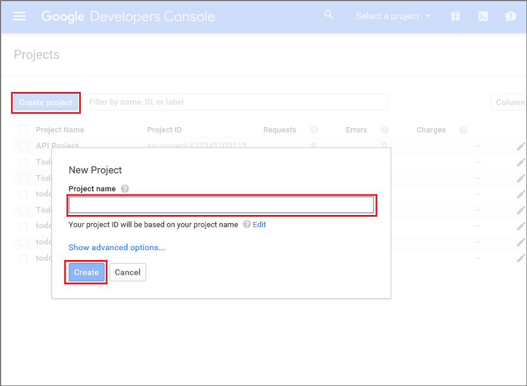
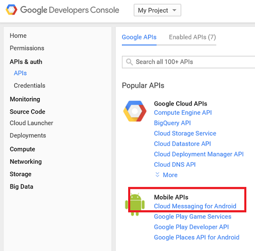
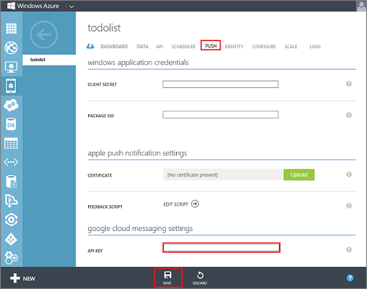

<properties
	pageTitle="Get started with push notifications (Android JavaScript) | Microsoft Azure"
	description="Learn how to use Azure Mobile Services to send push notifications to your Android JavaScript app."
	services="mobile-services, notification-hubs"
	documentationCenter="android"
	authors="RickSaling"
	writer="ricksal"
	manager="erikre"
	editor=""/>

<tags
	ms.service="mobile-services"
	ms.workload="mobile"
	ms.tgt_pltfrm="mobile-android"
	ms.devlang="java"
	ms.topic="article"
	ms.date="07/21/2016"
	ms.author="ricksal"/>

# Add push notifications to your Mobile Services Android app

> [AZURE.SELECTOR-LIST (Platform | Backend )]
- [(iOS | .NET)](../articles/mobile-services-dotnet-backend-ios-get-started-push.md)
- [(iOS | JavaScript)](../articles/mobile-services-javascript-backend-ios-get-started-push.md)
- [(Windows Runtime 8.1 universal C# | .NET)](../articles/mobile-services-dotnet-backend-windows-universal-dotnet-get-started-push.md)
- [(Windows Runtime 8.1 universal C# | Javascript)](../articles/mobile-services-javascript-backend-windows-universal-dotnet-get-started-push.md)
- [(Windows Phone Silverlight 8.x | Javascript)](../articles/mobile-services-javascript-backend-windows-phone-get-started-push.md)
- [(Android | .NET)](../articles/mobile-services-dotnet-backend-android-get-started-push.md)
- [(Android | Javascript)](../articles/mobile-services-javascript-backend-android-get-started-push.md)
- [(Xamarin.iOS | Javascript)](../articles/partner-xamarin-mobile-services-ios-get-started-push.md)
- [(Xamarin.Android | Javascript)](../articles/partner-xamarin-mobile-services-android-get-started-push.md)
- [(Xamarin.Android | .NET)](../articles/mobile-services-dotnet-backend-xamarin-android-get-started-push.md)
- [(Xamarin.Forms | JavaScript)](../articles/partner-xamarin-mobile-services-xamarin-forms-get-started-push.md)

&nbsp;

>[AZURE.WARNING] This is an **Azure Mobile Services** topic.  This service has been superseded by Azure App Service Mobile Apps and is scheduled for removal from Azure.  We recommend using Azure Mobile Apps for all new mobile backend deployments.  Read [this announcement](https://azure.microsoft.com/blog/transition-of-azure-mobile-services/) to learn more about the pending deprecation of this service.  
> 
> Learn about [migrating your site to Azure App Service](../articles/app-service-mobile/app-service-mobile-migrating-from-mobile-services.md).
>
> Get started with Azure Mobile Apps, see the [Azure Mobile Apps documentation center](https://azure.microsoft.com/documentation/learning-paths/appservice-mobileapps/).
> For the equivalent Mobile Apps version of this topic, see [Add push notifications to your Android app](../app-service-mobile/app-service-mobile-android-get-started-push.md).

## Summary

This topic shows how to use Azure Mobile Services to send push notifications to your Android app using Google Cloud Messaging ("GCM"). You will add push notifications to the quickstart project that is a prerequisite for this tutorial. Push notifications are enabled by using the Azure Notification Hub that is included in your mobile service. When complete, your mobile service will send a push notification each time a record is inserted.

## Prerequisites

[AZURE.INCLUDE [mobile-services-android-prerequisites](../../includes/mobile-services-android-prerequisites.md)]

## Sample code
To see the completed source code go [here](https://github.com/Azure/mobile-services-samples/tree/master/GettingStartedWithPush).

## Enable Google Cloud Messaging

1. Navigate to the [Google Cloud Console](https://console.developers.google.com/project), sign in with your Google account credentials. 
 
2. Click **Create Project**, type a project name, then click **Create**. If requested, carry out the SMS Verification, and click **Create** again.

   	   

	 Type in your new **Project name** and click **Create project**.

3. Click the **Utilities and More** button and then click **Project Information**. Make a note of the **Project Number**. You will need to set this value as the `SenderId` variable in the client app.

   	

4. In the project dashboard, under **Mobile APIs**, click **Google Cloud Messaging**, then on the next page click **Enable API** and accept the terms of service. 

	

	 

5. In the project dashboard, Click **Credentials** > **Create Credential** > **API Key**. 

   	

6. In **Create a new key**, click **Server key**, type a name for your key, then click **Create**.

7. Make a note of the **API KEY** value.

	You will use this API key value to enable Azure to authenticate with GCM and send push notifications on behalf of your app.

## Configure Mobile Services to send push requests

1. Log on to the [Azure classic portal](https://manage.windowsazure.com/), click **Mobile Services**, and then click your app.

2. Click the **Push** tab, enter the **API Key** value obtained from GCM in the previous procedure, then click **Save**.

   	

    >[AZURE.NOTE]When you set your GCM credentials for enhanced push notifications in the Push tab in the portal, they are shared with Notification Hubs to configure the notification hub with your app.

Both your mobile service and your app are now configured to work with GCM and Notification Hubs. 

## Add push notifications to your app

Your next step is to install Google Play services. Google Cloud Messaging has some minimum API level requirements for development and testing, which the **minSdkVersion** property in the Manifest must conform to.

If you will be testing with an older device, then consult [Set Up Google Play Services SDK] to determine how low you can set this value, and set it appropriately.

###Add Google Play Services to the project

[AZURE.INCLUDE [Add Play Services](../../includes/mobile-services-add-google-play-services.md)]

###Add code

[AZURE.INCLUDE [mobile-services-android-getting-started-with-push](../../includes/mobile-services-android-getting-started-with-push.md)]

## Update the registered insert script in the Azure classic portal

1. In the [Azure classic portal](https://manage.windowsazure.com/), click the **Data** tab and then click the **TodoItem** table. 
 
2. In **todoitem**, click the **Script** tab and select **Insert**.
   
   	This displays the function that is invoked when an insert occurs in the **TodoItem** table.

3. Replace the insert function with the following code, and then click **Save**:

		function insert(item, user, request) {
		// Define a simple payload for a GCM notification.
	    var payload = {
	        "data": {
	            "message": item.text
	        }
	    };		
		request.execute({
		    success: function() {
		        // If the insert succeeds, send a notification.
		        push.gcm.send(null, payload, {
		            success: function(pushResponse) {
		                console.log("Sent push:", pushResponse, payload);
		                request.respond();
		                },              
		            error: function (pushResponse) {
		                console.log("Error Sending push:", pushResponse);
		                request.respond(500, { error: pushResponse });
		                }
		            });
		        },
		    error: function(err) {
		        console.log("request.execute error", err)
		        request.respond();
		    }
		  });
		}

   	This registers a new insert script, which uses the [gcm object](http://go.microsoft.com/fwlink/p/?LinkId=282645) to send a push notification to all registered devices after the insert succeeds. 

## Test push notifications in your app

You can test the app by directly attaching an Android phone with a USB cable, or by using a virtual device in the emulator.

###Setting up the Android emulator for testing

When you run this app in the emulator, make sure that you use an Android Virtual Device (AVD) that supports Google APIs.

1. From the right end of the toolbar, select the Android Virtual Device Manager, select your device, click the edit icon on the right.

	

2. Select **Change** on the device description line, select **Google APIs**,  then click OK.

   	

	This targets the AVD to use Google APIs.

###Running the test

1. From the **Run** menu item, click **Run app** to start the app.

2. In the app, type meaningful text, such as _A new Mobile Services task_ and then click the **Add** button.

  	

3. Swipe down from the top of the screen to open the device's Notification Drawer to see the notification.

You have successfully completed this tutorial.

## Troubleshooting

### Verify Android SDK Version

[AZURE.INCLUDE [Verify SDK](../../includes/mobile-services-verify-android-sdk-version.md)]

## Next steps

<!---This tutorial demonstrated the basics of enabling an Android app to use Mobile Services and Notification Hubs to send push notifications. Next, consider completing the next tutorial, [Send push notifications to authenticated users], which shows how to use tags to send push notifications from a Mobile Service to only an authenticated user.

+ [Send broadcast notifications to subscribers]
	 Learn how users can register and receive push notifications for categories they're interested in.

+ [Send template-based notifications to subscribers]
	 Learn how to use templates to send push notifications from a Mobile Service, without having to craft platform-specific payloads in your back-end.
-->

Learn more about Mobile Services and Notification Hubs in the following topics:

* [Get started with authentication]
   Learn how to authenticate users of your app with different account types using mobile services.

* [What are Notification Hubs?]
   Learn more about how Notification Hubs works to deliver notifications to your apps across all major client platforms.

* [Debug Notification Hubs applications](http://go.microsoft.com/fwlink/p/?linkid=386630)
   Get guidance troubleshooting and debugging Notification Hubs solutions.

* [How to use the Android client library for Mobile Services]
   Learn more about how to use Mobile Services with Android.

* [Mobile Services server script reference]
   Learn more about how to implement business logic in your mobile service.

<!-- Anchors. -->
[Register your app for push notifications and configure Mobile Services]: #register
[Update the generated push notification code]: #update-scripts
[Insert data to receive notifications]: #test
[Next Steps]:#next-steps

<!-- Images. -->
[13]: ./media/mobile-services-windows-store-javascript-get-started-push/mobile-quickstart-push1.png
[14]: ./media/mobile-services-windows-store-javascript-get-started-push/mobile-quickstart-push2.png

<!-- URLs. -->
[Submit an app page]: http://go.microsoft.com/fwlink/p/?LinkID=266582
[My Applications]: http://go.microsoft.com/fwlink/p/?LinkId=262039
[Get started with Mobile Services]: mobile-services-android-get-started.md
[Get started with authentication]: mobile-services-android-get-started-users.md
[Get started with push notifications]: /develop/mobile/tutorials/get-started-with-push-js
[Push notifications to app users]: /develop/mobile/tutorials/push-notifications-to-users-js
[Authorize users with scripts]: /develop/mobile/tutorials/authorize-users-in-scripts-js
[JavaScript and HTML]: /develop/mobile/tutorials/get-started-with-push-js
[Set Up Google Play Services SDK]: http://go.microsoft.com/fwlink/?LinkId=389801
[Azure classic portal]: https://manage.windowsazure.com/
[How to use the Android client library for Mobile Services]: mobile-services-android-how-to-use-client-library.md

[gcm object]: http://go.microsoft.com/fwlink/p/?LinkId=282645

[Mobile Services server script reference]: http://go.microsoft.com/fwlink/?LinkId=262293
[What are Notification Hubs?]: ../notification-hubs-overview.md
[Send broadcast notifications to subscribers]: ../notification-hubs-android-send-breaking-news.md
[Send template-based notifications to subscribers]: ../notification-hubs-android-send-localized-breaking-news.md
