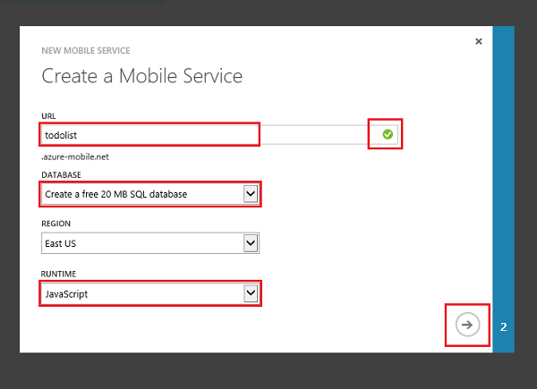

<properties
	pageTitle="Get Started with Mobile Services for Windows Store apps (C#) | Microsoft Azure"
	description="Follow this tutorial to get started using Azure Mobile Services for Windows Store development in C#."
	services="mobile-services"
	documentationCenter="windows"
	authors="ggailey777"
	manager="dwrede"
	editor=""/>

<tags
	ms.service="mobile-services"
	ms.workload="mobile"
	ms.tgt_pltfrm="mobile-windows"
	ms.devlang="dotnet"
	ms.topic="get-started-article"
	ms.date="07/21/2016"
	ms.author="glenga"/>

# Get started with Mobile Services

> [AZURE.SELECTOR-LIST (Platform | Backend )]
- [(iOS | .NET)](mobile-services-dotnet-backend-ios-get-started.md)
- [(iOS | JavaScript)](mobile-services-ios-get-started.md)
- [(Windows Runtime 8.1 universal C# | .NET)](mobile-services-dotnet-backend-windows-store-dotnet-get-started.md)
- [(Windows Runtime 8.1 universal C# | Javascript)](mobile-services-javascript-backend-windows-store-dotnet-get-started.md)
- [(Windows Runtime 8.1 universal JavaScript | Javascript)](mobile-services-javascript-backend-windows-store-javascript-get-started.md)
- [(Android | .NET)](mobile-services-dotnet-backend-android-get-started.md)
- [(Android | Javascript)](mobile-services-android-get-started.md)
- [(Xamarin.iOS | .NET)](mobile-services-dotnet-backend-xamarin-ios-get-started.md)
- [(Xamarin.iOS | Javascript)](../articles/partner-xamarin-mobile-services-ios-get-started.md)
- [(Xamarin.Android | .NET)](mobile-services-dotnet-backend-xamarin-android-get-started.md)
- [(Xamarin.Android | Javascript)](../articles/partner-xamarin-mobile-services-android-get-started.md)
- [(HTML | Javascript)](mobile-services-html-get-started.md)
- [(PhoneGap | Javascript)](mobile-services-javascript-backend-phonegap-get-started.md)
- [(Sencha | Javascript)](../articles/partner-sencha-mobile-services-get-started.md)
&nbsp;

>[AZURE.WARNING] This is an **Azure Mobile Services** topic.  This service has been superseded by Azure App Service Mobile Apps and is scheduled for removal from Azure.  We recommend using Azure Mobile Apps for all new mobile backend deployments.  Read [this announcement](https://azure.microsoft.com/blog/transition-of-azure-mobile-services/) to learn more about the pending deprecation of this service.  
>
> Learn about [migrating your site to Azure App Service](https://azure.microsoft.com/en-us/documentation/articles/app-service-mobile-migrating-from-mobile-services/).
>
> Get started with Azure Mobile Apps, see the [Azure Mobile Apps documentation center](https://azure.microsoft.com/documentation/learning-paths/appservice-mobileapps/).
> For the equivalent Mobile Apps version of this topic, see [Create a Windows App](../app-service-mobile/app-service-mobile-windows-store-dotnet-get-started.md).

This tutorial shows you how to add a cloud-based backend service to a universal Windows app using Azure Mobile Services. Universal Windows app solutions include projects for both Windows Store 8.1 and Windows Phone Store 8.1 apps and a common shared project. For more information, see [Build universal Windows apps that target Windows and Windows Phone](http://msdn.microsoft.com/library/windows/apps/xaml/dn609832.aspx).

In this tutorial, you will create both a new mobile service and a simple *To do list* app that stores app data in the new mobile service. The mobile service that you will create uses JavaScript for server-side business logic. To create a mobile service that lets you write your server-side business logic in the supported .NET languages using Visual Studio, see the .NET backend version of this topic.

The following are screen captures from the completed app:

 Windows Store app

 Windows Phone Store app

Completing this tutorial is a prerequisite for all other Mobile Services tutorials for Windows Store and Windows Phone Store apps.

To complete this tutorial, you need the following:

* An active Azure account. If you don't have an account, you can sign up for an Azure trial and get up to 10 free mobile services that you can keep using even after your trial ends. For details, see [Azure Free Trial](https://azure.microsoft.com/pricing/free-trial/?WT.mc_id=A0E0E5C02&amp;returnurl=http%3A%2F%2Fazure.microsoft.com%2Fen-us%2Fdocumentation%2Farticles%2Fmobile-services-javascript-backend-windows-store-javascript-get-started%2F).
* [Visual Studio 2013 Express for Windows]

## Create a new mobile service

Follow these steps to create a new mobile service.

1.	Log into the [Azure classic portal](https://manage.windowsazure.com/). At the bottom of the navigation pane, click **+NEW**. Expand **Compute** and **Mobile Service**, then click **Create**.

	

	This displays the **Create a Mobile Service** dialog.

2.	In the **Create a Mobile Service** dialog, select **Create a free 20 MB SQL Database**, select **JavaScript** runtime, then type a subdomain name for the new mobile service in the **URL** textbox. Click the right arrow button to go to the next page.

	

	This displays the **Specify database settings** page.

	>[AZURE.NOTE]As part of this tutorial, you create a new SQL Database instance and server. You can reuse this new database and administer it as you would any other SQL Database instance. If you already have a database in the same region as the new mobile service, you can instead choose **Use existing Database** and then select that database. The use of a database in a different region is not recommended because of additional bandwidth costs and higher latencies.

3.	In **Name**, type the name of the new database, then type **Login name**, which is the administrator login name for the new SQL Database server, type and confirm the password, and click the check button to complete the process.
	

You have now created a new mobile service that can be used by your mobile apps.

## Create a new universal Windows app

Once you have created your mobile service, you can follow an easy quickstart in the Azure classic portal to either create a new universal Windows app or modify an existing Windows Store or Windows Phone app project to connect to your mobile service.

In this section you will create a new universal Windows app that is connected to your mobile service.

1.  In the [Azure classic portal], click **Mobile Services**, and then click the mobile service that you just created.

2. In the quickstart tab, click **Windows** under **Choose platform** and expand **Create a new Windows Store app**.

   	This displays the three easy steps to create a Windows Store app connected to your mobile service.

  	

3. If you haven't already done so, download and install [Visual Studio 2013 Express for Windows] on your local computer or virtual machine.

4. Click **Create TodoItem table** to create a table to store app data.

5. Under **Download and run your app**, select a language for your app, then click **Download**.

  	This downloads the project for the sample *To do list* application that is connected to your mobile service. Save the compressed project file to your local computer, and make a note of where you save it.

## Run your Windows app

The final stage of this tutorial is to build and run your new app.

1. Browse to the location where you saved the compressed project files, expand the files on your computer, and open the solution file in Visual Studio.

2. Press the **F5** key to rebuild the project and start the app.

3. In the app, type meaningful text, such as *Complete the tutorial*, in **Insert a TodoItem**, and then click **Save**.

   	This sends a POST request to the new mobile service hosted in Azure. Data from the request is inserted into the TodoItem table. Items stored in the table are returned by the mobile service, and the data is displayed in the second column in the app.

4. (Optional) In a universal Windows solution, change the default start up project to the other app and run the app again.

	Notice that data saved from the previous step is loaded from the mobile service after the app starts.

4. Back in the [Azure classic portal](https://manage.windowsazure.com/), click the **Data** tab and then click the **TodoItems** table.

   	This lets you browse the data inserted by the app into the table.

   	

>[AZURE.NOTE]You can review the code that accesses your mobile service to query and insert data, which is found in the MainPage.xaml.cs file.

## Next Steps
Now that you have completed the quickstart, learn how to perform additional important tasks in Mobile Services:

* [Get started with offline data sync]  
  Learn how to use offline data sync to make your app responsive and robust.

* [Add authentication to your Mobile Services app ][Get started with authentication]  
  Learn how to authenticate users of your app with an identity provider.

* [Add push notifications to your app][Get started with push notifications]  
  Learn how to send a very basic push notification to your app.

* [How to use the .NET client library](mobile-services-dotnet-how-to-use-client-library.md)  
 Learn how to query the mobile service, work with data, and access custom APIs.

<!-- Anchors. -->
[Getting started with Mobile Services]:#getting-started
[Create a new mobile service]:#create-new-service
[Define the mobile service instance]:#define-mobile-service-instance
[Next Steps]:#next-steps

<!-- Images. -->

<!-- URLs. -->
[Get started with offline data sync]: mobile-services-windows-store-dotnet-get-started-offline-data.md
[Get started with authentication]: mobile-services-javascript-backend-windows-universal-dotnet-get-started-users.md
[Get started with push notifications]: mobile-services-javascript-backend-windows-universal-dotnet-get-started-push.md
[Visual Studio 2013 Express for Windows]: http://go.microsoft.com/fwlink/?LinkId=257546
[Mobile Services SDK]: http://go.microsoft.com/fwlink/?LinkId=257545
[Azure classic portal]: https://manage.windowsazure.com/
