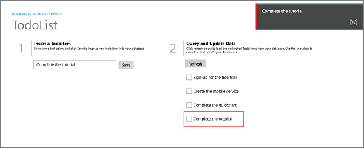
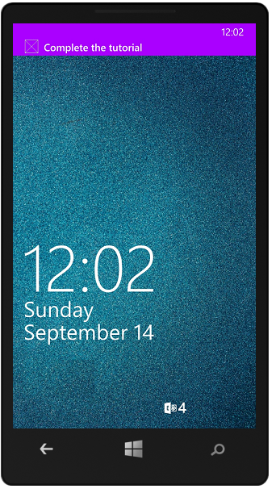

<properties 
	pageTitle="Add push notifications to your universal Windows 8.1 app | Microsoft Azure" 
	description="Learn how to send push notifications to your universal Windows 8.1 app from your JavaScript backend mobile service using Azure Notification Hubs." 
	services="mobile-services,notification-hubs" 
	documentationCenter="windows" 
	authors="ggailey777" 
	manager="erikre" 
	editor=""/>

<tags 
	ms.service="mobile-services" 
	ms.workload="mobile" 
	ms.tgt_pltfrm="mobile-windows" 
	ms.devlang="dotnet" 
	ms.topic="article" 
	ms.date="07/21/2016" 
	ms.author="glenga"/>

# Add push notifications to your Mobile Services app

> [AZURE.SELECTOR-LIST (Platform | Backend )]
- [(iOS | .NET)](mobile-services-dotnet-backend-ios-get-started-push.md)
- [(iOS | JavaScript)](mobile-services-javascript-backend-ios-get-started-push.md)
- [(Windows Runtime 8.1 universal C# | .NET)](mobile-services-dotnet-backend-windows-universal-dotnet-get-started-push.md)
- [(Windows Runtime 8.1 universal C# | Javascript)](mobile-services-javascript-backend-windows-universal-dotnet-get-started-push.md)
- [(Windows Phone Silverlight 8.x | Javascript)](mobile-services-javascript-backend-windows-phone-get-started-push.md)
- [(Android | .NET)](mobile-services-dotnet-backend-android-get-started-push.md)
- [(Android | Javascript)](mobile-services-javascript-backend-android-get-started-push.md)
- [(Xamarin.iOS | Javascript)](../articles/partner-xamarin-mobile-services-ios-get-started-push.md)
- [(Xamarin.Android | Javascript)](../articles/partner-xamarin-mobile-services-android-get-started-push.md)
- [(Xamarin.Android | .NET)](mobile-services-dotnet-backend-xamarin-android-get-started-push.md)
- [(Xamarin.Forms | JavaScript)](../articles/partner-xamarin-mobile-services-xamarin-forms-get-started-push.md)

&nbsp;

>[AZURE.WARNING] This is an **Azure Mobile Services** topic.  This service has been superseded by Azure App Service Mobile Apps and is scheduled for removal from Azure.  We recommend using Azure Mobile Apps for all new mobile backend deployments.  Read [this announcement](https://azure.microsoft.com/blog/transition-of-azure-mobile-services/) to learn more about the pending deprecation of this service.  
> 
> Learn about [migrating your site to Azure App Service](https://azure.microsoft.com/en-us/documentation/articles/app-service-mobile-migrating-from-mobile-services/).
>
> Get started with Azure Mobile Apps, see the [Azure Mobile Apps documentation center](https://azure.microsoft.com/documentation/learning-paths/appservice-mobileapps/).
> For the equivalent Mobile Apps version of this topic, see [Add push notifications to your Windows app](../app-service-mobile/app-service-mobile-windows-store-dotnet-get-started-push.md).	
 
This topic shows you how to use Azure Mobile Services with a JavaScript backend to send push notifications to a universal Windows app. In this tutorial you enable push notifications using Azure Notification Hubs in a universal Windows app project. When complete, your mobile service will send a push notification from the JavaScript backend to all registered Windows Store and Windows Phone Store apps each time a record is inserted in the TodoList table. The notification hub that you create is free with your mobile service, can be managed independent of the mobile service, and can be used by other applications and services.

>[AZURE.NOTE]This topic shows you how to use the tooling in Visual Studio 2013 with Update 3 to add support for push notifications from Mobile Services to a universal Windows app. The same steps can be used to add push notifications from Mobile Services to a Windows Store or Windows Phone Store 8.1 app. To add push notifications to a Windows Phone 8 or Windows Phone Silverlight 8.1 app, see this version of [Get started with push notifications in Mobile Services](mobile-services-javascript-backend-windows-phone-get-started-push.md).

This tutorial walks you through these basic steps to enable push notifications:

1. [Register your app for push notifications](#register)
2. [Update the service to send push notifications](#update-service)
3. [Test push notifications in your app](#test)

To complete this tutorial, you need the following:

* An active [Microsoft Store account](http://go.microsoft.com/fwlink/p/?LinkId=280045).
* [Visual Studio 2013 Express for Windows](http://go.microsoft.com/fwlink/?LinkId=257546) with Update 3, or a later version

##Register your app for push notifications

The following steps registers your app with the Windows Store, configure your mobile service to enable push notifications, and add code to your app to register a device channel with your notification hub. Visual Studio 2013 connects to Azure and to the Windows Store by using the credentials that you provide. 

1. In Visual Studio 2013, open Solution Explorer, right-click the Windows Store app project, click **Add** then **Push Notification...**. 

	

	This starts the Add Push Notification Wizard.

2. Click **Next**, sign in to your Windows Store account, then supply a name in **Reserve a new name** and click **Reserve**.

	This creates a new app registration.

3. Click the new registration in the **App Name** list, then click **Next**.

4. In the **Select a service** page, click the name of your mobile service, then click **Next** and **Finish**. 

	The notification hub used by your mobile service is updated with the Windows Notification Services (WNS) registration. You can now use Azure Notification Hubs to send notifications from Mobile Services to your app by using WNS. 

	>[AZURE.NOTE]This tutorial demonstrates sending notifications from a mobile service backend. You can use the same notification hub registration to send notifications from any backend service. For more information, see [Notification Hubs Overview](http://msdn.microsoft.com/library/azure/jj927170.aspx).

5. When you complete the wizard, a new **Push setup is almost complete** page is opened in Visual Studio. This page details an alternate method to configure your mobile service project to send notifications that is different from this tutorial. 

	The code that is added to your universal Windows app solution by the Add Push Notification wizard is platform-specific. Later in this section, you will remove this redundancy by sharing the Mobile Services client code, which makes the universal app easier to maintain.  

<!-- URLs. -->
[Get started with Mobile Services]: /develop/mobile/tutorials/get-started/
[Get started with data]: /develop/mobile/tutorials/get-started-with-data-dotnet/

&nbsp;&nbsp;6. Browse to the `\Services\MobileServices\your_service_name` project folder, open the generated push.register.cs code file, and inspect the **UploadChannel** method that registers the device's channel URL with the notification hub.

&nbsp;&nbsp;7. Open the shared App.xaml.cs code file and notice that a call to the new **UploadChannel** method was added in the **OnLaunched** event handler. This makes sure that registration of the device is attempted whenever the app is launched.

&nbsp;&nbsp;8. Repeat the previous steps to add push notifications to the Windows Phone Store app project, then in the shared App.xaml.cs file, remove the extra call to **Mobile Service Client**, **UploadChannel** and the remaining `#if...#endif` conditional wrapper. Both projects can now share a single call to **UploadChannel**. 

&nbsp;&nbsp;Note that you can also simplify the generated code by unifying the `#if...#endif` wrapped [MobileServiceClient] definitions into a single  unwrapped definition used by both versions of the app.

Now that push notifications are enabled in the app, you must update the mobile service to send push notifications. 

##Update the service to send push notifications

The following steps update the insert script registered to the TodoItem table. You can implement similar code in any server script or anywhere else in your backend services. 

Finally, you must update the script registered to the insert operation on the TodoItem table to send notifications.

1. Click **TodoItem**, click **Script** and select **Insert**. 

2. Replace the insert function with the following code, and then click **Save**:

		function insert(item, user, request) {
		// Define a payload for the Windows Store toast notification.
		var payload = '<?xml version="1.0" encoding="utf-8"?><toast><visual>' +    
		    '<binding template="ToastText01">  <text id="1">' +
		    item.text + '</text></binding></visual></toast>';
		
		request.execute({
		    success: function() {
		        // If the insert succeeds, send a notification.
		    	push.wns.send(null, payload, 'wns/toast', {
		            success: function(pushResponse) {
		                console.log("Sent push:", pushResponse);
						request.respond();
		                },              
		                error: function (pushResponse) {
		                    console.log("Error Sending push:", pushResponse);
							request.respond(500, { error: pushResponse });
		                    }
		                });
		            }
		        });
		}

	This insert script sends a push notification (with the text of the inserted item) to all Windows Store app registrations after the insert succeeds.

## Test push notifications in your app

1. In Visual Studio, right-click the Windows Store project, click **Set as StartUp Project**, then press the F5 key to run the Windows Store app.
	
	After the app starts, the device is registered for push notifications.

2. Stop the Windows Store app and repeat the previous step to run the Windows Phone Store app.

	At this point, both devices are registered to receive push notifications.

3. Run the Windows Store app again, and type text in **Insert a TodoItem**, and then click **Save**.

   	

   	Note that after the insert completes, both the Windows Store and the Windows Phone apps receive a push notification from WNS.

   	

	The notification is displayed on Windows Phone even when the app isn't running.

   	

## Next steps

This tutorial demonstrated the basics of enabling a Windows Store app to use Mobile Services and Notification Hubs to send push notifications. Next, consider completing one of the following tutorials:

+ [Send push notifications to authenticated users](mobile-services-javascript-backend-windows-store-dotnet-push-notifications-app-users.md)
	 Learn how to use tags to send push notifications from your mobile service to only an authenticated user.

+ [Send broadcast notifications to subscribers](../notification-hubs/notification-hubs-windows-notification-dotnet-push-xplat-segmented-wns.md)
	 Learn how users can register and receive push notifications for categories they're interested in.

+ [Send platform-agnostic notifications to subscribers](../notification-hubs/notification-hubs-aspnet-cross-platform-notification.md)
	 Learn how to use templates to send push notifications from your mobile service, without having to craft platform-specific payloads in your back-end.

Learn more about Mobile Services and Notification Hubs in the following topics:

* [Azure Notification Hubs - Diagnosis guidelines](../notification-hubs/notification-hubs-push-notification-fixer.md)
	 Learn how to troubleshoot your push notification issues.

* [Get started with authentication]
   Learn how to authenticate users of your app with different account types using mobile services.

* [What are Notification Hubs?]
   Learn more about how Notification Hubs works to deliver notifications to your apps across all major client platforms.

* [How to use a .NET client for Azure Mobile Services]
   Learn more about how to use Mobile Services from C# Windows apps.

<!-- Anchors. -->

<!-- Images. -->

<!-- URLs. -->
[Submit an app page]: http://go.microsoft.com/fwlink/p/?LinkID=266582
[My Applications]: http://go.microsoft.com/fwlink/p/?LinkId=262039
[Live SDK for Windows]: http://go.microsoft.com/fwlink/p/?LinkId=262253
[Get started with Mobile Services]: mobile-services-dotnet-backend-windows-store-dotnet-get-started.md
[Get started with authentication]: mobile-services-javascript-backend-windows-universal-dotnet-get-started-users.md

[Send push notifications to authenticated users]: mobile-services-javascript-backend-windows-store-dotnet-push-notifications-app-users.md

[What are Notification Hubs?]: ../notification-hubs-overview.md

[How to use a .NET client for Azure Mobile Services]: mobile-services-windows-dotnet-how-to-use-client-library.md
[MobileServiceClient]: http://go.microsoft.com/fwlink/p/?LinkId=302030
 