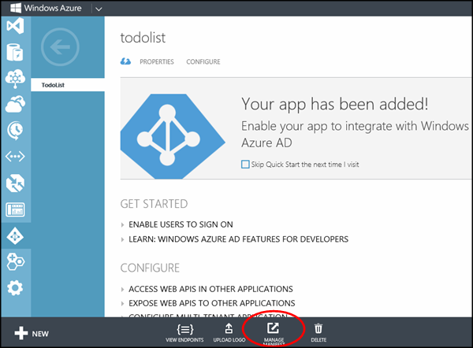
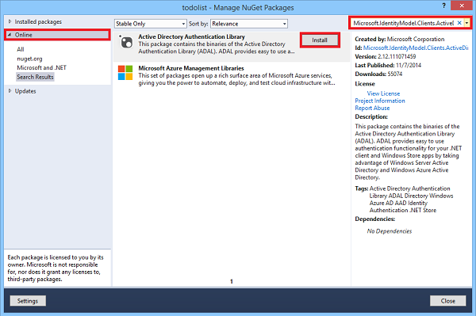

<properties
	pageTitle="Authenticate your app with Active Directory Authentication Library Single Sign-On (Windows Store) | Microsoft Azure"
	description="Learn how to authentication users for single sign-on with ADAL in your Windows Store application."
	documentationCenter="windows"
	authors="wesmc7777"
	manager="dwrede"
	editor=""
	services="mobile-services"/>

<tags
	ms.service="mobile-services"
	ms.workload="mobile"
	ms.tgt_pltfrm="mobile-windows-store"
	ms.devlang="dotnet"
	ms.topic="article"
	ms.date="07/21/2016"
	ms.author="wesmc"/>

# Authenticate your app with Active Directory Authentication Library Single Sign-On

>[AZURE.WARNING] This is an **Azure Mobile Services** topic.  This service has been superseded by Azure App Service Mobile Apps and is scheduled for removal from Azure.  We recommend using Azure Mobile Apps for all new mobile backend deployments.  Read [this announcement](https://azure.microsoft.com/blog/transition-of-azure-mobile-services/) to learn more about the pending deprecation of this service.  
> 
> Learn about [migrating your site to Azure App Service](../articles/app-service-mobile/app-service-mobile-migrating-from-mobile-services.md).
>
> Get started with Azure Mobile Apps, see the [Azure Mobile Apps documentation center](https://azure.microsoft.com/documentation/learning-paths/appservice-mobileapps/).

&nbsp;

> [AZURE.SELECTOR-LIST (Platform | Backend)]
- [(iOS | .NET)](../articles/mobile-services-dotnet-backend-ios-adal-sso-authentication.md)
- [(Windows 8.x Store C# | .NET)](../articles/mobile-services-windows-store-dotnet-adal-sso-authentication.md)

##Overview

In this tutorial, you add authentication to the quickstart project using the Active Directory Authentication Library to support [client-directed login operations](http://msdn.microsoft.com/library/azure/jj710106.aspx) with Azure Active Directory. To support [service-directed login operations](http://msdn.microsoft.com/library/azure/dn283952.aspx) with Azure Active Directory, start with the [Add authentication to your Mobile Services app](mobile-services-dotnet-backend-windows-universal-dotnet-get-started-users.md) tutorial.

To be able to authenticate users, you must register your application with the Azure Active Directory (AAD). This is done in two steps. First, you must register your mobile service and expose permissions on it. Second, you must register your Windows Store app and grant it access to those permissions

>[AZURE.NOTE] This tutorial is intended to help you better understand how Mobile Services enables you to do single sign-on Azure Active Directory authentication for Windows Store apps using a [client-directed login operation](http://msdn.microsoft.com/library/azure/jj710106.aspx). If this is your first experience with Mobile Services, complete the tutorial [Get started with Mobile Services].

##Prerequisites

This tutorial requires the following:

* Visual Studio 2013 running on Windows 8.1.
* Completion of the [Get started with Mobile Services] tutorial.
* Microsoft Azure Mobile Services SDK NuGet package
* Active Directory Authentication Library NuGet package

## Register your mobile service with the Azure Active Directory

In this section you will register your mobile service with the Azure Active Directory and configure permissions to allow single sign-on impersonation.

1. Register your application with your Azure Active Directory by following the [How to Register with the Azure Active Directory] topic.

2. In the [Azure classic portal](https://manage.windowsazure.com/), go back to the Azure Active Directory extension and click on your active directory

3. Click the **Applications** tab and then click your application.

4. Click **Manage Manifest**. Then click **Download Manifest** and save the application manifest to a local directory.

   

5. Open the application manifest file with Visual Studio. At the top of the file find the app permissions line that looks as follows:

        "oauth2Permissions": [],

    Replace that line with the following app permissions and save the file.

        "oauth2Permissions": [
            {
                "adminConsentDescription": "Allow the application access to the mobile service",
                "adminConsentDisplayName": "Have full access to the mobile service",
                "id": "b69ee3c9-c40d-4f2a-ac80-961cd1534e40",
                "isEnabled": true,
                "origin": "Application",
                "type": "User",
                "userConsentDescription": "Allow the application full access to the mobile service on your behalf",
                "userConsentDisplayName": "Have full access to the mobile service",
                "value": "user_impersonation"
            }
        ],

6. In the [Azure classic portal](https://manage.windowsazure.com/), click **Manage Manifest** for the application again and click **Upload Manifest**.  Browse to the location of the application manifest that you just updated and upload the manifest.

<!-- URLs. -->
[How to Register with the Azure Active Directory]: ../articles/mobile-services/mobile-services-how-to-register-active-directory-authentication.md

##Register your app with the Azure Active Directory

To register the app with Azure Active Directory, you must associate it to the Windows Store and have a package security identifier (SID) for the app. The package SID gets registered with the native application settings in the Azure Active Directory.

###Associate the app with a new store app name

1. In Visual Studio, right click the client app project and click **Store** and **Associate App with the Store**

    ![][1]

2. Sign into your Dev Center account.

3. Enter the app name you want to reserve for the app and click **Reserve**.

    ![][2]

4. Select the new app name and click **Next**.

5. Click **Associate** to associate the app with the store name.

###Retrieve the package SID for your app.

Now you need to retrieve your package SID which will be configured with the native app settings.

1. Log into your [Windows Dev Center Dashboard] and click **Edit** on the app.

    ![][3]

2. Then click **App management** > **App identity** and Copy your package SID from the page.

    ![][4]

###Create the native app registration

1. Navigate to **Active Directory** in the [classic portal], then click your directory.

    ![][7]

2. Click the **Applications** tab at the top, then click to **ADD** an app.

    ![][8]

3. Click **Add an application my organization is developing**.

4. In the Add Application Wizard, enter a **Name** for your application and click the  **Native Client Application** type. Then click to continue.

    ![][9]

5. In the **Redirect URI** box, paste the App package SID you copied earlier then click to complete the native app registration.

    ![][10]

6. Click the **Configure** tab for the native application and copy the **Client ID**. You will need this later.

    ![][11]

7. Scroll the page down to the **permissions to other applications** section and grant full access to the mobile service application that you registered earlier. Then click **Save**

    ![][12]

Your mobile service is now configured in AAD to receive single sign-on logins from your app.

##Configure the mobile service to require authentication

By default, all requests to mobile service resources are restricted to clients that present the application key, which does not strictly secure access to resources. To secure your resources, you must restrict access to only authenticated clients.

1. In Visual Studio, open your mobile service project, expand the Controllers folder, and open **TodoItemController.cs**. The **TodoItemController** class implements data access for the TodoItem table. Add the following `using` statement:

		using Microsoft.WindowsAzure.Mobile.Service.Security;

2. Apply the following _AuthorizeLevel_ attribute to the **TodoItemController** class. 

		[AuthorizeLevel(AuthorizationLevel.User)]

	This makes sure that all operations against the _TodoItem_ table require an authenticated user. You can also apply the *AuthorizeLevel* attribute at the method level.

3. (Optional) If you wish to debug authentication locally, expand the `App_Start` folder, open **WebApiConfig.cs**, and add the following code to the **Register** method.  

		config.SetIsHosted(true);

	This tells the local mobile service project to run as if it is being hosted in Azure, including honoring the *AuthorizeLevel* settings. Without this setting, all HTTP requests to localhost are permitted without authentication despite the *AuthorizeLevel* setting. When you enable self-hosted mode, you also need to set a value for the local application key.

4. (Optional) In the web.config project file, set a string value for the `MS_ApplicationKey` app setting. 

	This is the password that you use (with no username) to test the API help pages when you run the service locally.  This string value is not used by the live site in Azure, and you do not need to use the actual application key; any valid string value will work.
 
4. Republish your project.

##Add authentication code to the client app

1. Open your Windows store client app project in Visual Studio.

1. In the Solution Explorer window of Visual Studio, right click the project and click **Manage NuGet Packages**.

2. In the NuGet Package manager, click **Online**. Enter **Microsoft.IdentityModel.Clients.ActiveDirectory** as a search term. Then click **Install** to install the Active Directory Authentication Library Nuget package. 

   

4. In the Solution Explorer window of Visual Studio, open the MainPage.cs file and add the following using statements.

        using Windows.UI.Popups;
        using Microsoft.IdentityModel.Clients.ActiveDirectory;
        using Newtonsoft.Json.Linq;

5. Add the following code to the MainPage class which declares the `AuthenticateAsync` method.

        private MobileServiceUser user;
        private async Task AuthenticateAsync()
        {
            string authority = "<INSERT-AUTHORITY-HERE>";
            string resourceURI = "<INSERT-RESOURCE-URI-HERE>";
            string clientID = "<INSERT-CLIENT-ID-HERE>";
            while (user == null)
            {
                string message;
                try
                {
                  AuthenticationContext ac = new AuthenticationContext(authority);
                  AuthenticationResult ar = await ac.AcquireTokenAsync(resourceURI, clientID, (Uri) null);
                  JObject payload = new JObject();
                  payload["access_token"] = ar.AccessToken;
                  user = await App.MobileService.LoginAsync(MobileServiceAuthenticationProvider.WindowsAzureActiveDirectory, payload);
                  message = string.Format("You are now logged in - {0}", user.UserId);
                }
                catch (InvalidOperationException)
                {
                  message = "You must log in. Login Required";
                }
                var dialog = new MessageDialog(message);
                dialog.Commands.Add(new UICommand("OK"));
                await dialog.ShowAsync();
            }
        }

6. In the code for the `AuthenticateAsync` method above, replace **INSERT-AUTHORITY-HERE** with the name of the tenant in which you provisioned your application, the format should be https://login.windows.net/tenant-name.onmicrosoft.com. This value can be copied out of the Domain tab in your Azure Active Directory in the [Azure classic portal].

7. In the code for the `AuthenticateAsync` method above, replace **INSERT-RESOURCE-URI-HERE** with the **App ID URI** for your mobile service. If you followed the [How to Register with the Azure Active Directory] topic your App ID URI should be similar to https://todolist.azure-mobile.net/login/aad.

8. In the code for the `AuthenticateAsync` method above, replace **INSERT-CLIENT-ID-HERE** with the client ID you copied from the native client application.

9. In the Solution Explorer window for Visual Studio, open the Package.appxmanifest file in the client project. Click the **Capabilities** tab and enable **Enterprise Application** and **Private Networks (Client & Server)**. Save the file.

    ![][14]

10. In the MainPage.cs file, update the `OnNavigatedTo` event handler to call the `AuthenticateAsync` method as follows.

        protected override async void OnNavigatedTo(NavigationEventArgs e)
        {
            await AuthenticateAsync();
            await RefreshTodoItems();
        }

##Test the client using authentication

1. In Visual Studio,run the client app.
2. You will receive a prompt to login against your Azure Active Directory.
3. The app authenticates and returns the todo items.

    ![][15]

<!-- Images -->
[0]: ./media/mobile-services-windows-store-dotnet-adal-sso-authenticate/mobile-services-aad-app-manage-manifest.png
[1]: ./media/mobile-services-windows-store-dotnet-adal-sso-authentication/mobile-services-vs-associate-app.png
[2]: ./media/mobile-services-windows-store-dotnet-adal-sso-authentication/mobile-services-vs-reserve-store-appname.png
[3]: ./media/mobile-services-windows-store-dotnet-adal-sso-authentication/mobile-services-store-app-edit.png
[4]: ./media/mobile-services-windows-store-dotnet-adal-sso-authentication/mobile-services-store-app-services.png
[5]: ./media/mobile-services-windows-store-dotnet-adal-sso-authentication/mobile-services-live-services-site.png
[6]: ./media/mobile-services-windows-store-dotnet-adal-sso-authentication/mobile-services-store-app-package-sid.png
[7]: ./media/mobile-services-windows-store-dotnet-adal-sso-authentication/mobile-services-select-aad.png
[8]: ./media/mobile-services-windows-store-dotnet-adal-sso-authentication/mobile-services-aad-applications-tab.png
[9]: ./media/mobile-services-windows-store-dotnet-adal-sso-authentication/mobile-services-native-selection.png
[10]: ./media/mobile-services-windows-store-dotnet-adal-sso-authentication/mobile-services-native-sid-redirect-uri.png
[11]: ./media/mobile-services-windows-store-dotnet-adal-sso-authentication/mobile-services-native-client-id.png
[12]: ./media/mobile-services-windows-store-dotnet-adal-sso-authentication/mobile-services-native-add-permissions.png
[14]: ./media/mobile-services-windows-store-dotnet-adal-sso-authentication/mobile-services-package-appxmanifest.png
[15]: ./media/mobile-services-windows-store-dotnet-adal-sso-authentication/mobile-services-app-run.png

<!-- URLs. -->
[How to Register with the Azure Active Directory]: mobile-services-how-to-register-active-directory-authentication.md
[Azure classic portal]: https://manage.windowsazure.com/
[classic portal]: https://manage.windowsazure.com/
[Get started with Mobile Services]: mobile-services-dotnet-backend-windows-store-dotnet-get-started.md
[Windows Dev Center Dashboard]: http://go.microsoft.com/fwlink/p/?LinkID=266734
