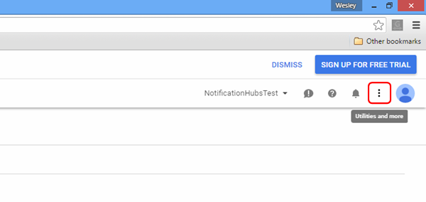
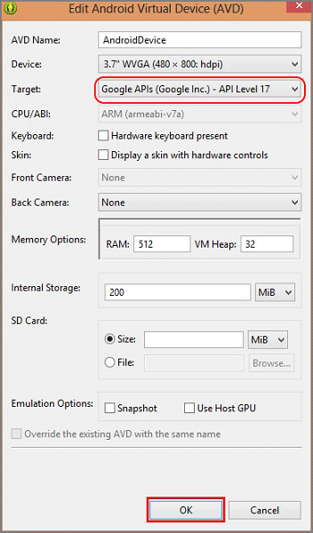
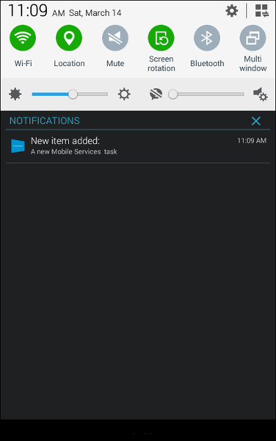

<properties
	pageTitle="Add push notifications to your Xamarin Android app | Microsoft Azure"
	description="Learn how to configure push notifications with Google Cloud Messaging for you Xamarin.Android apps using Azure Mobile Services and Azure Notification Hubs."
	documentationCenter="xamarin"
	authors="ggailey777"
	manager="dwrede"
	services="mobile-services"
	editor=""/>

<tags
	ms.service="mobile-services"
	ms.workload="mobile"
	ms.tgt_pltfrm="mobile-xamarin-android"
	ms.devlang="dotnet"
	ms.topic="article"
	ms.date="07/21/2016"
	ms.author="glenga"/>

# Add push notifications to your Mobile Services app

> [AZURE.SELECTOR-LIST (Platform | Backend )]
- [(iOS | .NET)](mobile-services-dotnet-backend-ios-get-started-push.md)
- [(iOS | JavaScript)](mobile-services-javascript-backend-ios-get-started-push.md)
- [(Windows Runtime 8.1 universal C# | .NET)](mobile-services-dotnet-backend-windows-universal-dotnet-get-started-push.md)
- [(Windows Runtime 8.1 universal C# | Javascript)](mobile-services-javascript-backend-windows-universal-dotnet-get-started-push.md)
- [(Windows Phone Silverlight 8.x | Javascript)](mobile-services-javascript-backend-windows-phone-get-started-push.md)
- [(Android | .NET)](mobile-services-dotnet-backend-android-get-started-push.md)
- [(Android | Javascript)](mobile-services-javascript-backend-android-get-started-push.md)
- [(Xamarin.iOS | Javascript)](../articles/partner-xamarin-mobile-services-ios-get-started-push.md)
- [(Xamarin.Android | Javascript)](../articles/partner-xamarin-mobile-services-android-get-started-push.md)
- [(Xamarin.Android | .NET)](mobile-services-dotnet-backend-xamarin-android-get-started-push.md)
- [(Xamarin.Forms | JavaScript)](../articles/partner-xamarin-mobile-services-xamarin-forms-get-started-push.md)

&nbsp;

>[AZURE.WARNING] This is an **Azure Mobile Services** topic.  This service has been superseded by Azure App Service Mobile Apps and is scheduled for removal from Azure.  We recommend using Azure Mobile Apps for all new mobile backend deployments.  Read [this announcement](https://azure.microsoft.com/blog/transition-of-azure-mobile-services/) to learn more about the pending deprecation of this service.  
> 
> Learn about [migrating your site to Azure App Service](https://azure.microsoft.com/en-us/documentation/articles/app-service-mobile-migrating-from-mobile-services/).
>
> Get started with Azure Mobile Apps, see the [Azure Mobile Apps documentation center](https://azure.microsoft.com/documentation/learning-paths/appservice-mobileapps/).
> For the equivalent Mobile Apps version of this topic, see [Add push notifications to your Xamarin.Android app](../app-service-mobile/app-service-mobile-xamarin-android-get-started-push.md).

##Overview
This topic shows you how to use Azure Mobile Services to send push notifications to a Xamarin.Android app. In this tutorial you add push notifications using the Google Cloud Messaging (GCM) service to the [Get started with Mobile Services] project. When complete, your mobile service will send a push notification each time a record is inserted.

This tutorial requires the following:

+ An active Google account.
+ [Google Cloud Messaging Client Component]. You will add this component during the tutorial.

You should already have Xamarin and the [Azure Mobile Services Component] installed in your project from when you completed either [Get started with Mobile Services].

##Enable Google Cloud Messaging

1. Navigate to the [Google Cloud Console](https://console.developers.google.com/project), sign in with your Google account credentials. 
 
2. Click **Create Project**, type a project name, then click **Create**. If requested, carry out the SMS Verification, and click **Create** again.

   	   

	 Type in your new **Project name** and click **Create project**.

3. Click the **Utilities and More** button and then click **Project Information**. Make a note of the **Project Number**. You will need to set this value as the `SenderId` variable in the client app.

   	

4. In the project dashboard, under **Mobile APIs**, click **Google Cloud Messaging**, then on the next page click **Enable API** and accept the terms of service. 

	

	 

5. In the project dashboard, Click **Credentials** > **Create Credential** > **API Key**. 

   	

6. In **Create a new key**, click **Server key**, type a name for your key, then click **Create**.

7. Make a note of the **API KEY** value.

	You will use this API key value to enable Azure to authenticate with GCM and send push notifications on behalf of your app.

##Configure your mobile service to send push requests

1. Log on to the [Azure classic portal](https://manage.windowsazure.com/), click **Mobile Services**, and then click your app.

2. Click the **Push** tab, enter the **API Key** value obtained from GCM in the previous procedure, then click **Save**.

   	

    >[AZURE.NOTE]When you set your GCM credentials for enhanced push notifications in the Push tab in the portal, they are shared with Notification Hubs to configure the notification hub with your app.

Both your mobile service and your app are now configured to work with GCM and Notification Hubs. 

##Update the registered insert script to send notifications

>[AZURE.TIP] The following steps show you how to update the script registered to the insert operation on the TodoItem table in the Azure classic portal. You can also access and edit this mobile service script directly in Visual Studio, in the Azure node of Server Explorer.

1. In the [Azure classic portal](https://manage.windowsazure.com/), click the **Data** tab and then click the **TodoItem** table. 
 
2. In **todoitem**, click the **Script** tab and select **Insert**.
   
   	This displays the function that is invoked when an insert occurs in the **TodoItem** table.

3. Replace the insert function with the following code, and then click **Save**:

		function insert(item, user, request) {
		// Define a simple payload for a GCM notification.
	    var payload = {
	        "data": {
	            "message": item.text
	        }
	    };		
		request.execute({
		    success: function() {
		        // If the insert succeeds, send a notification.
		        push.gcm.send(null, payload, {
		            success: function(pushResponse) {
		                console.log("Sent push:", pushResponse, payload);
		                request.respond();
		                },              
		            error: function (pushResponse) {
		                console.log("Error Sending push:", pushResponse);
		                request.respond(500, { error: pushResponse });
		                }
		            });
		        },
		    error: function(err) {
		        console.log("request.execute error", err)
		        request.respond();
		    }
		  });
		}

   	This registers a new insert script, which uses the [gcm object](http://go.microsoft.com/fwlink/p/?LinkId=282645) to send a push notification to all registered devices after the insert succeeds. 

##Configure the existing project for push notifications

1. In the Solution view (or **Solution Explorer** in Visual Studio), right-click the **Components** folder, click  **Get More Components...**, search for the **Google Cloud Messaging Client** component and add it to the project.

2. Open the ToDoActivity.cs project file and add the following using statement to the class:

		using Gcm.Client;

3. In the **ToDoActivity** class, add the following new code: 

        // Create a new instance field for this activity.
        static ToDoActivity instance = new ToDoActivity();

        // Return the current activity instance.
        public static ToDoActivity CurrentActivity
        {
            get
            {
                return instance;
            }
        }
        // Return the Mobile Services client.
        public MobileServiceClient CurrentClient
        {
            get
            {
                return client;
            }
        }

	This enables you to access the mobile client instance from the push handler service process.

4.	Add the following code to the **OnCreate** method, after the **MobileServiceClient** is created:

        // Set the current instance of TodoActivity.
        instance = this;

        // Make sure the GCM client is set up correctly.
        GcmClient.CheckDevice(this);
        GcmClient.CheckManifest(this);

        // Register the app for push notifications.
        GcmClient.Register(this, ToDoBroadcastReceiver.senderIDs);

Your **ToDoActivity** is now prepared for adding push notifications.

##Add push notifications code to your app

4. Create a new class in the project called `ToDoBroadcastReceiver`.

5. Add the following using statements to **ToDoBroadcastReceiver** class:

		using Gcm.Client;
		using Microsoft.WindowsAzure.MobileServices;

6. Add the following permission requests between the **using** statements and the **namespace** declaration:

		[assembly: Permission(Name = "@PACKAGE_NAME@.permission.C2D_MESSAGE")]
		[assembly: UsesPermission(Name = "@PACKAGE_NAME@.permission.C2D_MESSAGE")]
		[assembly: UsesPermission(Name = "com.google.android.c2dm.permission.RECEIVE")]

		//GET_ACCOUNTS is only needed for android versions 4.0.3 and below
		[assembly: UsesPermission(Name = "android.permission.GET_ACCOUNTS")]
		[assembly: UsesPermission(Name = "android.permission.INTERNET")]
		[assembly: UsesPermission(Name = "android.permission.WAKE_LOCK")]

7. Replace the existing **ToDoBroadcastReceiver** class definition with the following:
 
	    [BroadcastReceiver(Permission = Gcm.Client.Constants.PERMISSION_GCM_INTENTS)]
	    [IntentFilter(new string[] { Gcm.Client.Constants.INTENT_FROM_GCM_MESSAGE }, 
	        Categories = new string[] { "@PACKAGE_NAME@" })]
	    [IntentFilter(new string[] { Gcm.Client.Constants.INTENT_FROM_GCM_REGISTRATION_CALLBACK }, 
	        Categories = new string[] { "@PACKAGE_NAME@" })]
	    [IntentFilter(new string[] { Gcm.Client.Constants.INTENT_FROM_GCM_LIBRARY_RETRY }, 
        Categories = new string[] { "@PACKAGE_NAME@" })]
        public class ToDoBroadcastReceiver : GcmBroadcastReceiverBase<PushHandlerService>
        {
	        // Set the Google app ID.
	        public static string[] senderIDs = new string[] { "<PROJECT_NUMBER>" };
        }

	In the above code, you must replace _`<PROJECT_NUMBER>`_ with the project number assigned by Google when you provisioned your app in the Google developer portal. 

8. In the ToDoBroadcastReceiver.cs project file, add the following code that defines the **PushHandlerService** class:
 
		// The ServiceAttribute must be applied to the class.
    	[Service] 
    	public class PushHandlerService : GcmServiceBase
    	{
        	public static string RegistrationID { get; private set; }
 
        	public PushHandlerService() : base(ToDoBroadcastReceiver.senderIDs) { }
    	}

	Note that this class derives from **GcmServiceBase** and that the **Service** attribute must be applied to this class.

	>[AZURE.NOTE]The **GcmServiceBase** class implements the **OnRegistered()**, **OnUnRegistered()**, **OnMessage()** and **OnError()** methods. You must override these methods in the **PushHandlerService** class.

5. Add the following code to the **PushHandlerService** class that overrides the **OnRegistered** event handler. 

        protected override void OnRegistered(Context context, string registrationId)
        {
            System.Diagnostics.Debug.WriteLine("The device has been registered with GCM.", "Success!");
            
            // Get the MobileServiceClient from the current activity instance.
            MobileServiceClient client = ToDoActivity.CurrentActivity.CurrentClient;           
            var push = client.GetPush();

            List<string> tags = null;

            //// (Optional) Uncomment to add tags to the registration.
            //var tags = new List<string>() { "myTag" }; // create tags if you want

            try
            {
                // Make sure we run the registration on the same thread as the activity, 
                // to avoid threading errors.
                ToDoActivity.CurrentActivity.RunOnUiThread(
                    async () => await push.RegisterNativeAsync(registrationId, tags));
            }
            catch (Exception ex)
            {
                System.Diagnostics.Debug.WriteLine(
                    string.Format("Error with Azure push registration: {0}", ex.Message));                
            }
        }

	This method uses the returned GCM registration ID to register with Azure for push notifications.

10. Override the **OnMessage** method in **PushHandlerService** with the following code:

        protected override void OnMessage(Context context, Intent intent)
        {          
            string message = string.Empty;

            // Extract the push notification message from the intent.
            if (intent.Extras.ContainsKey("message"))
            {
                message = intent.Extras.Get("message").ToString();
                var title = "New item added:";

                // Create a notification manager to send the notification.
                var notificationManager = 
                    GetSystemService(Context.NotificationService) as NotificationManager;

                // Create a new intent to show the notification in the UI. 
                PendingIntent contentIntent = 
					PendingIntent.GetActivity(context, 0, 
					new Intent(this, typeof(ToDoActivity)), 0);	          

                // Create the notification using the builder.
                var builder = new Notification.Builder(context);
                builder.SetAutoCancel(true);
                builder.SetContentTitle(title);
                builder.SetContentText(message);
                builder.SetSmallIcon(Resource.Drawable.ic_launcher);
                builder.SetContentIntent(contentIntent);
                var notification = builder.Build();

                // Display the notification in the Notifications Area.
                notificationManager.Notify(1, notification);

            }
        }

12. Override the **OnUnRegistered()** and **OnError()** methods with the following code.

        protected override void OnUnRegistered(Context context, string registrationId)
        {
            throw new NotImplementedException();
        }

        protected override void OnError(Context context, string errorId)
        {
            System.Diagnostics.Debug.WriteLine(
                string.Format("Error occurred in the notification: {0}.", errorId));
        }

##Test push notifications in your app

You can test the app by directly attaching an Android phone with a USB cable, or by using a virtual device in the emulator.

4. Create a new class in the project called `ToDoBroadcastReceiver`.

5. Add the following using statements to **ToDoBroadcastReceiver** class:

		using Gcm.Client;
		using Microsoft.WindowsAzure.MobileServices;

6. Add the following permission requests between the **using** statements and the **namespace** declaration:

		[assembly: Permission(Name = "@PACKAGE_NAME@.permission.C2D_MESSAGE")]
		[assembly: UsesPermission(Name = "@PACKAGE_NAME@.permission.C2D_MESSAGE")]
		[assembly: UsesPermission(Name = "com.google.android.c2dm.permission.RECEIVE")]

		//GET_ACCOUNTS is only needed for android versions 4.0.3 and below
		[assembly: UsesPermission(Name = "android.permission.GET_ACCOUNTS")]
		[assembly: UsesPermission(Name = "android.permission.INTERNET")]
		[assembly: UsesPermission(Name = "android.permission.WAKE_LOCK")]

7. Replace the existing **ToDoBroadcastReceiver** class definition with the following:
 
	    [BroadcastReceiver(Permission = Gcm.Client.Constants.PERMISSION_GCM_INTENTS)]
	    [IntentFilter(new string[] { Gcm.Client.Constants.INTENT_FROM_GCM_MESSAGE }, 
	        Categories = new string[] { "@PACKAGE_NAME@" })]
	    [IntentFilter(new string[] { Gcm.Client.Constants.INTENT_FROM_GCM_REGISTRATION_CALLBACK }, 
	        Categories = new string[] { "@PACKAGE_NAME@" })]
	    [IntentFilter(new string[] { Gcm.Client.Constants.INTENT_FROM_GCM_LIBRARY_RETRY }, 
        Categories = new string[] { "@PACKAGE_NAME@" })]
        public class ToDoBroadcastReceiver : GcmBroadcastReceiverBase<PushHandlerService>
        {
	        // Set the Google app ID.
	        public static string[] senderIDs = new string[] { "<PROJECT_NUMBER>" };
        }

	In the above code, you must replace _`<PROJECT_NUMBER>`_ with the project number assigned by Google when you provisioned your app in the Google developer portal. 

8. In the ToDoBroadcastReceiver.cs project file, add the following code that defines the **PushHandlerService** class:
 
		// The ServiceAttribute must be applied to the class.
    	[Service] 
    	public class PushHandlerService : GcmServiceBase
    	{
        	public static string RegistrationID { get; private set; }

###Setting up the Android emulator for testing
When you run this app in the emulator, make sure that you use an Android Virtual Device (AVD) that supports Google APIs.

> [AZURE.IMPORTANT] In order to receive push notifications, you must set up a Google account on your Android Virtual Device (in the emulator, navigate to **Settings** and click **Add Account**). Also, make sure that the emulator is connected to the Internet.

1. From **Tools**, click **Open Android Emulator Manager**, select your device, and then click **Edit**.

   	

2. Select **Google APIs** in **Target**, then click **OK**.

   	

3. On the top toolbar, click **Run**, and then select your app. This starts the emulator and runs the app.

  The app retrieves the *registrationId* from GCM and registers with the Notification Hub.

###Inserting a new item generates a notification.

1. In the app, type meaningful text, such as _A new Mobile Services task_ and then click the **Add** button.

2. Swipe down from the top of the screen to open the device's Notification Center to see the notification.

	

You have successfully completed this tutorial.

## Next steps

Learn more about Mobile Services and Notification Hubs in the following topics:

* [Get started with authentication](mobile-services-android-get-started-users.md)
   Learn how to authenticate users of your app with different account types using mobile services.

* [What are Notification Hubs?](../notification-hubs/notification-hubs-push-notification-overview.md)
   Learn more about how Notification Hubs works to deliver notifications to your apps across all major client platforms.

* [Debug Notification Hubs applications](http://go.microsoft.com/fwlink/p/?linkid=386630)
   Get guidance troubleshooting and debugging Notification Hubs solutions.

* [How to use the .NET client library for Mobile Services](mobile-services-dotnet-how-to-use-client-library.md)
   Learn more about how to use Mobile Services with Xamarin C# code.

* [Mobile Services server script reference](mobile-services-how-to-use-server-scripts.md)
   Learn more about how to implement business logic in your mobile service.

<!-- URLs. -->
[Get started with Mobile Services]: mobile-services-ios-get-started.md

[Google Cloud Messaging Client Component]: http://components.xamarin.com/view/GCMClient/
[Azure Mobile Services Component]: http://components.xamarin.com/view/azure-mobile-services/
