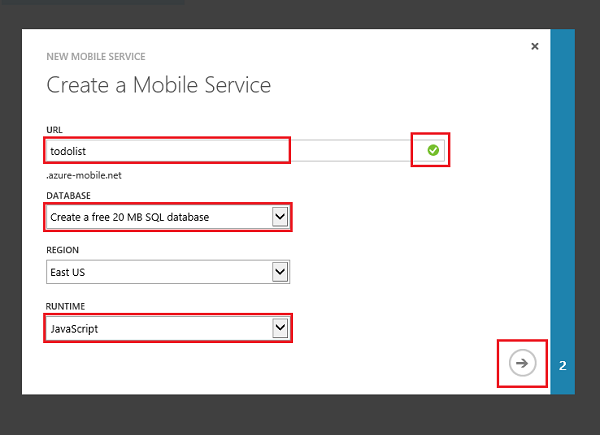

<properties
	pageTitle="Get Started with Mobile Services for Xamarin.Android | Microsoft Azure"
	writer="craigd"
	description="Learn how to use Azure Mobile Services with your Xamarin.Android app."
	documentationCenter="xamarin"
	authors="lindydonna"
	manager="dwrede"
	editor=""
	services="mobile-services"/>

<tags
	ms.service="mobile-services"
	ms.workload="mobile"
	ms.tgt_pltfrm="mobile-xamarin-android"
	ms.devlang="dotnet"
	ms.topic="hero-article"
	ms.date="07/21/2016"
	ms.author="donnam"/>

# Get started with Mobile Services

> [AZURE.SELECTOR-LIST (Platform | Backend )]
- [(iOS | .NET)](../articles/mobile-services-dotnet-backend-ios-get-started.md)
- [(iOS | JavaScript)](../articles/mobile-services-ios-get-started.md)
- [(Windows Runtime 8.1 universal C# | .NET)](../articles/mobile-services-dotnet-backend-windows-store-dotnet-get-started.md)
- [(Windows Runtime 8.1 universal C# | Javascript)](../articles/mobile-services-javascript-backend-windows-store-dotnet-get-started.md)
- [(Windows Runtime 8.1 universal JavaScript | Javascript)](../articles/mobile-services-javascript-backend-windows-store-javascript-get-started.md)
- [(Android | .NET)](../articles/mobile-services-dotnet-backend-android-get-started.md)
- [(Android | Javascript)](../articles/mobile-services-android-get-started.md)
- [(Xamarin.iOS | .NET)](../articles/mobile-services-dotnet-backend-xamarin-ios-get-started.md)
- [(Xamarin.iOS | Javascript)](../articles/partner-xamarin-mobile-services-ios-get-started.md)
- [(Xamarin.Android | .NET)](../articles/mobile-services-dotnet-backend-xamarin-android-get-started.md)
- [(Xamarin.Android | Javascript)](../articles/partner-xamarin-mobile-services-android-get-started.md)
- [(HTML | Javascript)](../articles/mobile-services-html-get-started.md)
- [(PhoneGap | Javascript)](../articles/mobile-services-javascript-backend-phonegap-get-started.md)
- [(Sencha | Javascript)](../articles/partner-sencha-mobile-services-get-started.md)
&nbsp;

>[AZURE.WARNING] This is an **Azure Mobile Services** topic.  This service has been superseded by Azure App Service Mobile Apps and is scheduled for removal from Azure.  We recommend using Azure Mobile Apps for all new mobile backend deployments.  Read [this announcement](https://azure.microsoft.com/blog/transition-of-azure-mobile-services/) to learn more about the pending deprecation of this service.  
>
> Learn about [migrating your site to Azure App Service](../articles/app-service-mobile/app-service-mobile-migrating-from-mobile-services.md).
>
> Get started with Azure Mobile Apps, see the [Azure Mobile Apps documentation center](https://azure.microsoft.com/documentation/learning-paths/appservice-mobileapps/).
> For the equivalent Mobile Apps version of this topic, see [Create a Xamarin.Android App](../app-service-mobile/app-service-mobile-xamarin-android-get-started.md).

This tutorial shows you how to add a cloud-based backend service to a Xamarin.Android app using Azure Mobile Services. In this tutorial, you will create both a new mobile service and a simple *To do list* app that stores app data in the new mobile service.

If you prefer to watch a video, the clip below follows the same steps on this tutorial.

Video: "Getting Started with Xamarin and Azure Mobile Services" with Craig Dunn, developer evangelist for Xamarin  (duration: 10:05 min)

> [AZURE.VIDEO getting-started-with-xamarin-and-mobile-services]

A screenshot from the completed app is below:

![][0]

Completing this tutorial requires XCode and Xamarin Studio for OS X or Visual Studio on Windows with a networked Mac. Complete installation instructions are on [Setup and Install for Visual Studio and Xamarin](https://msdn.microsoft.com/library/mt613162.aspx).

The downloaded quickstart project contains the Azure Mobile services component for Xamarin.Android. While this project targets Android 4.2 or a later version, the Mobile Services SDK requires only Android 2.2 or a later version.

> [AZURE.IMPORTANT] To complete this tutorial, you need an Azure account. If you don't have an account, you can sign up for an Azure trial and get up to 10 free mobile services that you can keep using even after your trial ends. For details, see [Azure Free Trial](https://azure.microsoft.com/pricing/free-trial/?WT.mc_id=A9C9624B5).

## Create a new mobile service

Follow these steps to create a new mobile service.

1.	Log into the [Azure classic portal](https://manage.windowsazure.com/). At the bottom of the navigation pane, click **+NEW**. Expand **Compute** and **Mobile Service**, then click **Create**.

	

	This displays the **Create a Mobile Service** dialog.

2.	In the **Create a Mobile Service** dialog, select **Create a free 20 MB SQL Database**, select **JavaScript** runtime, then type a subdomain name for the new mobile service in the **URL** textbox. Click the right arrow button to go to the next page.

	

	This displays the **Specify database settings** page.

	>[AZURE.NOTE]As part of this tutorial, you create a new SQL Database instance and server. You can reuse this new database and administer it as you would any other SQL Database instance. If you already have a database in the same region as the new mobile service, you can instead choose **Use existing Database** and then select that database. The use of a database in a different region is not recommended because of additional bandwidth costs and higher latencies.

3.	In **Name**, type the name of the new database, then type **Login name**, which is the administrator login name for the new SQL Database server, type and confirm the password, and click the check button to complete the process.
	

You have now created a new mobile service that can be used by your mobile apps.

## Create a new Xamarin.Android app

Once you have created your mobile service, you can follow an easy quickstart in the Azure classic portal to either create a new app or modify an existing app to connect to your mobile service.

In this section you will create a new Xamarin.Android app that is connected to your mobile service.

1.  In the [Azure classic portal], click **Mobile Services**, and then click the mobile service that you just created.

2. In the quickstart tab, click **Xamarin.Android** under **Choose platform** and expand **Create a new Android app**.

	![][6]

	This displays the three easy steps to create a Xamarin.Android app connected to your mobile service.

	![][7]

3. Click **Create TodoItem table** to create a table to store app data.

4. Under **Download and run app**, click **Download**.

	This downloads the project for the sample _To do list_ application that is connected to your mobile service. Save the compressed project file to your local computer, and make a note of where you save it.

## Run your Android app

The final stage of this tutorial is to build and run your new app.

1. Browse to the location where you saved the compressed project files and expand the files on your computer.

2. In Xamarin Studio or Visual Studio, click **File** then **Open**, navigate to the uncompressed sample files, and select **XamarinTodoQuickStart.Android.sln** to open it.

3. Press the **Run** button to build the project and start the app. You will be asked to select an emulator or a connected USB device.

	> [AZURE.NOTE] To be able to run the project in the Android emulator, you must define at least one Android Virtual Device (AVD). Use the AVD Manager to create and manage these devices.

4. In the app, type meaningful text, such as _Complete the tutorial_, and then click **Add**.

	![][10]

	This sends a POST request to the new mobile service hosted in Azure. Data from the request is inserted into the TodoItem table. Items stored in the table are returned by the mobile service, and the data is displayed in the list.

	> [AZURE.NOTE]
   	> You can review the code that accesses your mobile service to query and insert data, which is found in the ToDoActivity.cs C# file.

6. Back in the [Azure classic portal], click the **Data** tab and then click the **TodoItems** table.

	![][11]

	This lets you browse the data inserted by the app into the table.

	![][12]

## Next Steps
Now that you have completed the quickstart, learn how to perform additional important tasks in Mobile Services:

* [Get started with offline data sync]
  Learn how the quickstart uses offline data sync to make the app responsive and robust.

* [Get started with authentication]
  Learn how to authenticate users of your app with an identity provider.

* [Get started with push notifications]
  Learn how to send a very basic push notification to your app.

<!-- Anchors. -->
[Getting started with Mobile Services]:#getting-started
[Create a new mobile service]:#create-new-service
[Define the mobile service instance]:#define-mobile-service-instance
[Next Steps]:#next-steps

<!-- Images. -->
[0]: ./media/partner-xamarin-mobile-services-android-get-started/mobile-quickstart-completed-android.png
[2]: ./media/partner-xamarin-mobile-services-android-get-started/mobile-create.png
[3]: ./media/partner-xamarin-mobile-services-android-get-started/mobile-create-page1.png
[4]: ./media/partner-xamarin-mobile-services-android-get-started/mobile-create-page2.png
[5]: ./media/partner-xamarin-mobile-services-android-get-started/obile-services-selection.png
[6]: ./media/partner-xamarin-mobile-services-android-get-started/mobile-portal-quickstart-xamarin-android.png
[7]: ./media/partner-xamarin-mobile-services-android-get-started/mobile-quickstart-steps-xamarin-android.png
[8]: ./media/partner-xamarin-mobile-services-android-get-started/mobile-xamarin-project-android-xs.png
[9]: ./media/partner-xamarin-mobile-services-android-get-started/mobile-xamarin-project-android-vs.png
[10]: ./media/partner-xamarin-mobile-services-android-get-started/mobile-quickstart-startup-android.png
[11]: ./media/partner-xamarin-mobile-services-android-get-started/mobile-data-tab.png
[12]: ./media/partner-xamarin-mobile-services-android-get-started/mobile-data-browse.png
[13]: ./media/partner-xamarin-mobile-services-android-get-started/mobile-services-diagram.png

<!-- URLs. -->
[Get started with data]: /develop/mobile/tutorials/get-started-with-data-xamarin-android
[Get started with offline data sync]: mobile-services-xamarin-android-get-started-offline-data.md
[Get started with authentication]: /develop/mobile/tutorials/get-started-with-users-xamarin-android
[Get started with push notifications]: /develop/mobile/tutorials/get-started-with-push-xamarin-android
[Mobile Services Android SDK]: https://go.microsoft.com/fwLink/p/?LinkID=266533
[Azure]: http://azure.microsoft.com/
[Azure classic portal]: https://manage.windowsazure.com/
